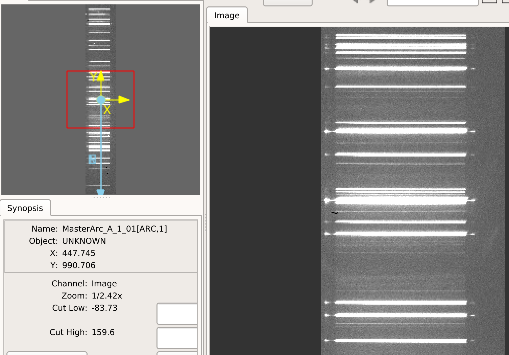

.. include:: ../include/links.rst

.. _arc:

===
Arc
===

Overview
========

This file describes the data model for the ``Arc`` image.
It is generally a simple combination of all input arc frames.

The image is written to disk as a multi-extension FITS file
prefixed by ``Arc`` in the ``Calibrations/`` folder.
See :ref:`calib-naming` for the naming convention.

Inspecting
==========

The first extension is the combined image.
You can view it with any standard image viewer, e.g.:

.. code-block:: console

    ginga Calibrations/Arc_A_1_01.fits

Most often you use only one arc frame and this appears
very similar to the raw image.  If you do stack several,
the output could be quite different.

The image will also be a trimmed portion of the raw image and also re-oriented
so that vertical is the spectral dimension with blue at the bottom, following
the PypeIt :ref:`pypeit-orientation`.

Here is an screen shot of a ``ginga`` view
for an example from the ``shane_kast_red`` spectrograph.

Yup, an arc.

Trouble Shooting
================

If your image appears to be in err, here are the things to consider:

 - Is one or more of your input arc frames junk?

 - Is one or more of your input arc frames mis-labeled?

Current ArcImage Data Model
===========================

Internally, the image is held in
:class:`~pypeit.images.buildimage.ArcImage`,
which subclasses from :class:`~pypeit.images.pypeitimage.PypeItImage` and
:class:`~pypeit.datamodel.DataContainer`.

The datamodel written to disk is:

.. include:: ../include/datamodel_arcimage.rst

