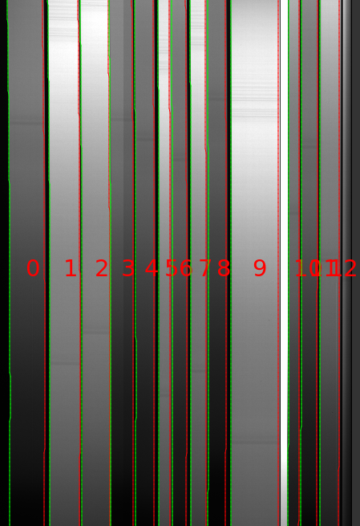

.. include:: ../include/links.rst

.. _edges:

=====
Edges
=====

Overview
========

This file describes the ``Edges`` object.
It contains the core information required to describe the edges
of each slit on a given detector (or orders for echelle).

See below for the `Current EdgeTrace Data Model`_.
This is written to disk as a multi-extension FITS file prefixed by
``Edges`` in the ``Calibrations/`` folder.
See the :ref:`calib-naming` docs for more.

We also describe how to view the slit edges
using `pypeit_chk_edges`_.

Viewing
=======

The preferred way to view the slit edges identified
by PypeIt is with the `pypeit_chk_edges`_ script.

The script usage can be displayed by calling the script with the
``-h`` option:

.. include:: ../help/pypeit_chk_edges.rst

.. _pypeit_chk_edges:

pypeit_chk_edges
----------------

There are currently 2 options for viewing the slit edges on the image
used to construct them.  Each uses the `pypeit_chk_edges`_ script.

ginga
+++++

This is the default mode when executing, e.g.:

.. code-block:: console

    pypeit_chk_edges Calibrations/Edges_A_1_DET01.fits.gz

.. warning::
    
    These files can take an annoyingly long time to load because they tend to be
    large and require decompression.

Two images are shown, the trace image (typically a combination of dome
flats) and the Sobel filtered image used to detect the slit edges.

Here is a zoom-in screen shot for the :ref:`keck-lris-red` spectrograph.

A few things to note from this good-performing example:

 - The slits run nearly vertically across the image

 - The left/right edge of each slit identified is a green/red (purple in more
   recent versions) line

 - There were 13 slits identified (0 indexing)

 - The brightest `slit` is an alignment box and was discarded by the code

matplotlib
++++++++++

To avoid ginga, use the `--mpl` flag:

.. code-block:: console

    pypeit_chk_edges Calibrations/Edges_A_1_DET01.fits.gz --mpl

The color scheme is distinct and the labeling
now includes -1 or +1 for left/right edges.

SlitTrace
=========

The ``Edges`` file allows one to fully reconstruct its underlying object
(:class:`~pypeit.edgetrace.EdgeTraceSet`) when instantiated from the output
file.  Unfortunately, this means the PypeIt object and output file are a bit too
unwieldy to pass through the remainder of the code just to access its primary
product, the slit-edge pixel coordinates.  For that reason, we also create a
:ref:`slits` object; follow the link for more description of that object.

.. _edges-trouble:

Edges Troubleshooting
======================

See :doc:`slit_tracing` for a discussion of how to customize, debug, and
finesse your slit tracing results.

Current EdgeTrace Data Model
============================

Internally, the processed image is held in :class:`~pypeit.edgetrace.EdgeTraceSet`,
which subclasses from :class:`~pypeit.datamodel.DataContainer`.

The datamodel written to disk is:

.. include:: ../include/datamodel_edgetraceset.rst

