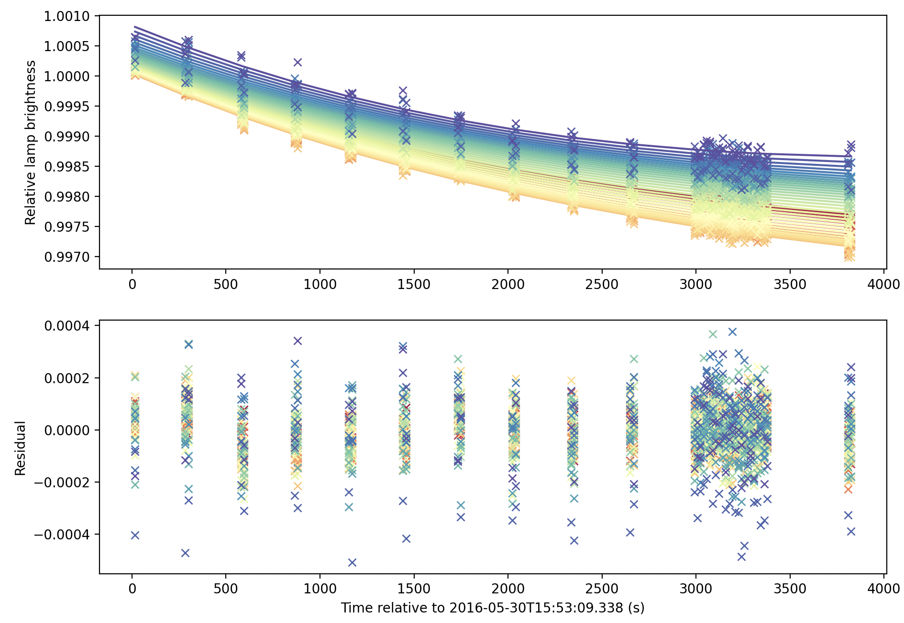

=====================
Non-Linear correction
=====================

The non-linear correction is a simple way to correct the non-linear behavior of the
sensor. Imagine a perfect light source that emits photons with a constant count rate.
An ideal detector would be able to measure this count rate independently of the exposure
time. However, in practice, detectors have a non-linear response to the incoming photons.
This means that the count rate measured by the detector is not proportional to the count
rate of the light source. The non-linear correction is a simple way to correct this
non-linear behavior. Most modern CCD cameras have a linear response to about 1% over
most of the dynamic range, so this correction is not necessary for most applications.
The correction parameters can be measured by the user, but care should be taken with
how you collect the calibration data, since the internal continuum light source used
for most flat-field calibrations is not a perfect light source.

At present, the non-linear correction is only implemented for KCWI, which is already very
close to linear over most of the dynamic range of the CCD. If you have collected non-linear
calibration data with another instrument, please contact the developers to see if we can
implement this correction for your instrument.

Calibrations required
---------------------

The non-linear correction requires a set of dedicated calibration data that can be used to measure
the non-linear response of the detector. This calibration data should be collected with
a continuum light source (usually internal to the instrument). We currently recommend that
you turn on the internal lamp, and leave it for 30 minutes to warm up and settle. The lamp
count rate will likely decay over time, so we recommend that you collect a series of exposures
that are bracketed by `reference` exposures of constant exposure time (also known as the
`bracketed repeat exposure` technique). The reference exposures are used to monitor the
temporal decay of the lamp count rate. Here is a screenshot to show the lamp decay as a
function of time. The points are the `reference exposures` and are colour-coded by the
wavelength of the light, and the solid lines are the best-fit exponential + 2D polynomial
decay curves. The bottom panel shows a residual of the fit. Thus, both the relative shape
and the intensity of the lamp decay can be monitored as a function of time.

Between a set of reference exposures, you should
acquire a series of exposures with increasing exposure time. The exposure time should be
increased by a factor of 2 between each exposure. The exposure time should be chosen so that
the count rate is not too high, but also not too low. The counts should extend to at least 10%
of the maximum counts of the detector. The `reference` exposures should have an exposure time
that is close to the middle of the range of exposure times used for the other exposures. It is
often good practice to collect an even number of exposures at each exposure time; some shutters
move in opposite directions for adjacent exposures, and the true exposure time may depend on
the direction that the shutter is moving.

To determine the non-linearity, we assume that the correction is quadratic, such that the
quadratic term is a small perturbation from linear response. The functional form of the
true count rate is then:

.. math::

    C_T \cdot t = C_M \cdot t (1 + b \cdot C_M \cdot t)

where :math:`C_T` is the true count rate, :math:`C_M` is the measured count rate, :math:`t`
is the exposure time, and :math:`b` is the non-linearity coefficient.
The non-linearity coefficient can be determined by fitting
the measured count rate as a function of the exposure time. That that as the true count rate
tends to zero, the measured count rate tends to zero. The non-linearity coefficient can be
measured for each pixel on the detector, and it is a good idea to consider the non-linearity
coefficient for different amplifiers separately. The above equation can be written as a matrix
equation:

.. math::

    M \cdot x = e
    M = \begin{bmatrix}
    C_{M,1}t_1 & (C_{M,1}t_1)^2 \\
    C_{M,2}t_2 & (C_{M,2}t_2)^2 \\
    \vdots & \vdots \\
    C_{M,n}t_n & (C_{M,n}t_n)^2 \\
    \end{bmatrix}
    x = \begin{bmatrix}
    1/C_T \\
    b/C_T \\
    \end{bmatrix}
    e = \begin{bmatrix}
    t_1 \\
    t_2 \\
    \vdots \\
    t_n \\
    \end{bmatrix}

where :math:`M` is a matrix of measured count rates, :math:`x` is a vector of the non-linearity
coefficient and the true count rate, and :math:`e` is a vector of exposure times. The non-linearity
coefficient can be determined by inverting the matrix :math:`M`, and solving for :math:`x`. The
non-linearity coefficient can be determined for each pixel on the detector. The central value of
the distribution of non-linearity coefficients can be used as a fixed non-linearity coefficient
for each amplifier of the detector.
