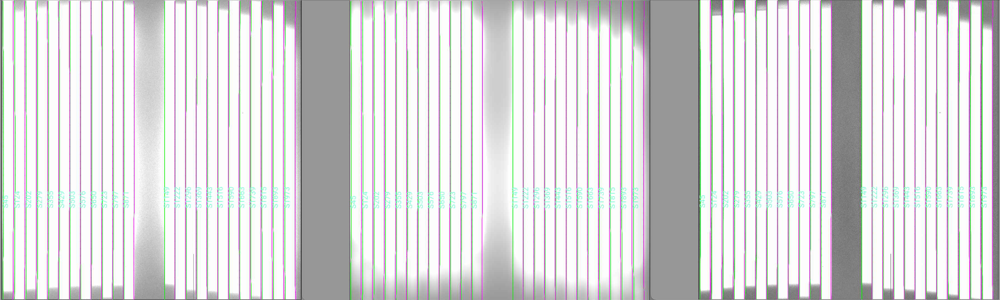

.. include:: ../include/links.rst

.. _scattlight:

===========================
Scattered light subtraction
===========================

Overview
========

This document describes how PypeIt implements a scattered light subtraction.
Scattered light usually affects data at the few percent level or even less.
So, before you implement a scattered light correction for your data, convince
yourself that this is really needed for your science case. There is currently
one algorithm that can be applied to all spectrographs, although this model
has only been tested with Keck/KCWI and Keck/ESI data, and may not be optimal
for your instrument setup, so inspect the outputs to be sure that you are not
adding artefacts to your data.

Overview
========

This file describes the model fitting procedure and how to check the results of your
scattered light fits. The input image used should generally be a bright object that
does not fill the slit. A bright standard star or a series of alignment frames are
a good choice.

The image is written to disk as a multi-extension FITS file
prefixed by ``ScatteredLight`` in the ``Calibrations/`` folder.
See :ref:`calib-naming` for the naming convention.

Model Implementation
====================

The scattered light model is derived from regions of the
detector that are outside of the slit boundaries. The slit edges are padded (assuming 1x1 binning)
by a default integer value so that bleeding light from the edges of the slits minimally
impacts the scattered light modelling procedure. If you would like to change the default amount
of padding, you can set the number of padded pixels by the following parameter (the following
example will pad the slits by 10 detector pixels, assuming 1x1 binning):

.. code-block:: ini

    [calibrations]
        [[scattlight]]
            pad = 10

Note: if your data are binned by 2 in the spatial direction, then setting ``pad=10`` would actually
pad the slit edges by 5 pixels.

The current scattered light model involves a 14+ parameter fit to the inter-slit regions. The model
utilises the observed 2D (trimmed+oriented+debiased) frame to estimate the scattered light. The
scattered light model is essentially a blurred, shifted, flux-scaled, rotated, and zoomed version of the
detector image. The amount of blurring in the spatial and spectral direction include contributions from
a Gaussian and a Lorentzian kernel.
The relative importance of these kernels is controlled by scaling parameter (1 paramerer),
and each kernel has two widths each (one for each direction on the detector; 4 parameters total),
and the joint kernel is rotated (1 additional parameter).
The scattered light image is than shifted in the spectral and spatial directions (2 additional parameters),
and there is a parameter to estimate the zoom factor in the spectral and spatial directions (2 parameters).
Finally, the scattered light flux is scaled by a low order 2D polynomial, including:
(i) 2 parameters in the spatial direction (a linear term and a cross-term)
``par1 * spatial + par2 * spatial*spectral``; and
(ii) N (where N>=1) parameters for the spectral dependence.
``par3 + par4 * spectral + par5 * spectral^2 + ...``.

Once the best-fitting model parameters are determined, these can be applied to any
other frame to estimate the scattered light contribution of this frame.
Alternatively, the scattered light can be determined for each frame independently (i.e. you can
derive a separate set of 14+ model parameters for each frame that you wish to perform a scattered
light correction). To set this option, you can add the following arguments to your pypeit file:

.. code-block:: ini

    [calibrations]
        [[FRAMETYPE]]
            [[[process]]]
            scattlight_method = frame

You can also set ``scattlight_method = archive``, which will use pre-determined archival values
for the spectrograph that you are trying to reduce data for. However, note that not all spectrographs
have this feature implemented, so this is not a good idea in general.

Inspecting
==========

There is a dedicated PypeIt script to check the scattered light model fit:

.. code-block:: console

    pypeit_chk_scattlight Calibrations/ScatteredLight_A_0_DET01.fits.gz Calibrations/Slits_A_0_DET01.fits.gz

Where the first and second arguments are the ``ScatteredLight`` and ``Slits`` calibration frames.
A three panel ginga window will be opened that shows:
(1) the data frame used to determine the scattered light model parameters;
(2) the model of the scattered light; and
(3) The model subtracted from the data (i.e. data-model).
All panels are re-oriented so that vertical is the spectral dimension with
blue at the bottom, following the PypeIt :ref:`pypeit-orientation` convention.

Here is an screen shot of a ``ginga`` view of an example from
the ``keck_kcwi`` spectrograph (BL grating).
The left image shows the raw data,
the middle image shows the estimated scattered light, based on a model fit, and
the right image shows the raw frame with the scattered light subtracted off.
All images are shown on the same color scale.

Trouble Shooting
================

If your scattered light model appears to be in error, here are some things to consider:

 - Does the scattered light input frame have enough pixels between the
   slits to accurately pin down the scattered light contribution?

 - Check your chosen scattered light frame. It might be mislabeled. It's
   often best to choose one really good scattered light frame, unless you
   are confident that all frames labelled ``scattlight`` closely resemble
   one another

 - Check your slit tracing. If some slits are apparently missing, you might
   want to check that the slits are correctly traced.

Current Scattered Light Data Model
==================================

The datamodel written to disk is:

.. include:: ../include/class_datamodel_scatteredlight.rst

The `astropy.io.fits.BinTableHDU`_ contains all the data from the underlying
:class:`~pypeit.scattlight.ScatteredLight` class.  For details see its datamodel.
