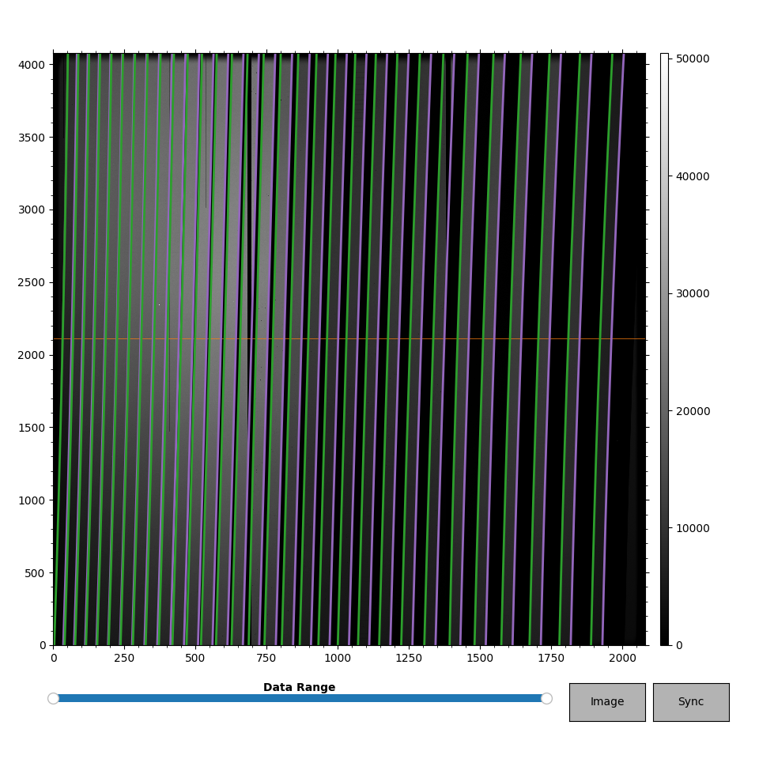

.. _slit_tracing:

============
Slit Tracing
============

Overview
========

One of the first and most crucial steps of the pipeline is to auto-magically
identify the slits (or orders) on a given detector. This is a challenging
task owing to the wide variety in:

  - the number of slits/orders,
  - the separation between slits/orders (if any)
  - the varying brightness of flats across the detector

Developing a single algorithm to handle all of these edge cases (pun
intended) is challenging if not impossible. Therefore, there are a number of
user-input parameters that one may need to consider when running PypeIt (see
below :ref:`slit_tracing_issues` and :ref:`slit_tracing_customizing`).

Underlying the effort is the :class:`~pypeit.edgetrace.EdgeTraceSet` class; see
:func:`~pypeit.edgetrace.EdgeTraceSet.auto_trace` for a description of the
algorithm.

Slit-mask design matching
-------------------------

PypeIt can incorporate information about the slit-mask design into the
slit-tracing process. This is primarily performed by
:func:`pypeit.edgetrace.EdgeTraceSet.maskdesign_matching`, which matches
the slit edges traced by PypeIt to the slit edges predicted
using the slit-mask design information stored in the observations.
Moreover, :func:`~pypeit.edgetrace.EdgeTraceSet.maskdesign_matching`
uses the predicted slit edges positions to add slit traces that have
not been detected in the image.

This functionality at the moment is implemented only for these
:ref:`slitmask_info_instruments` and is switched on by setting
``use_maskdesign`` flag in :ref:`edgetracepar` to True. Other parameters
may need to be adjusted as well, depending on the instrument (see
:ref:`slitmask_ids_report` and the relevant instrument documentation pages).

.. _slitmask_info_instruments:

Slit-mask design Spectrographs
++++++++++++++++++++++++++++++
- :doc:`../spectrographs/deimos`
- :doc:`../spectrographs/mosfire`
- :doc:`../spectrographs/lris` (limited)
- :doc:`../spectrographs/gemini_gmos` (limited)

Viewing
=======

See :doc:`edges` and :doc:`slits` for notes on how to view the
outputs related to `Slit Tracing`_.

One can also run the :ref:`pypeit_parse_slits` script on the ``Slit`` output
to get a terse description of the output.

Scripts
=======

.. _pypeit_trace_edges:

pypeit_trace_edges
------------------

Slit tracing is one of the steps in PypeIt that can be run independently of
the full reduction, using the ``pypeit_trace_edges`` script.  **If you're having
difficulty getting the slit tracing to perform as desired, we recommend you
troubleshoot the tracing using this script.**

``pypeit_trace_edges`` can be run just by providing a trace image; however, this
approach hasn't been well tested and may lead to *different results* from what
you get with :ref:`run-pypeit`.  Instead, we recommend that you first construct
the :ref:`pypeit_file` you would use to fully reduce the data (see
:ref:`pypeit_setup`) and supply that as the argument to ``pypeit_trace_edges``.

The script usage can be displayed by calling the script with the
``-h`` option:

.. include:: ../help/pypeit_trace_edges.rst

Specifically note that the ``--show`` option will show you the result of the
tracing after each main step in the process.  The ``--debug`` option provides
additional output that can be used to diagnose the parameterized fits to the
edge traces and the PCA decomposition.  Fair warning that, for images with many
slits, these plots can be laborious to wade through...

pypeit_edge_inspector
---------------------

We also provide a script that allows you to interact with and edit the traces by
hand.

.. important::
    
    **Direct, by-hand editing of the edge traces should only be used as a last
    resort!**  The automated tracing is deterministic and reproducible, whereas
    subjective by-eye adjustments to the traces are not.  If at all possible,
    you should use the parameters to fix the performance of the automated
    tracing.  Having said that, there will be cases where the limitations of the
    automated tracing algorithm(s) affect the quality of data reduction in a way
    that could be improved by simple by-hand adjustments.

The ``pypeit_edge_inspector`` script provides a interactive window (using
matplotlib) that allows you to move, add, and delete traces.  The script
requires a valid ``Edges`` calibration file and will *overwrite* this file,
regardless of whether or not you make any adjustments to the traces. For this
reason, we recommend you make a copy of the ``Edges`` (and ``Slits``)
calibration file(s) *before* executing the script.

The script usage can be displayed by calling the script with the
``-h`` option:

.. include:: ../help/pypeit_edge_inspector.rst

The interactive window looks like this:

The trace image is shown in grayscale.  The left and right traces are green and
magenta, respectively.  The orange horizontal line shows the "reference row"
used when locating new traces.  Only the vertical line of the cursor (not shown)
moves; the horizontal line always stays at the reference row.  Note that the
vertical line marking the cursor may not appear if the typical matplotlib zoom
or pan buttons are active.

Pressing the ``?`` key anywhere in the window will print the key bindings to the
terminal window:

.. code-block:: console

    --------------------------------------------------
    Key bindings
        m: Move the nearest trace to the cursor
        d: Delete the nearest trace
        l: Add a left trace
        r: Add a right trace
        U: Undo all changes since last save
        ?: Print this list of key bindings
    --------------------------------------------------

The typical matplotlib buttons work as usual.  The "Data Range" slider allows
you to change the range of data shown, and appropriately adjusts the colorbar.
The "Image" button at the bottom right allows you to toggle between the trace
image and the sobel-filtered image used to detect the slit edges.  The "Save"
button consolidates all the changes you've made, saves them to the ``Edges``
object, and attempts to synchronize left-right edges.  **Make sure you hit the
save button before closing the matplotlib window.**  Otherwise, any changes you
have made will not be saved.  After closing the window, the code **overwrites**
the ``Edges`` and ``Slits`` calibration files to include your changes.  If you
then re-execute ``run_pypeit``, the code should recognize that the files exist
and use them instead of redoing the edge tracing **as long as you don't tell the
code to do otherwise.**

.. _slit_tracing_issues:

Known Slit Tracing Issues
=========================

No Slits
--------

It is possible that the edge-tracing algorithm will not find *any* slit
edges. This may be because the edges fall off the detector, that there truly
is no data in a given detector of a multi-detector instrument (e.g.,
:doc:`../spectrographs/lris`), or the threshold for edge detection has been set too high. An
inability to find slit edges can be common for long-slit observations, but
occurs occasionally for multi-slit. If you know that a given detector should
have well-defined slit edges, try adjusting the ``edge_thresh`` parameter
(see :ref:`trace-edge-thresh`). Regardless, if PypeIt does not find any
slit edges, there are two ways it can proceed:

 1. The default behavior for *most* (but not all) instruments is to simply
    skip any detectors where the edge-tracing algorithm does not find any
    edges. If this is the case, ``run_pypeit`` will issue a warning that the
    calibrations for a given detector have failed (in ``get_slits``). For
    single-detector instruments, this means that PypeIt might exit
    gracefully without actually producing much output. For multi-detector
    instruments (e.g., DEIMOS), this means that PypeIt will skip any
    further processing of the detector and move on to the next one. If you
    already know the detectors that should be skipped, you can use the
    :ref:`pypeit_file` to *select* the detectors that should be processed
    (see the ``detnum`` parameter in :ref:`reduxpar`):

    .. code-block:: ini

        [rdx]
            detnum = 2,3,4

 2. You can force PypeIt to add left and right edges that bound the
    spatial extent of the detector using the ``bound_detector`` parameter in
    :ref:`edgetracepar`. This is required for instruments
    where the entire detector is illuminated so that the slit edges are
    projected off the detector, or for situations where the detector is
    windowed (Shane Kast) in such a way that the slit edges are not covered
    by the windowed detector. Although bounding the detector in this way
    allows the code to continue to subsequent analysis steps, using this
    approach comes with a significant warning:

    .. warning::

        When bounding the spatial extent of the detector by straight slit
        edges, the spectral curvature is not properly traced. This can lead
        to errors in the subsequent processing steps and/or highly
        sub-optimal extraction of any object spectra. If available, users
        should be sure to add a standard-star observation to the PypeIt
        file (ensuring that is classified as a ``standard`` frame), so that
        PypeIt will use the standard star trace as a crutch for object
        tracing in the ``science`` frames.

Slit PCA fails
--------------

The default tracing uses a PCA analysis that requires a minimum
number of slits to succeed.  If there aren't enough, you should
revert back to the ``nearest`` mode by setting the ``sync_predict``
keyword in :ref:`edgetracepar`, e.g.:

.. code-block:: ini

    [calibrations]
        [[slitedges]]
            sync_predict = nearest

Another option is to set ``sync_predict = auto``. This will let PypeIt
determine which mode to use between ``pca`` and ``nearest``. In general,
PypeIt will first try ``pca``, and if that is not possible, it will use ``nearest``.

.. _slit-tracing-missing-slit:

Missing a Slit
--------------

It is common for some spectrographs for the code to miss
one or more slits.  This may be mitigated by modifying the
``edge_thresh`` or ``minimum_slit_length`` keywords of
:ref:`edgetracepar`.

.. TODO: WHAT IF THE "detector" is a mosaic?  Does it need to be the tuple of
.. the detectors in the mosaic, or the mosaic number?

Otherwise, the code may be instructed to add slits at user-input
locations.  The syntax is a list of lists, with
each sub-list having syntax (all integers) ``detector:y_spec:x_spat0:x_spat1``.

For example:

.. code-block:: ini

    [calibrations]
        [[slitedges]]
            add_slits = 2:2000:2121:2322,3:2000:1201:1500

The above will add one slit on detector 2 with left/right edge at
2121/2322 at row 2000.  The shapes of the slit will be taken from
the ones that are nearest or the PCA model if it exists.

Too Many Slits
--------------

The code may identify stray light or some other spurious
feature as a slit.  This might be mitigated by increasing
the value of ``edge_thresh`` in
:ref:`edgetracepar`.  Indeed, this
is required for longslit observations
with the red camera of :doc:`../spectrographs/lris`.

.. TODO: WHAT IF THE "detector" is a mosaic?  Does it need to be the tuple of
.. the detectors in the mosaic, or the mosaic number?

Otherwise, the code may be instructed to remove slits at user-input
locations. The syntax is a list of lists,
with each sub-list having syntax (all integers):  detector:y_spec:x_spat
For example:

.. code-block:: ini

    [calibrations]
        [[slitedges]]
            rm_slits = 2:2000:2121,3:2000:1500

This will remove any slit on detector 2 that contains ``x_spat=2121``
at ``y_spec=2000`` and similarly for the slit on ``det=3``.

.. _slit_tracing_customizing:

Slit Tracing Customizing
========================

The following are settings that the user may consider
varying to improve the slit tracing.

Remember, you can test the performance of the slit-edge tracing with different
parameters using :ref:`pypeit_trace_edges`, instead of executing
:ref:`run-pypeit`.

.. _trace-edge-thresh:

Detection Threshold
-------------------

The detection threshold for identifying slits is set
relatively low to err on the side of finding more as opposed to fewer slit edges.
The algorithm can be fooled by scattered light and detector
defects.  One can increase the threshold with the ``edge_thresh``
parameter:

.. code-block:: ini

    [calibrations]
        [[slitedges]]
            edge_thresh = 30.

Then monitor the number of slits detected by the algorithm.

Presently, we recommend that you err on the conservative
side regarding thresholds, i.e. higher values of ``edge_thresh``,
unless you have especially faint trace flat frames.

On the flip side, if slit defects (common) are being
mistaken as slit edges then *increase* ``edge_thresh``
and hope for the best.

.. _trace-slit-mask_frac_thresh:

Trace Length Threshold
----------------------

When tracing, edges are found first independently, and then edge pixels are
connected by following the detected edges along the spectral direction.  Only
traces that span a specified fraction of the spectral length of the detector are
included in the set of "valid" traces to be fit with a low-order polynomial.
The specified fraction is set by the parameter ``fit_min_spec_length``.

The default value is 0.6, which may be too large for some
instruments (e.g. LRISb with the 300 grism).  Consider
lowering the value, especially if the code raised a warning
on too few edges for the PCA decomposition of the traces:

.. code-block:: ini

    [calibrations]
        [[slitedges]]
            fit_min_spec_length = 0.45

You may also need to adjust the `Smash Range`_.

Smash Range
-----------

One of the final steps in slit/order definition is to identify
edges by smashing a rectified version of the Sobolev image.
The default is to smash the entire image, but if the spectra
are primarily in a subset of the image one should consider
modifying the default parameter.  This is frequently the
case for low-dispersion data, e.g. LRISb 300 grism spectra
(which has a different default value).  Modify it as such:

.. code-block:: ini

    [calibrations]
        [[slits]]
            smash_range = 0.5,1.

Algorithm
=========

See documentation for :func:`~pypeit.edgetrace.EdgeTraceSet.auto_trace` and the
subfunctions referenced therein.

Open Issues
===========

#.  Bad columns yield fake edges.  These should be masked out by the pipeline
    using the instrument-specific bad pixel mask.
#.  Overlapping slits are notoriously difficult to detect.  One may need to
    add/subtract individual slits on occasion.

