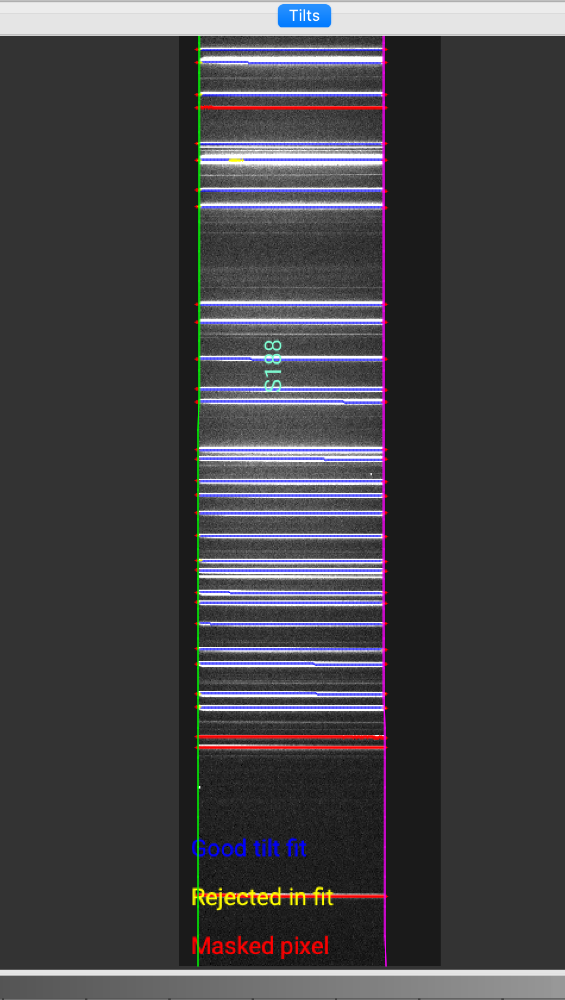
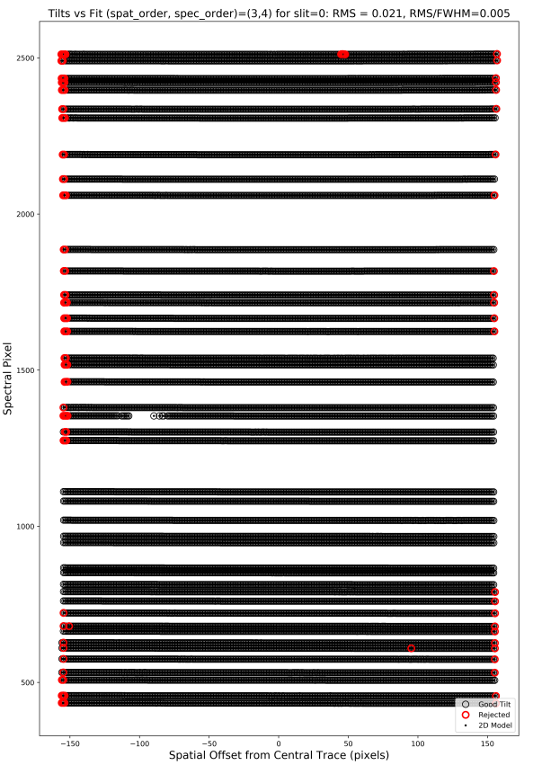
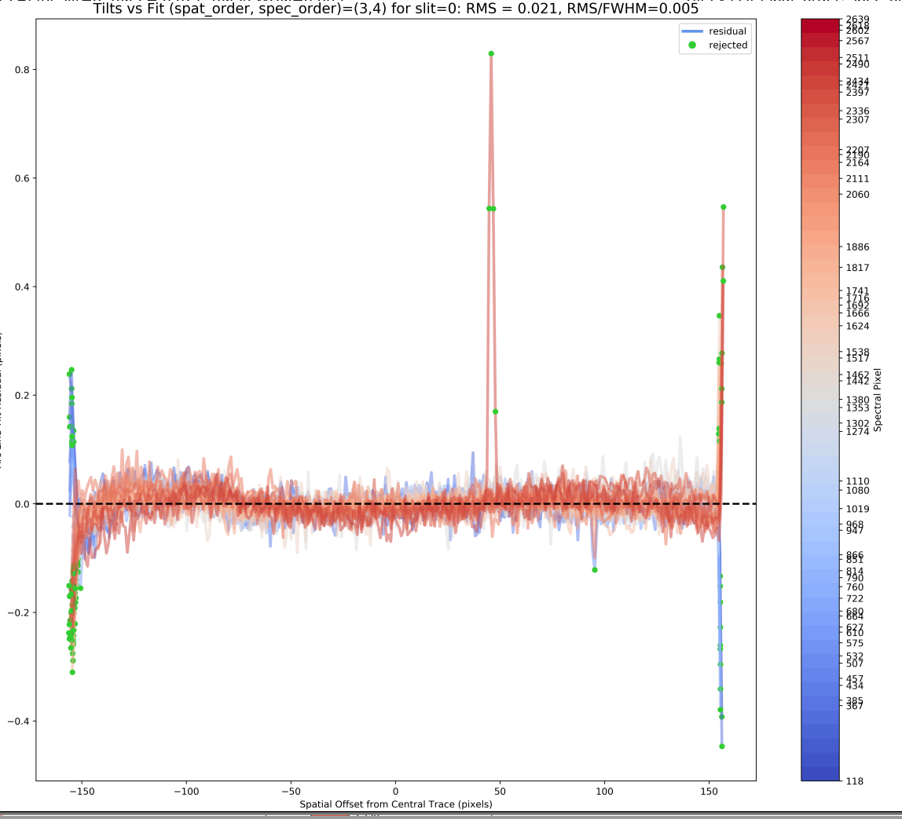
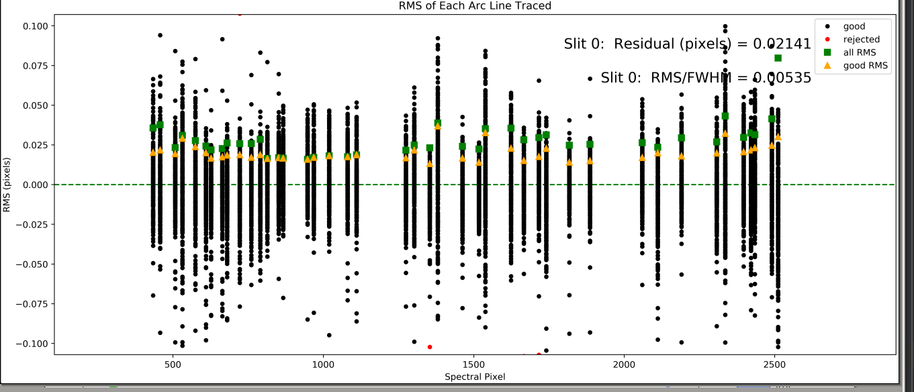

.. include:: ../include/links.rst

.. _tilts:

=====
Tilts
=====

Overview
========

This file describes the data model for the ``Tilts``.

The images are written to disk as a multi-extension FITS file
prefixed by ``Tilts`` in the ``Calibrations/`` folder.
See :ref:`calib-naming` for the naming convention.

Inspecting
==========

To examine the quality of this step the user can run the `pypeit_chk_tilts`_ script,
or inspect the PNG files generated by the code. :doc:`../qa` describes how to access them.

.. _pypeit_chk_tilts:

pypeit_chk_tilts
----------------

There are currently 2 options for viewing the traced and 2D fitted tilts on the image
used to construct them.  Each uses the `pypeit_chk_tilts`_ script.

ginga
+++++

This is the default mode when executing, e.g.:

.. code-block:: console

    pypeit_chk_tilts Calibrations/Tilts_A_0_DET01.fits

The :doc:`tilt` image is shown in ginga with the traced and 2D fitted tilts over-plotted.

Here is a zoom-in screen shot for the ``shane_kast_red`` spectrograph.

You want to check that the traced and 2D fitted tilts overlay well on the arc/OH lines.

matplotlib
++++++++++

To avoid ginga, use the `--mpl` flag:

.. code-block:: console

    pypeit_chk_tilts Calibrations/Tilts_A_0_DET01.fits --mpl

QA PNG files
------------

There are 3 PNG files generated per slit:

2D Arc Tilts
++++++++++++

This QA shows the spectral vs. spatial positions of all
the lines traced by the code.  Here is an example
from ``shane_kast_red``:

Here is what you hope to see in this QA:

 - RMS < 0.1

 - Very few red points

 - The red points are mainly at the very edges of the black lines

 - The black points span across the full detector

On the last point, if only a smaller portion of the detector
is covered, the code is extrapolating.
Indeed, the example above only shows
outputs down to ~480 Spectral Pixel, which is not ideal.
Of course, this will be the case for spectrographs
that have data which does not span the full detector.

Spat Tilts
++++++++++

This QA examines the residuals of (tilt position - model)
as a function of spatial offset along the slit.  Here
is an example from ``shane_kast_red``:

One hopes to see small residuals without any substantial
spatial dependence.  But, it is common for there to be
significant residuals at the edges of the slit
(as in this example).

Spec Tilts
++++++++++

This QA examines the residuals of (tilt position - model)
as a function of spetral offset along the slit.  Here
is an example from ``shane_kast_red``:

One hopes to see:

 - The black points scattering about 0

 - The orange and green points not too far above 0

Troubleshooting
===============

If one or more of your image appears to be in err,
here are the things to consider:

Insufficient Lines
------------------

.. todo::
    
    Explain how to add more

Current WaveTilts Data Model
============================

Internally, the image is held in
:class:`pypeit.wavetilts.WaveTilts`
which subclasses from :class:`pypeit.datamodel.DataContainer`.

The datamodel written to disk is:

.. include:: ../include/datamodel_wavetilts.rst

``TILTS`` content is:

.. include:: ../include/class_datamodel_wavetilts.rst

