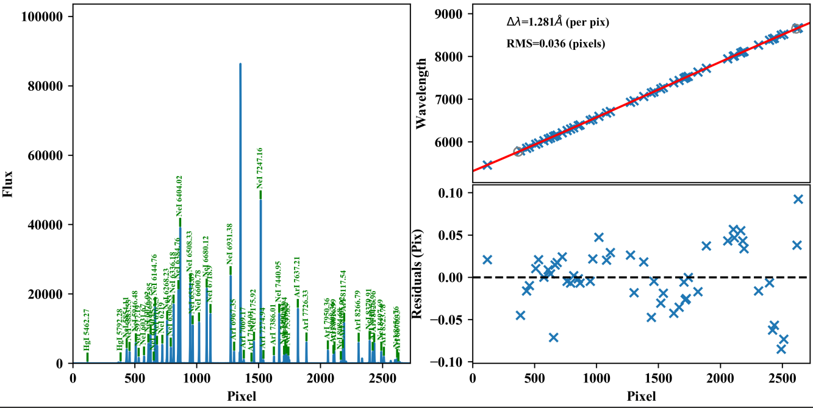

.. include:: ../include/links.rst

.. _wvcalib:

=========
WaveCalib
=========

Overview
========

This file describes the data model for the ``WaveCalib``.

The images are written to disk as a multi-extension FITS file
prefixed by ``WaveCalib`` in the ``Calibrations/`` folder.
See :ref:`calib-naming` for the naming convention.

Inspecting
==========

.. _pypeit-chk-wavecalib:

pypeit_chk_wavecalib
--------------------

You can print a set of simple diagnostics to the screen
with the **pypeit_chk_wavecalib** script, e.g. :

.. code-block:: console

    $ pypeit_chk_wavecalib Calibrations/WaveCalib_A_1_MSC03.fits

     N. SpatID minWave Wave_cen maxWave dWave Nlin     IDs_Wave_range    IDs_Wave_cov(%) measured_fwhm  RMS
    --- ------ ------- -------- ------- ----- ---- --------------------- --------------- ------------- -----
      0     35  6422.5   7753.8  9053.2 0.325   48  6508.325 -  9047.930            96.5           3.5 0.046
      1     93  6310.0   7641.4  8940.8 0.325   49  6336.179 -  8931.145            98.6           3.6 0.036
      2    140  6440.8   7772.1  9071.5 0.325   47  6508.325 -  9047.930            96.5           3.6 0.049
      3    184  6301.2   7632.6  8932.0 0.325   50  6306.533 -  8931.145            99.8           3.6 0.037
      4    243  6257.1   7588.5  8887.9 0.325   49  6268.229 -  8821.832            97.1           3.6 0.034

- ``SpatID`` is the spatial position of the slit/order.

- ``minWave``, ``maxWave``, ``Wave_cen``, ``dWave`` are, respectively, the
  minimum wavelength value, the maximum wavelength value, the central
  wavelength, and the wavelength dispersion of the calibrated arc spectra.  All
  the values are in Angstrom.

- ``Nlin``, ``IDs_Wave_range``, ``IDs_Wave_cov(%)`` are, respectively, the
  number, the wavelength range, and the spectral coverage of the identified and
  fitted arc lines.

- ``measured_fwhm`` is the measured arc lines FWHM (in binned pixels of the input
  arc frame), i.e, the approximate spectral resolution. Note that this not
  necessarily the ``fwhm`` used to identify the arc lines during the wavelength
  calibration, see :ref:`wvcalib-fwhm`.

- ``RMS`` is the RMS of the wavelength solution (in pixels).

PNGs
----

At present, the only way to visually examine the quality of this step is by
viewing the PNG file generated by the code.  :doc:`../qa` describes how to
access them.

There is 1 PNG file generated per slit.  Here is an
example from the ``shane_kast_red`` spectrograph.

What you hope to see in your QA is:

 - On the left, many of the blue arc lines marked with IDs

 - In the upper right, an RMS < 0.1 pixels

 - In the lower right, a random scatter about 0 residuals

Troubleshooting
===============

Wavelength solutions are amongst the most challenging
part of data reduction.  See :doc:`wave_calib` for
extensive details on how PypeIt performs wavelength
calibration and related issues.

Current WaveCalib Data Model
============================

Internally, the image is held in
:class:`pypeit.wavecalib.WaveCalib`
which subclasses from :class:`pypeit.datamodel.DataContainer`.

The datamodel written to disk is:

.. include:: ../include/datamodel_wavecalib.rst

