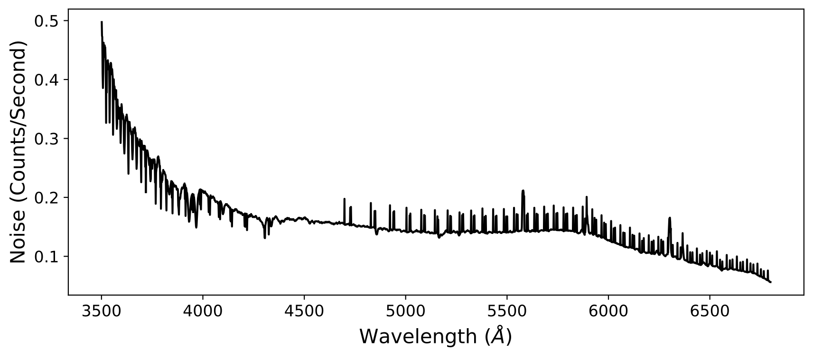
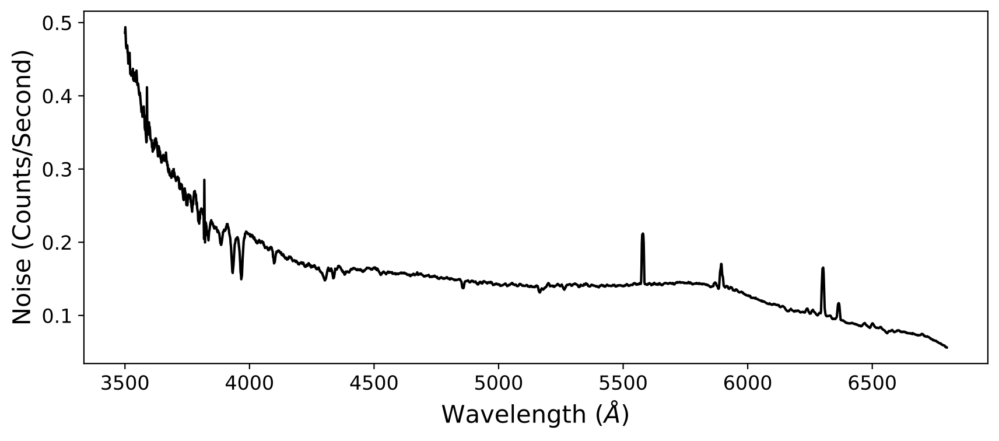

.. include:: include/links.rst

.. _coadd1d:

================
Coadd 1D Spectra
================

Overview
========

This document will describe how to combine the 1D spectra
from multiple exposures of the same object.

Coadding 1D spectra must be done outside of the data reduction pipeline (:ref:`run-pypeit`);
i.e. PypeIt will *not* coadd your spectra as
part of the data reduction process.

The current defaults use the :ref:`extraction-optimal` extraction
and :ref:`flux-calibrated<fluxing>` data.

See below for the :ref:`coadd1d_datamodel`.

.. _coadd1d_file:

coadd1d File
============

The :ref:`pypeit_coadd_1dspec` requires an
input file to guide the process.
The format of this type of :doc:`input_files`
includes a :ref:`parameter_block` (optional)
and a :ref:`data_block` (required).

We describe each in turn.

Parameter Block
---------------

This optional :ref:`parameter_block` can set the name of the 
output file 
and/or modify default parameters for the script, see :ref:`coadd1dpar`.

Here is an example:

.. code-block:: ini

    # User-defined coadding parameters
    [coadd1d]
        coaddfile = 'J1217p3905_coadd.fits'
        sensfuncfile = 'sensfunc.fits' # Required only for Echelle

The coaddfile parameter is optional, if it is not set 
the output file will be placed in the same directory as the first spec1d 
file named ``coadd1d_<target>_<instrument>_<start date>_<end date>.fits``.

.. note::

    If you are using an Echelle :doc:`spectrograph<spectrographs/spectrographs>`
    (e.g.  ``keck_nires``), you must specify a ``sensfuncfile`` generated by
    :doc:`fluxing` a standard star.

See `Parameters`_ below for common parameters modified
for coadd1d.

Data Block
----------

A :ref:`data_block` is required to indicate the spectra
to be combined.   It always begins and ends with ``coadd1d read`` and ``coadd1d end``, respectively.

One should then include the ``path`` to the :doc:`out_spec1D` files,
unless you intend to run the script within the same folder as the data.

Last, the data block provides a table of :doc:`out_spec1D` files
and the object name in each to be coadded.
See :doc:`out_spec1D` for a discussion of the naming.

Here is an example:

.. code-block:: console

    # Data block
    coadd1d read
      path /path/to/your/reduced/data/Science
                                                   filename | obj_id
      spec1d_b27-J1217p3905_KASTb_2015May20T045733.560.fits | SPAT0176-SLIT0000-DET01
      spec1d_b28-J1217p3905_KASTb_2015May20T051801.470.fits | SPAT0175-SLIT0000-DET01
    coadd1d end

It is possible to provide only a single entry (it must be the first row)
in the ``obj_id`` column.  
This will then be used for all of the :doc:`out_spec1D` files input.

The list of object identifiers in a given :doc:`out_spec1D` 
file can be output with the *pypeit_show_1dspec* script, e.g.:

.. code-block:: console

    pypeit_show_1dspec spec1d-filename.fits --list

These can also be recovered from the object info ``.txt`` files
in the ``Science/`` folder (one per exposure).

.. _pypeit_coadd_1dspec:

pypeit_coadd_1dspec script
==========================

The primary script for 1D coadding is called ``pypeit_coadd_1dspec``,
which requires a `coadd1d File`_ to guide the process.

The script usage can be displayed by calling the script with the
``-h`` option:

.. include:: help/pypeit_coadd_1dspec.rst

run
---

An example execution looks like this:

.. code-block:: console

    pypeit_coadd_1dspec FRB190714_LRISr_coadd1d_file.txt --show

A substantial set of output are printed to the screen, and
if successful the final spectrum is written to disk.
See below for the `Current Coadd1D Data Model`_.

The parameters that guide the coadd process are also written
to disk for your records. The default location is ``coadd1d.par``.
You can choose another location with the ``--par_outfile``
option (see below).

Command Line Options
--------------------

--show
++++++

At the end of the process, this will launch a `matplotlib`_ window
showing the stacked spectrum on the bottom.  The top panel
illustrates the number of pixels included in the stack.

--par_outfile
+++++++++++++

This file will hold a listing of the parameters
used to run the coadd1d process.

Parameters
==========

Here we describe a set of parameters frequently
defined in the `Parameter Block`_ of the
`coadd1d File`_.

Fluxing
-------

The default parameters assume your spectra have gone
through :doc:`fluxing`.  If not you should set:

.. code-block:: ini

    [coadd1d]
        flux_value = False

If the data were fluxed, then the output ``flux`` spectrum will have units of
:math:`[10^{-17} {\rm erg/s/cm^2/\mathrm{\mathring{A}}}]`.

Flux Scale
++++++++++

If your data has been fluxed, you may scale the coadded
spectrum to a chosen value (typically a photometric
measurement) in one of many filter curves.

To do so, you need to add the ``filter`` and ``magnitude``
to the ``[coadd1d]`` block of the `coadd1d file`_.

Here is an example:

.. code-block:: ini

    [coadd1d]
        coaddfile = 'J121555.09-130116.0_LRISr_A.fits'
        filter = PS1-R
        filter_mag = 20.85
        filter_mask = 7187:7376

The call here will convolve the coadded spectrum with the PS1 r-band filter, and
then scale the flux to give an AB magnitude of 20.85.  Furthermore, the spectral
wavelengths from :math:`7187 < \lambda < 7376 [\mathrm{\mathring{A}}]` are masked
in the analysis.

Filters
+++++++

The list of available filters is provided in
`this file <https://github.com/pypeit/PypeIt/blob/release/pypeit/data/filters/filter_list.ascii>`__.

Scaling
-------

.. TODO: Why is this here?  This info should be on the "user-level" parameters
.. page with useful clarifications here

==================   =======================  ==================================================
Parameter            Option                   Description
==================   =======================  ==================================================
scale_method         default: auto            scale the flux arrays based on the root mean
                                              square value (RMS) of the S/N^2 value for all
                                              spectra; if this RMS value is less than the
                                              minimum median scale value, no scaling is applied.
                                              If the RMS value is greater than the minimum but
                                              smaller than the maximum median scale value, the
                                              applied method is the median, as described below
--                   hand                     scale the flux arrays using values specified by
                                              the user in the input parameter 'hand_scale'. Must
                                              have one value per spectrum
--                   median                   scale the flux arrays by the median flux value
                                              of each spectra
==================   =======================  ==================================================

Wave Method
-----------

You may want to specify the method used to construct the wavelength grid for
coadding your spectra.  This is done by modifying ``wave_method`` in the
``[coadd1d]`` block of your `coadd1d file`_.  The default method is ``linear``,
which uses a fixed linear grid in wavelength.  However, this may not be ideal
depending on your instrument set-up and observations.

Here is an example of some Keck LRISb data.  After coadding the 1D spectra, you
may see a noise pattern like this:

which, while still correct, may not be desirable.  Note this figure was obtained
by plotting the quantity :math:`\frac{1}{\sqrt{\texttt{ivar}}}` using the
``ivar`` array in the second extension of the `coadd1d file`_.  This noise
pattern occurs because ``pypeit_coadd_1dspec`` does not interpolate the spectra,
in order to guarantee that neighboring pixels do not have correlated noise.
However, if your wavelength grid is such that multiple values land in one
re-binned pixel, this pattern will appear.

To avoid this noise pattern, you can modify the value of ``wave_method``.  For
example, if we use the ``iref`` option instead, the above example becomes:

The ``iref`` option uses the grid of one of the spectra that you are coadding as
the wavelength grid.  The reason why this works is because, in general, the
wavelength solution of a slit will be non-linear, so the pixel spacing will be
different between different ``wave_method`` options.  For a linear grid, the
number of exposures contributing to a given pixel in the final grid is varying
because of how non-linear grids overlap with the linear grid.  By using the
``iref`` option or a linear grid with wider spacing, this effect can be reduced.
If your data contains exposures that aren't dithered, the ``iref`` option will
coadd your exposures on the native wavelength grid, which will avoid the
fluctuations in the noise vector. 

If your data contains exposures that are dithered a lot, ``iref`` will probably
give you similar noise fluctuations, so using a linear grid with wider spacing
may give you a better result.  To change the spacing of the wavelength grid, you
can modify ``samp_fact`` in the ``[coadd1d]`` block of your `coadd1d file`_.  The
default value is 1.0.  Setting ``samp_fact`` > 1.0 over-samples (finer grid),
while setting ``samp_fact`` < 1.0 under-samples (coarser grid).

.. _coadd1d_datamodel:

Current Coadd1D Data Model
==========================

The result of the 1D coadding will be saved to a fits file.  The file name can
be provided directly using the ``coadd1dfile`` parameter in the
:ref:`coadd1d_file` or you can use the default.  The default filename convention
is ``coadd1d_<target>_<instrument name>_<YYYYMMDD>.fits`` or
``coadd1d_<target>_<instrument name>_<YYYYMMDD>-<YYYYMMDD>.fits``, if the coadd
included more than one day's worth of data. The default location of the file
will be along side the first spec1d file.  
Currently ``instrument_name`` is
taken from the ``camera`` attribute of the relevant
:class:`~pypeit.spectrographs.spectrograph.Spectrograph` class.

The format of the 1D coadd file follows the general
class :class:`~pypeit.onespec.OneSpec`, such 
that its file extensions are:

.. include:: include/datamodel_onespec.rst

You view the spectrum using the ``lt_xspec`` script 
(``pypeit_show_1dspec`` will not work), which loads the data
and launches a GUI from the `linetools`_ package. e.g.:

.. code-block:: console

    lt_xspec J1217p3905_coadd.fits

