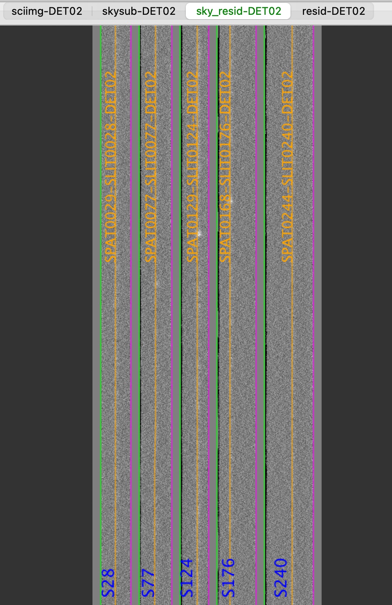
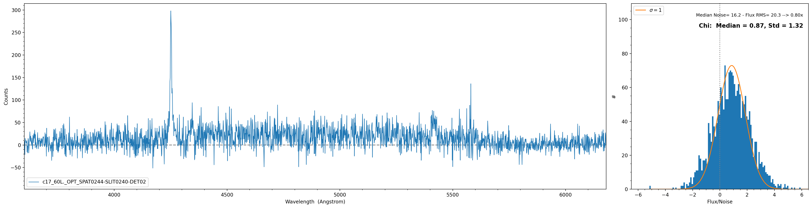
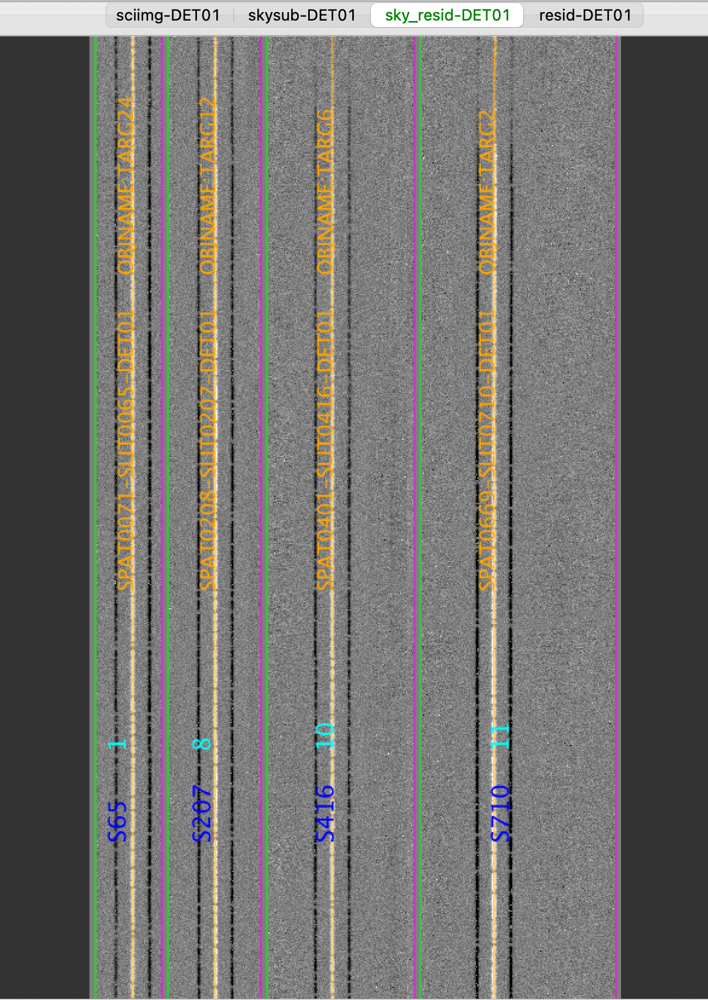

.. include:: include/links.rst

.. _coadd2d_howto:

=============
Coadd2D HOWTO
=============

Overview
========

This document explains how to run :ref:`pypeit-coadd-2dspec`, including three examples using
multi-slit observations. See `Keck/LRIS Example`_, `Keck/DEIMOS Example`_, and `Keck/MOSFIRE Example`_.

When Running the Script
-----------------------

:ref:`pypeit-coadd-2dspec` is run only after a successful main reduction (i.e., :ref:`run-pypeit`).
See :ref:`deimos_howto` for an example on how to run the main reduction for DEIMOS.

Coadd2d File
------------

Similarly to :ref:`pypeit_file`, a coadd2d file is used to guide the 2D coadding of 2D reduced
spectra and the subsequent extraction of the 1D spectra. Unlike the :ref:`pypeit_file`, the coadd2d file
needs to be generated by the user and needs to be divided into two blocks:
a `Parameter Block`_ and a `Data Block`_. Here is an example of a coadd2d file::

    # User-defined execution parameters
    [rdx]
       spectrograph = keck_mosfire
    [reduce]
        [[findobj]]
            sig_thresh=5.0
    [coadd2d]
       offsets = maskdef_offsets
       weights = uniform
       manual = 1:22.4:608.1:3.,2:22.4:608.1:3.       # det:spat:spec:fwhm

    # Read in the data
    spec2d read
    Science/spec2d_MF.20180718.22100-HIP61138_MOSFIRE_20180718T060820.621.fits
    Science/spec2d_MF.20180718.22154-HIP61138_MOSFIRE_20180718T060914.170.fits
    spec2d end

Data Block
..........

The data block includes a list of reduced 2D spectra files, which can be found in the ``Science``
folder:

.. code-block:: bash

    $ ls -1 Science/spec2d*.fits
    Science/spec2d_MF.20180718.22100-HIP61138_MOSFIRE_20180718T060820.621.fits
    Science/spec2d_MF.20180718.22154-HIP61138_MOSFIRE_20180718T060914.170.fits

Parameter Block
...............

The parameter block includes the parameters used to guide the 2D coadding and the reduction (i.e.,
object finding and extraction) of the coadded spectra. The parameters for the reduction are the same
as the ones used during the main ``PypeIt`` run, see :ref:`pypeit_par:ReducePar Keywords`.
The full set of parameters for the 2D coadding can be found here :ref:`pypeit_par:Coadd2DPar Keywords`.

The coadd2d parameter ``manual`` provides the location of the objects that the user want to manually extract.
Each object location is separated by a comma, and is constructed as ``det:spat:spec:fwhm``, which means
that the object is located in detector ``det`` at the spatial pixel ``spat`` and spectral pixel ``spec``
and it has a fwhm equal to ``fwhm``. The location of the object must be in the 2D coadded frame, therefore
:ref:`pypeit-coadd-2dspec` must be run twice: once to inspect the 2D coadded frame and locate the object,
and a second time to perform the manual extraction.

The options for the parameters ``offsets`` and ``weights`` are explained below.

offsets
+++++++

This parameter defines the offsets in spatial pixels between the frames to be coadded.
Here are the options:

- ``offset = None``: ``PypeIt`` will compute the offsets using the 1D extracted spectrum with
  the highest S/N. If such spectrum is not found in each frame that the user wants to coadd,
  ``PypeIt`` will stop with an error. In this case a list of offsets should be provided, or set
  ``offsets = maskdef_offsets`` if available. **This is the default**.

- ``offsets`` is a `list` (e.g., ``offsets = 0.,1.2,-2.5``): These values will be used as they are.

- ``offsets = maskdef_offsets``: ``PypeIt`` will use the offsets, determined during the main reduction run,
  between the position of the extracted objects and their expected position from the
  slitmask design information.

.. note::
   The ``offsets = maskdef_offsets`` option is only available for multi-slit observations and
   currently only for Keck/DEIMOS and Keck/MOSFIRE.
   Set the parameters :ref:`pypeit_par:SlitMaskPar Keywords` in the :ref:`pypeit_file` during
   the main ``PypeIt`` run to determine how ``maskdef_offsets`` are computed. See :ref:`radec_object_report`
   for more info.

weights
+++++++

This parameter defines the weights to be used in the 2D coadding.

- ``weights = auto``: ``PypeIt`` will try to compute (S/N)^2 weights using the 1D extracted spectrum with
  the highest S/N. If such spectrum is not found in each frame that the user wants to coadd,
  ``PypeIt`` will use uniform weights. **This is the default**.

- ``weights`` is a `list` (e.g., ``weights = 1.,1.,1.``): These values will be used as they are.

- ``weights = uniform``: ``PypeIt`` will use uniform weights.

Keck/LRIS Example
=================

LRIS: Create coadd2D file
-------------------------

After a successful reduction with :ref:`run-pypeit`, we create a coadd 2D file. We create a txt file
that in this case we call `keck_lris_blue_multi_600_4000_d560.coadd2d` and start filling the `Data Block`_.
We grab the 2D spectra files that we want to coadd from the `Science` folder:

.. code-block:: bash

    [INFO]    :: run_pypeit.py 143 main() - Data reduction complete
    [INFO]    :: run_pypeit.py 146 main() - Generating QA HTML

    $ ls -1 Science/spec2d*.fits
    Science/spec2d_b170320_2083-c17_60L._LRISb_20170320T055336.211.fits
    Science/spec2d_b170320_2090-c17_60L._LRISb_20170320T082144.525.fits
    Science/spec2d_b170320_2084-c17_60L._LRISb_20170320T062414.630.fits
    Science/spec2d_b170320_2091-c17_60L._LRISb_20170320T085223.894.fits

and paste them in `keck_lris_blue_multi_600_4000_d560.coadd2d`. We then fill out the `Parameter Block`_.
Our coadd2d file looks like this::

    # User-defined execution parameters
    [rdx]
      spectrograph = keck_lris_blue
      detnum = 2
    [reduce]
        [[findobj]]
            sig_thresh=5.0

    # Read in the data
    spec2d read
    Science/spec2d_b170320_2083-c17_60L._LRISb_20170320T055336.211.fits
    Science/spec2d_b170320_2090-c17_60L._LRISb_20170320T082144.525.fits
    Science/spec2d_b170320_2084-c17_60L._LRISb_20170320T062414.630.fits
    Science/spec2d_b170320_2091-c17_60L._LRISb_20170320T085223.894.fits
    spec2d end

In this case, you will notice that there are no ``[coadd2d]`` parameters here. This means that default
parameters are use: ``offsets = None`` and ``weights = auto``.

LRIS: Run
---------

Once the coadd2d file is ready, the main call is simply:

.. code-block:: bash

    $ pypeit_coadd_2dspec --file keck_lris_blue_multi_600_4000_d560.coadd2d --only_slits 30,70,111,156,216

The ``--only_slits`` option allows to perform the 2D coadding only for the selected slits.
Several options can be added to this simple run and you can find all of them in :ref:`pypeit-coadd-2dspec`.

At the beginning of the run, the user should inspect the information printed on the terminal by the script,
and verify that the offsets and they way the weights are computed are accepted. This is an example of the
information printed on the terminal:

.. code-block:: bash

    [INFO]    :: Determining offsets using brightest object on slit: 582 with avg SNR= 5.16
    (...)
                 ---------------------------------------------
                  Summary of offsets from highest S/N object found on slitid = 582
                 ---------------------------------------------
                            exp#      offset
                             0         0.00
                             1         0.13
                             2         0.24
                             3        -0.04
                 -----------------------------------------------
    [INFO]    :: Computing weights using a unique reference object with the highest S/N
    [INFO]    ::
                 -------------------------------------
                   Summary for highest S/N object
                       found on slitid = 582
                 -------------------------------------
                            exp#        S/N
                             0          5.46
                             1          4.30
                             2          5.67
                             3          5.23
                 -------------------------------------

This confirms that both offsets and weights are computed using an object with the highest S/N and shows
the report on what was found.

LRIS: Output
------------

At the end of the run the code will generate 2D and 1D spectra outputs located in the
`Science_coadd` folder. These outputs are identical to the ones generated by the main ``PypeIt``
reduction.

LRIS: Inspecting spec2d output
------------------------------

Here is a screen shot from the third tab in the *ginga* window (sky_resid-DET02) after using
:ref:`pypeit_show_2dspec`, with this explicit call:

.. code-block:: bash

    $ pypeit_show_2dspec Science_coadd/spec2d_b170320-b170320-c17.fits --det DET02

The green/magenta lines are the slit edges. The orange line shows the ``PypeIt`` trace
of the object and the orange text is the ``PypeIt`` assigned name.

See :doc:`out_spec2D` for further details.

.. _inspecting_spec1d:

LRIS: Inspecting spec1d output
------------------------------

Like for the main ``PypeIt`` reduction, a summary of all the extracted sources can be
found in the `spec1d_b170320-b170320-c17.txt` file in the `Science_coadd` folder. Here is an
example of how it looks::

    | slit |                    name | spat_pixpos | spat_fracpos | box_width | opt_fwhm |  s2n |
    |   28 | SPAT0029-SLIT0028-DET02 |        28.7 |        0.492 |      3.00 |    1.392 | 0.85 |
    |   77 | SPAT0077-SLIT0077-DET02 |        77.0 |        0.501 |      3.00 |    1.030 | 0.76 |
    |  124 | SPAT0129-SLIT0124-DET02 |       128.7 |        0.608 |      3.00 |    1.325 | 1.90 |
    |  176 | SPAT0168-SLIT0176-DET02 |       168.4 |        0.331 |      3.00 |    1.145 | 1.20 |
    |  240 | SPAT0244-SLIT0240-DET02 |       244.2 |        0.563 |      3.00 |    1.045 | 0.87 |

The spec1d can also be inspected with the script ``pypeit_chk_noise_1dspec``, which show the spec1D for
visual inspection and a noise diagnostic plot. Here is an example of the call and how the plots looks:

.. code-block:: bash

    $ pypeit_chk_noise_1dspec Science_coadd/spec1d_b170320-b170320-c17.fits --pypeit_name SPAT0244-SLIT0240-DET02

The plot on the right is showing the distribution of Flux/Noise of the extracted spectrum. In this example
there is clearly flux coming from the object that bias the Flux/Noise diagnostic plot. However, this script
provide the possibility to select a region in the spectrum without emission to be used for the diagnostic plot.
You can find more info by running ``pypeit_chk_noise_1dspec -h``.

Keck/DEIMOS Example
===================

DEIMOS: Create coadd2D file
---------------------------

After a successful reduction with :ref:`run-pypeit`, we create a coadd 2D file.
Our coadd2d file is called `keck_deimos_1200g_m_7750.coadd2d` and looks like this::

    # User-defined execution parameters
    [rdx]
        spectrograph = keck_deimos
        detnum = 7
    [reduce]
        [[findobj]]
             sig_thresh = 10.0
    [coadd2d]
       offsets = maskdef_offsets
       weights = auto

    # Read in the data
    spec2d read
    Science/spec2d_DE.20170425.50487-dra11_DEIMOS_20170425T140121.014.fits
    Science/spec2d_DE.20170425.51771-dra11_DEIMOS_20170425T142245.350.fits
    Science/spec2d_DE.20170425.53065-dra11_DEIMOS_20170425T144418.240.fits
    spec2d end

.. note::
   As you can see we set ``offsets = maskdef_offsets``. For this DEIMOS dataset we computed the
   ``maskdef_offsets`` in the main ``PypeIt`` reduction by using these parameters in the :ref:`pypeit_file`::

       [reduce]
          [[slitmask]]
             use_alignbox = True

   which means that the offsets have been computed using the stars in the alignment boxes.

DEIMOS: Run
-----------

Once the coadd2d file is ready, the main call is simply:

.. code-block:: bash

    $ pypeit_coadd_2dspec --file keck_deimos_1200g_m_7750.coadd2d

The script will print in the terminal something like this:

.. code-block:: bash

    [INFO]    :: Determining offsets using maskdef_offset recoded in SlitTraceSet
    [INFO]    ::
                 ---------------------------------------------
                  Summary of offsets from maskdef_offset
                 ---------------------------------------------
                            exp#      offset
                             0         0.00
                             1         0.24
                             2         0.96
                 -----------------------------------------------
    [INFO]    :: Computing weights using a unique reference object with the highest S/N
    [INFO]    ::
                 -------------------------------------
                   Summary for highest S/N object
                       found on slitid = 1037
                 -------------------------------------
                            exp#        S/N
                             0         19.38
                             1         20.50
                             2         19.91
                 -------------------------------------

This confirms our choice for how to compute offsets and weights and shows the report on what was found.

DEIMOS: Inspecting spec2d output
--------------------------------

Here is a screen shot from the third tab in the *ginga* window (sky_resid-DET07) after using
:ref:`pypeit_show_2dspec`, with this explicit call:

.. code-block:: bash

    $ pypeit_show_2dspec Science_coadd/spec2d_DE.20170425.50487-DE.20170425.53065-dra11.fits --det DET07

.. image:: figures/coadd2d_keck_deimos.png

The green/magenta lines are the slit edges. The orange line shows the ``PypeIt`` trace
of the object and the orange text is the ``PypeIt`` assigned name plus the object name from the slitmask design.
Yellow lines and text indicate sources that had insufficient S/N for detection, but were force extracted
using the information in the slitmask design.

See :doc:`out_spec2D` for further details.

DEIMOS: Inspecting spec1d output
--------------------------------

A summary of all the extracted sources can be found in the `spec1d_DE.20170425.50487-DE.20170425.53065-dra11.txt`
file in the `Science_coadd` folder. See :ref:`deimos_howto:Spec1D` for an example of this file with the
explanation for some columns.

The spec1d can also be inspected with the script ``pypeit_chk_noise_1dspec``, which show the spec1D for
visual inspection and a noise diagnostic plot. See example in :ref:`inspecting_spec1d`.

Keck/MOSFIRE Example
====================

MOSFIRE: Create coadd2D file
----------------------------

After a successful reduction with :ref:`run-pypeit`, we create a coadd 2D file.
Our coadd2d file is called `keck_mosfire.coadd2d` and looks like this::

    [rdx]
    spectrograph = keck_mosfire
    [coadd2d]
       offsets = maskdef_offsets
       weights = auto

    # Read in the data
    spec2d read
    Science/spec2d_m120910_0163-MOSFIRE_DRP_MAS_MOSFIRE_20120910T123447.585.fits
    Science/spec2d_m120910_0164-MOSFIRE_DRP_MAS_MOSFIRE_20120910T123537.585.fits
    spec2d end

.. note::
   For this MOSFIRE dataset we computed the ``maskdef_offsets`` in the main ``PypeIt`` reduction
   by using these parameters in the :ref:`pypeit_file`::

       [reduce]
          [[slitmask]]
             use_dither_offset = False
             bright_maskdef_id = 1

   which means that the offsets have been computed using a bright object in the slit with
   `Slit_Number=1`.

MOSFIRE: Run
------------

Once the coadd2d file is ready, the main call is simply:

.. code-block:: bash

    $ pypeit_coadd_2dspec --file keck_mosfire.coadd2d --only_slits 1987,721,410,151

The ``--only_slits`` option allows to perform the 2D coadding only for the selected slits.

The script will print in the terminal something like this:

.. code-block:: bash

    [INFO]    :: Determining offsets using maskdef_offset recoded in SlitTraceSet
    [INFO]    ::
                 ---------------------------------------------
                  Summary of offsets from maskdef_offset
                 ---------------------------------------------
                            exp#      offset
                             0         0.00
                             1        -27.81
                 -----------------------------------------------
    [INFO]    :: Computing weights using a unique reference object with the highest S/N
    [INFO]    ::
                 -------------------------------------
                   Summary for highest S/N object
                       found on slitid = 151
                 -------------------------------------
                            exp#        S/N
                             0         18.77
                             1         19.36
                 -------------------------------------

MOSFIRE: Inspecting spec2d output
---------------------------------

Here is a screen shot from the third tab in the *ginga* window (sky_resid-DET01) after using
:ref:`pypeit_show_2dspec`, with this explicit call:

.. code-block:: bash

    $ pypeit_show_2dspec Science_coadd/spec2d_m120910-m120910-MOSFIRE.fits

MOSFIRE: Inspecting spec1d output
---------------------------------

A summary of all the extracted sources can be found in the `spec1d_m120910-m120910-MOSFIRE.txt` file
in the `Science_coadd` folder. Here is an example::

    | slit |                    name | maskdef_id | objname |     objra |   objdec | spat_pixpos | spat_fracpos | box_width | opt_fwhm |   s2n | maskdef_extract |
    |   65 | SPAT0071-SLIT0065-DET01 |          1 |  TARG24 | 344.92242 | 33.00392 |        70.9 |        0.549 |      3.00 |    0.730 | 19.25 |           False |
    |  207 | SPAT0208-SLIT0207-DET01 |          8 |  TARG12 | 345.00158 | 33.00703 |       207.7 |        0.501 |      3.00 |    0.630 | 22.81 |           False |
    |  416 | SPAT0401-SLIT0416-DET01 |         10 |   TARG6 | 345.02304 | 33.01136 |       401.2 |        0.437 |      3.00 |    0.640 | 18.35 |           False |
    |  710 | SPAT0669-SLIT0710-DET01 |         11 |   TARG2 | 345.04113 | 33.01283 |       668.7 |        0.373 |      3.00 |    0.656 | 28.52 |           False |

The spec1d can also be inspected with the script ``pypeit_chk_noise_1dspec``, which show the spec1D for
visual inspection and a noise diagnostic plot. See example in :ref:`inspecting_spec1d`.

