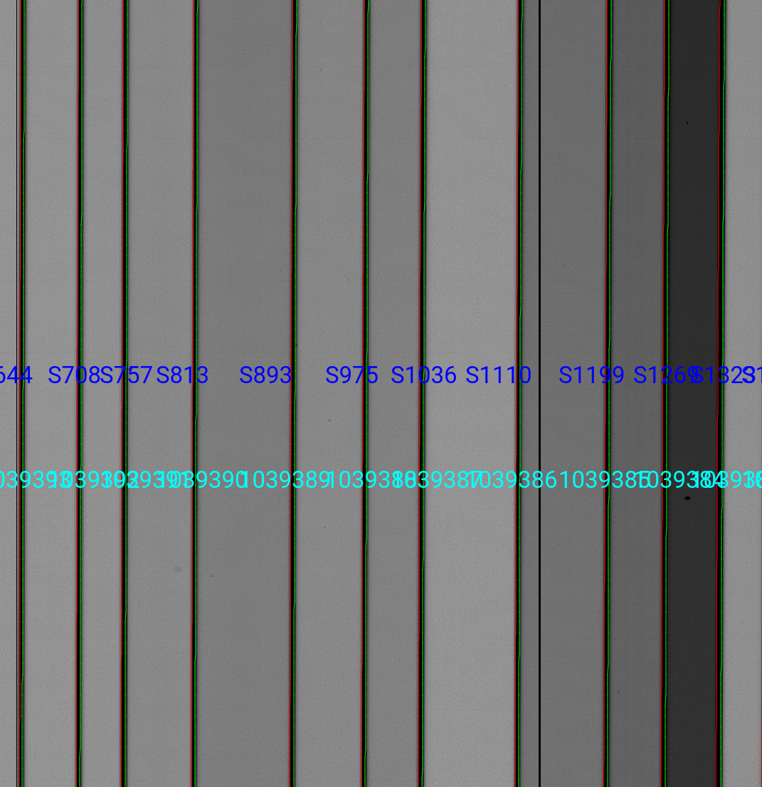
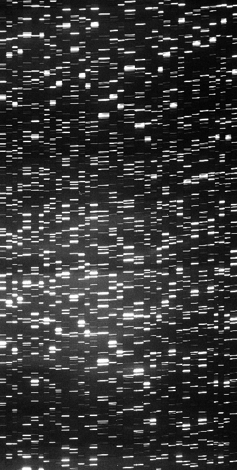
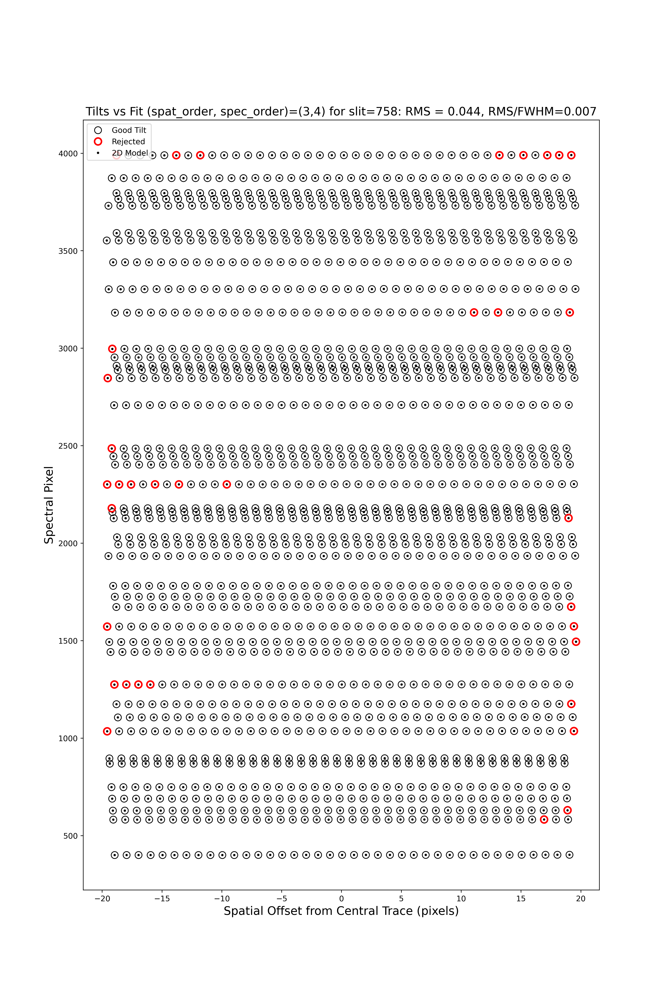
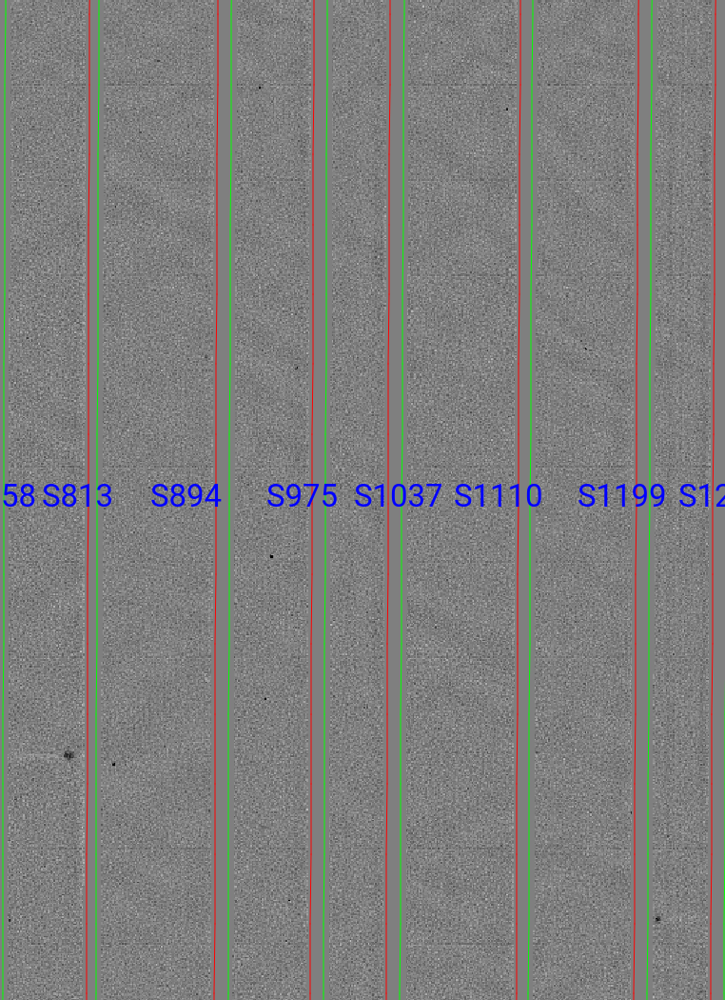

.. _deimos_howto:

============
DEIMOS HOWTO
============

Overview
========

This doc goes through a full run of ``PypeIt`` on a multi-slit
observations with Keck/DEIMOS.

Setup
=====

Organize data
-------------

Place all of the files in a single folder. Mine is named
``/home/xavier/Projects/PypeIt-development-suite/RAW_DATAkeck_deimos/1200G_M_7750``
(which I will refer to as ``RAW_PATH``) and the files within are:

.. code-block:: bash

    $ ls
    DE.20170425.09554.fits.gz  DE.20170425.09803.fits.gz  DE.20170425.53065.fits.gz
    DE.20170425.09632.fits.gz  DE.20170425.50487.fits.gz  
    DE.20170425.09722.fits.gz  DE.20170425.51771.fits.gz

It is perfectly fine for the files to contain more than one mask 
or observations with various gratings.  But be sure to include
all of the calibrations for each. 

Run ``pypeit_setup``
--------------------

The first script you will run with ``PypeIt`` is :ref:`pypeit_setup` which
examines your raw files and generates a sorted list and (when instructed)
one :doc:`pypeit_file` per instrument configuration.

Complete instructions are provided in :doc:`setup`.

Here is my call for these data::

    cd folder_for_reducing   # this is usually *not* the raw data folder
    pypeit_setup -r RAW_PATH/DE. -s keck_deimos -c A

This creates a :doc:`pypeit_file` in the folder named
*keck_deimos_A* beneath where the script was run.
Note that RAW_PATH should be the *full* path, i.e. including a /
at the start.  

If your files included more than one setup (including multiple
masks), then you may wish to replace ``A`` with ``B`` or some
other setup indicator.  Inspect the .sorted file in the setup_files
folder to see all the options.

Mine looks like this::

    # Auto-generated PypeIt file
    # Tue 20 Apr 2021 12:37:45

    # User-defined execution parameters
    [rdx]
    spectrograph = keck_deimos

    # Setup
    setup read
        Setup A:
            dispname: 1200G
            decker: dra11
            binning: 1,1
            dispangle: 7699.95654297
                amp: SINGLE:B
    setup end

    # Read in the data
    data read
    path /home/xavier/Projects/PypeIt-development-suite/RAW_DATA/keck_deimos/1200G_M_7750
    |                  filename |                 frametype |                 ra |                dec |  target | dispname | decker | binning |          mjd |    airmass | exptime |     dispangle |      amp |    dateobs |         utc |
    | DE.20170425.09554.fits.gz |                  arc,tilt |  57.99999999999999 |               45.0 | unknown |    1200G |  dra11 |     1,1 | 57868.110529 | 1.41291034 |     1.0 | 7699.95654297 | SINGLE:B | 2017-04-25 | 02:39:14.41 |
    | DE.20170425.09632.fits.gz | pixelflat,illumflat,trace |  57.99999999999999 |               45.0 | unknown |    1200G |  dra11 |     1,1 | 57868.111418 | 1.41291034 |    12.0 | 7699.95654297 | SINGLE:B | 2017-04-25 | 02:40:32.06 |
    | DE.20170425.09722.fits.gz | pixelflat,illumflat,trace |  57.99999999999999 |               45.0 | unknown |    1200G |  dra11 |     1,1 | 57868.112443 | 1.41291034 |    12.0 | 7699.95654297 | SINGLE:B | 2017-04-25 | 02:42:02.26 |
    | DE.20170425.09803.fits.gz | pixelflat,illumflat,trace |  57.99999999999999 |               45.0 | unknown |    1200G |  dra11 |     1,1 | 57868.113392 | 1.41291034 |    12.0 | 7699.95654297 | SINGLE:B | 2017-04-25 | 02:43:23.16 |
    | DE.20170425.50487.fits.gz |                   science | 260.04999999999995 | 57.958444444444446 |   dra11 |    1200G |  dra11 |     1,1 | 57868.584271 |  1.2765523 |  1200.0 | 7699.95654297 | SINGLE:B | 2017-04-25 | 14:01:27.15 |
    | DE.20170425.51771.fits.gz |                   science | 260.04999999999995 | 57.958444444444446 |   dra11 |    1200G |  dra11 |     1,1 | 57868.599136 | 1.29137753 |  1200.0 | 7699.95654297 | SINGLE:B | 2017-04-25 | 14:22:51.01 |
    | DE.20170425.53065.fits.gz |                   science | 260.04999999999995 | 57.958444444444446 |   dra11 |    1200G |  dra11 |     1,1 |   57868.6141 | 1.31412428 |  1000.0 | 7699.95654297 | SINGLE:B | 2017-04-25 | 14:44:25.52 |
    data end

In this example, all of the frametypes were accurately assigned
in the :doc:`pypeit_file`, so there are no edits to be made.
This should generally be the case for DEIMOS.

On the other hand, it is the user's responsibility to remove
any bad (or undesired) calibration or science frames from the
list.  Either delete them altogether or comment out with a #.

Note:  we generally recommend to *not* use bias frames with DEIMOS.

I am going to restrict the reduction to only one of the 8 detectors
in the DEIMOS mosaic.  Here detector 7, which is one of the middle
chips and the redder spectra.  I do this by editing the PypeIt file
and its parameter block to now read::

    # User-defined execution parameters
    [rdx]
    spectrograph = keck_deimos
    detnum = 7

A full run with all 8 detectors is both long and may 
tax (or exceed) the RAM of your computer.  
Therefore, you may wish
to reduce 1 or 2 detectors at a time in this fashion.

Main Run
========

Once the :doc:`pypeit_file` is ready, the main call is
simply::

    cd keck_deimos_A
    run_pypeit keck_deimos_A.pypeit -o

The "-o" specifies to over-write any existing science
output files.  As there are none, it is superflous but we
recommend (almost) always using it.

The :doc:`running` doc describes the process in some
more detail.

Inspecting Files
================

As the code runs, a series of files are written to the disk.

Calibrations
------------

The first set are :doc:`calibrations`.
What follows are a series of screen shots
and :doc:`qa` PNGs produced by *PypeIt*.

Slit Edges
++++++++++

The code will automatically assign edges to each slit on the
detector.  This includes using inform from the slitmask design
recorded in the FITS file, as described in :doc:`dev/deimos_slitmask_ids`

Here is a zoom-in screen shot from the first tab in the *ginga*
window after using
the :ref:`pypeit_chk_edges` script, with this explicit call
(be patient with *ginga*)::

    pypeit_chk_edges Masters/MasterEdges_A_1_07.fits.gz

Note the 07 in the filename refers to the detector 7.

The data is the combined flat images and the green/red
lines indicate the left/right slit edges.  The dark blue
labels are the internal slit identifiers of PypeIt.
The cyan numbers are the user-assigned ID values of the slits.

See :doc:`master_edges` for further details.

Arc
+++

Here is a screen shot of most of the arc image as viewed
with *ginga*::

    ginga Masters/MasterArc_A_1_07.fits

As typical of most arc images, one sees a series
of arc lines, here oriented approximately horizontally. 

See :doc:`master_arc` for further details.

Wavelengths
+++++++++++

One should inspect the :doc:`qa` for the wavelength
calibration.  These are PNGs in the QA/PNG/ folder.

Note:  there are multiple files generated for every slit.
When the reduction is complete, you may prefer to scan
through them by opening the HTML file under QA/.

1D
::

Here is an example of the 1D fits, written to
the QA/PNGs/Arc_1dfit_A_1_07_S0758.png file:

.. image:: figures/deimos_arc1d.png

What you hope to see in this QA is:

 - On the left, many of the blue arc lines marked with green IDs
 - In the upper right, an RMS < 0.1 pixels
 - In the lower right, a random scatter about 0 residuals

See :doc:`master_wvcalib` for further details.

2D
::

There are several QA files written for the 2D fits.
Here is QA/PNGs/Arc_tilts_2d_A_1_07_S0758.png:

Each horizontal line of black dots is an arc line.
Red points were rejected in the 2D fitting.  Provided
most were not rejected, the fit should be good.
An RMS<0.1 is also desired for this fit.

See :doc:`master_wvcalib` for further details.

Flatfield
+++++++++

The code produces flat field images for correcting
pixel-to-pixel variations and illumination of the detector.

Here is a zoom-in screen shot from the first tab in the *ginga*
window (pixflat_norm) after using
:ref:`pypeit_chk_flats`, with this explicit call::

    pypeit_chk_flats Masters/MasterFlat_A_1_07.fits

One notes the pixel-to-pixel variations;  these are
at the percent level.
The slit edges defined by the code
are also plotted (green/red lines).
The regions of the detector beyond the slit
boundaries have been set to unit value.

See :doc:`master_flat` for further details.

Spectra
-------

Eventually (be patient), the code will start
generating 2D and 1D spectra outputs.  One per standard
and science frame, located in the *Science/* folder.

Spec2D
++++++

Slit inspection
===============

It is frequently useful to view a summary of the slits
successfully reduced by PypeIt.  The
:ref:`pypeit_chk_2dslits`, with this explicit call::

Visual inspection
=================

Here is a screen shot from the third tab in the *ginga*
window (sky_resid-det01) after using
:ref:`pypeit_show_2dspec`, with this explicit call::

    pypeit_show_2dspec Science/spec2d_b27-J1217p3905_KASTb_2015may20T045733.560.fits

.. image:: figures/kastb_spec2d.png

The green/red lines are the slit edges.
The white line down the center is the object.
The orange line shows the *PypeIt* trace
of the object and the orange text is the
*PypeIt* assigned name.
The night sky and emission lines have been subtracted.

See :doc:`out_spec2D` for further details.

Spec1D
++++++

Here is a screen shot from the GUI showing the
1D spectrum after using
:ref:`pypeit_show_1dspec`, with this explicit call::

    pypeit_show_1dspec Science/spec1d_b27-J1217p3905_KASTb_2015may20T045733.560.fits

.. image:: figures/kastb_spec1d.png

This uses the
`XSpecGUI <https://linetools.readthedocs.io/en/latest/xspecgui.html>`_
from the *linetools* package.

See :doc:`out_spec1D` for further details.

Fluxing
=======

Now that we have a reduced standard star spectrum, we can
use that to generate a sensitivity file.  Here is the
call for this example, which I run in the Science/ folder::

    pypeit_sensfunc spec1d_b24-Feige66_KASTb_2015may20T041246.960.fits -o Kastb_feige66_sens.fits

See :doc:`fluxing` for further details.
