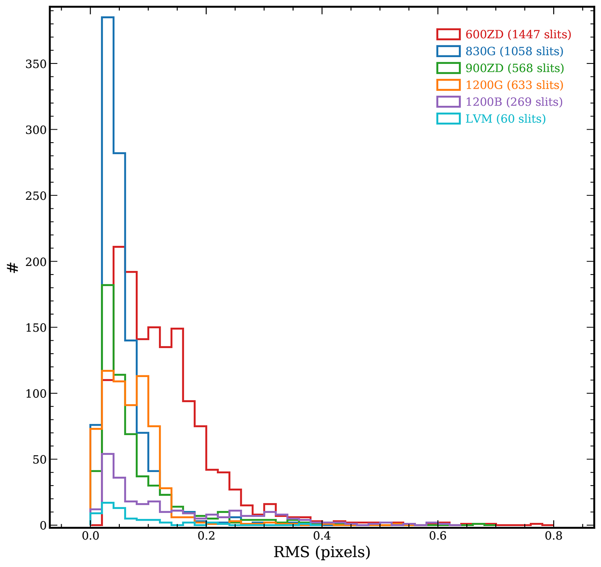
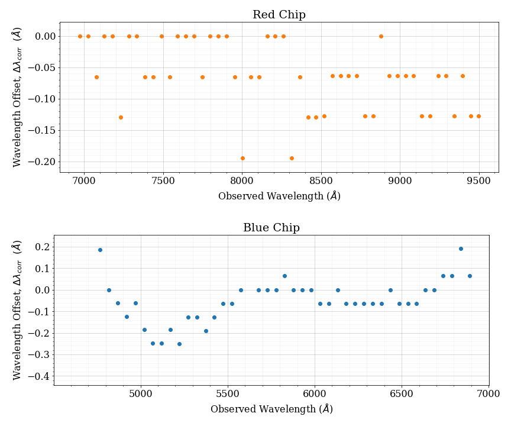

.. include:: ../include/links.rst

.. _deimos_wavecalib:

DEIMOS Wavelength Calibration
=============================

Version History
---------------

=========   ================   =========== ===========
*Version*   *Author*           *Date*      ``PypeIt``
=========   ================   =========== ===========
1.0         Debora Pelliccia   23 Feb 2021  1.3.2dev
1.1         Kyle Westfall      23 Mar 2023  1.12.2dev
=========   ================   =========== ===========

----

Basics
------

The procedure used to wavelength calibrate DEIMOS spectra follows the ``PypeIt`` general
procedure described in :ref:`wave_calib`. The user can choose among three :ref:`wvcalib-algorithms`
, or a :ref:`wvcalib-byhand`, to perform the wavelength calibration. :ref:`wvcalib-fulltemplate`
is the preferred algorithm for DEIMOS and it is set as the default one.

Procedure
---------
DEIMOS wavelength calibration is primarily performed by :func:`~pypeit.core.wavecal.autoid.full_template`.
This function requires the existence of an archived calibrated arc spectrum (i.e., `template`) stored in
``pypeit/data/arc_lines/reid_arxiv``. For DEIMOS we created, using the procedure described in
:ref:`construct_template`, five `templates` (one per each grating) spanning a wide range of wavelengths:

    ======================== ===============================
     keck_deimos_600ZD.fits  (~3500-10000 |AA|)
     keck_deimos_830G.fits   (~4500-11000 |AA|)
     keck_deimos_900ZD.fits  (~3500-10000 |AA|)
     keck_deimos_1200G.fits  (~4200-10000 |AA|)
     keck_deimos_1200B.fits  (~3800-7000 |AA|)
    ======================== ===============================

The :ref:`wvcalib-fulltemplate` algorithm performs, first, a cross-correlation between each observed arc spectrum
and the relevant archived `template` to obtain a rough estimate of the shift in wavelengths. The input arc spectrum
is then divided into snippets (in order to reduce non-linearities) and the cross-correlation against the `template`
is performed again for each snippet to get a better estimate of the shift+stretch in wavelengths, which is then
applied to the input spectrum. The wavelength solution is determined by using arc lines, detected in the input
spectrum, that match the wavelengths recorded in the :ref:`wvcalib-linelists` (stored as as ASCII tables
in ``/pypeit/data/arc_lines/lists``).

Application
-----------

To wavelength calibrate DEIMOS spectra using the :ref:`wvcalib-fulltemplate` algorithm, the **method**
keyword in :ref:`wavelengthsolutionpar` must be set to **full_template** and the file name of the
relevant `template` must be specified in the **reid_arxiv**.
These are by default set for DEIMOS.

Some of other relevant :ref:`wavelengthsolutionpar` are: **nsnippet**, **sigdetect**, **fwhm**,
**fwhm_fromlines**.

- **nsnippet** sets the number of snippets the arc spectrum is divided into, when the second cross-correlation is
  performed. The default is **nsnippet=2**.

- **sigdetect** sets a threshold for the detection of the lines in the input arc spectrum. Only arc lines detected
  with a significance above this threshold will be used for the determination of the wavelength solution. The
  default is **sigdetect = 5.0**.

- **fwhm** is an assumed value of the arc lines FWHM (i.e., spectral resolution) in unbinned pixels. The default for
  DEIMOS is **fwhm = 6.0**, but it may not work well if wider slits are used (slit width >1"), or for LVM slits. The
  keyword **fwhm_fromlines** should take care of this and override the assumed **fwhm**.

- **fwhm_fromlines**, if set to **True**, allows ``PypeIt`` to compute the arc lines FWHM from the lines with the highest
  detection significance. The FWHM computed in this way will override the assumed **fwhm**, which will still be used
  as first guess. The default for DEIMOS is **fwhm_fromlines = True**.

See :ref:`wavelengthsolutionpar` for all the parameters that guide the wavelength calibration.

Access
------

Users can access the DEIMOS wavelength calibration information in a couple of ways:

- Inspecting the Quality Assurance (QA) plot generated by ``PypeIt`` and saved in PNG files.
- Running ``pypeit_chk_wavecalib Calibrations/WaveCalib_X_X_XX.fits``, which prints wavelength solution
  information for each slit.

See :ref:`wvcalib` for more information.

If the user prefers to manually wavelength calibrate, it can be done by running
``pypeit_identify Arc_X_X_XX.fits Slits_X_X_XX.fits.gz``. See :ref:`wvcalib-byhand`
for more details.

Testing
-------

Requirements state:

* PD-20: "As a user, I expect automatic wavelength calibration for all slits to succeed (for narrow slits, 0.7"-2")"

    * PD-21: "Use arcs to provide wavelength solutions for narrow slits (0.7" - 2")"

    * PD-22: "Use special blue arcs to cover the bluest observations"

* PD-37:  "The pipeline produces a wavelength solution as accurate as the one derived starting from an optical model"

``PypeIt`` meets these requirements as demonstrated by the tests performed by the ``PyPeIt`` team and described below.

Description
^^^^^^^^^^^

We performed the wavelength calibration on a large sample of 36 DEIMOS datasets spanning a wide range of wavelengths,
gratings, central wavelengths, and slit widths:

======== ==========================================================================================================
Grating    Central wavelength (slit width)
======== ==========================================================================================================
600ZD     5500 |AA| (1"), 6000 |AA| (1.5"), 6100 |AA| (1"), 6300 |AA| (1"), 6500 |AA| (1"), 7000 |AA| (0.8"),
          7200 |AA| (1"), 7500 |AA| (1"), 7900 |AA| (1"), 8000 |AA| (1.2")
830G      6720 |AA| (1"), 7500 |AA| (1"), 7800 |AA| (1"), 8100 |AA| (0.6"), 8100 |AA| (1"), 8580 |AA| (1"),
          8580 |AA| (1"), 9000 |AA| (1")
900ZD     5500 |AA| (0.7"), 6000 |AA| (1"), 8000 |AA| (0.75")
1200G     5500 |AA| (1"), 6700 |AA| (1"), 7200 |AA| (1"), 7750 |AA| (0.7"), 8800 |AA| (1")
1200B     5200 |AA| (1"), 5280 |AA| (1"), 5500 |AA| (0.85")
======== ==========================================================================================================

Including six datasets using LVM slitmask, which is a special slitmask composed of 5 slits with different widths
(0.7", 0.8", 1.", 1.2", 1.5"). These datasets were taken with the following gratings (and central wavelengths):
830G (8400 |AA|), 600ZD (7100 |AA|), 830G (7900 |AA|), 1200G (7800 |AA|), 1200B (5450 |AA|), 1200B (5200 |AA|).

Results
^^^^^^^

Out of the **4072 slits** that have been tested, for only **37 (0.9%)** the wavelength calibration failed or
was wrong. From a visual inspection, we found that the success of the wavelength calibration is mostly
influenced by the quality of the arc spectra. In particular, artifacts, noisy spectra, ghosts, and strong
emission from adjacent slits are the main responsible for failed or bad wavelength calibration. For these cases,
the only way to obtain a wavelength calibration may be to perform a wavelength calibration by hand (see
:ref:`wvcalib-byhand`).

To further investigate the quality of the wavelength calibration, we inspected the distribution of the
wavelength solution RMS (in pixels), reported below (left panel), and we found that the majority of the
calibrated spectra have RMS<0.2 pixels.

Moreover, by comparing the wavelength calibration performed with ``PypeIt`` to the one performed with
the *DEEP2 IDL-based pipeline*, which produces wavelength solutions using the DEIMOS optical model, we found
very small wavelength offsets (~0.1 |AA|). See right panel below (dataset obtained with 600ZD grating, kindly
provided by Kevin McKinnon).

.. |AA|  unicode:: U+000C5 .. Angstrom