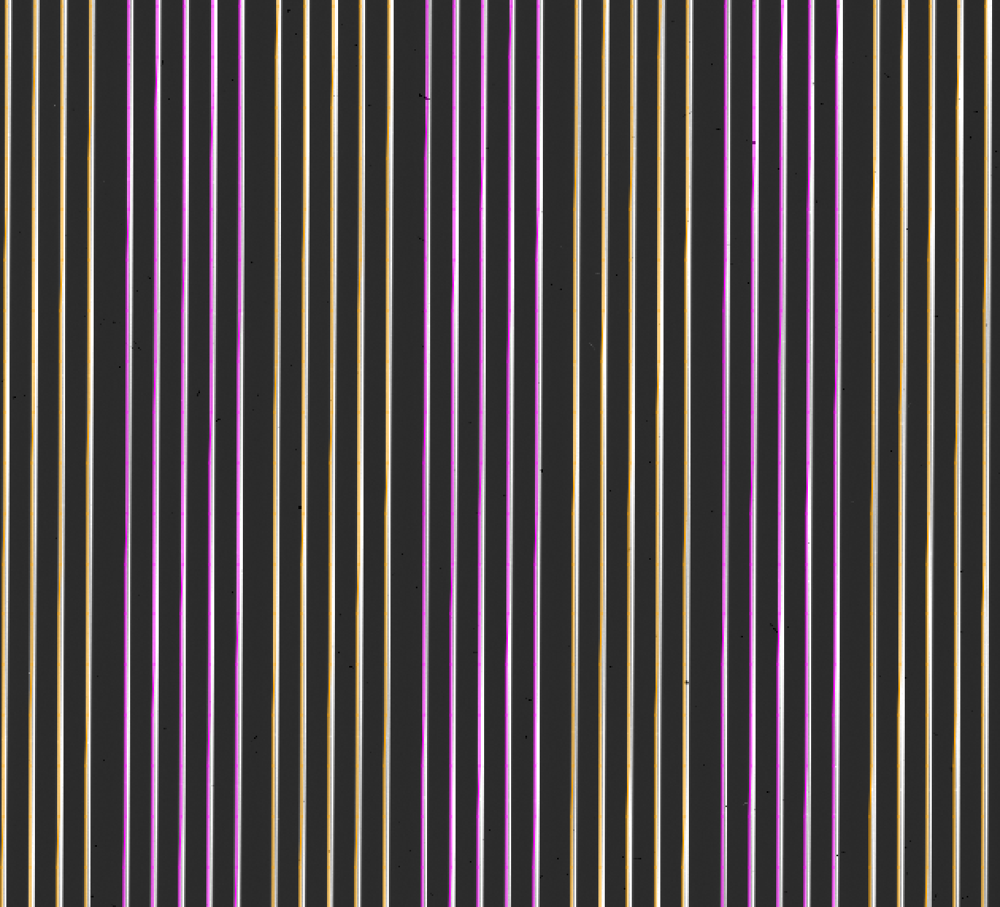

===========
MasterAlign
===========

Overview
========

This file describes the data model for the `MasterAlign`_ image.
It is generally a simple combination of all input alignment frames,
which are used to trace constant spatial position on a slit. These
frames are useful in slit-based IFUs (e.g. `cbar` frames for KCWI).

The image is written to disk as a multi-extension FITS file
prefixed by ``MasterAlignment`` in the Masters/ folder.
See :ref:`masters:Masters Naming` for the naming convention.

Inspecting
==========

The first extension is the combined image.
You can view it with any standard image viewer, e.g.::

    ginga Masters/MasterAlignment_A_1_01.fits

The image will also be a trimmed portion of the
raw image and also re-oriented
so that vertical is the spectral dimension with blue at the bottom.

Here is an screen shot of a `ginga` view for an example from
the `keck_kcwi` spectrograph.

The alignment traces are color-coded by the slit number (i.e. the
color alternates between orange and purple for each slit). In the
example above, each slit contains five contbars which are used for
the spatial alignment.

Trouble Shooting
================

If your image appears to be in err, here are the things to consider:

 - Is one or more of your input alignment frames junk?
 - Check each of your input alignment frames. Some might be mislabeled.
 - If some alignments are apparently missing, you might want to check
   that the slits are currently traced.

Current Alignments Data Model
=============================

Internally, the master image is held in
:class:`pypeit.images.buildimage.AlignImage`
which is a :class:`pypeit.images.pypeitimage.PypeItImage` and
:class:`pypeit.datamodel.DataContainer`.

The datamodel written to disk is:

.. include:: include/datamodel_alignments.rst

