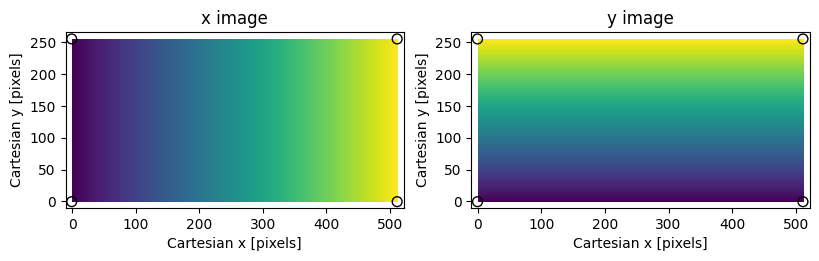
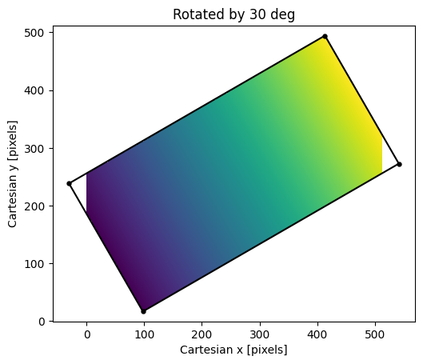
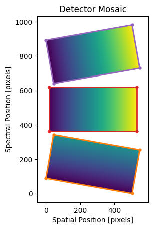

.. include:: include/links.rst

.. _mosaic:

================
Detector Mosaics
================

If the geometry of each detector in a detector array is known *a priori*,
PypeIt can construct a mosaic of the detector data for further processing,
instead of processing the detector data individually.  This is currently the
default approach for Gemini/GMOS and  Keck/DEIMOS only.

Coordinate Conventions
----------------------

Coordinate conventions are critical to understanding how PypeIt constructs
the detector mosaics.  In general, we adopt the standard numpy/matplotlib
convention (also identical to how 2D numpy arrays are displayed in `ginga`_),
where the first axis is along the ordinate (Cartesian :math:`y`) and the second
axis is along the abscissa (Cartesian :math:`x`).  We also assume the pixel
coordinates are with respect to the pixel center (i.e., not its bottom-left
corner).

For example, to construct arrays with the Cartesian :math:`x` and :math:`y`
pixel coordinates for an image with a specified shape:

.. code-block:: python

    import numpy as np
    shape = (256, 512)
    x, y = np.meshgrid(np.arange(shape[1]), np.arange(shape[0]))

Note that the shape of the image can be interpreted as the number of pixels
along :math:`y`, then the number of pixels along :math:`x` (e.g., ``(ny,nx)``).
You can also construct an array with the vertices of the image extent:

.. code-block:: python

    box = np.array([[-0.5,                 -0.5],
                    [shape[0]-0.5,         -0.5],
                    [shape[0]-0.5, shape[1]-0.5],
                    [-0.5,         shape[1]-0.5]])

Note the coordinates are ordered in the same way as the image with Cartesian
:math:`x` in ``box[:,1]`` and Cartesian :math:`y` in ``box[:,0]``.  Plotting the
results shows the expected image orientation:

.. code-block:: python

    from matplotlib import pyplot

    fig = pyplot.figure(figsize=pyplot.figaspect(1/2.))

    # Plot the x coordinates
    ax = fig.add_subplot(1,2,1)
    # Note the limits are set given that the shape provides (ny, nx)
    ax.set_xlim([-10, shape[1]+10])
    ax.set_ylim([-10, shape[0]+10])
    ax.set_xlabel('Cartesian x [pixels]')
    ax.set_ylabel('Cartesian y [pixels]')
    ax.set_title('x image')
    ax.imshow(x, origin='lower', interpolation='nearest')
    # Note the array slicing selects x then y
    ax.scatter(box[:,1], box[:,0], marker='o', edgecolor='k', s=50, facecolor='none')

    # Plot the y coordinates
    ax = fig.add_subplot(1,2,2)
    ax.set_xlim([-10, shape[1]+10])
    ax.set_ylim([-10, shape[0]+10])
    ax.set_xlabel('Cartesian x [pixels]')
    ax.set_ylabel('Cartesian y [pixels]')
    ax.set_title('y image')
    ax.imshow(y, origin='lower', interpolation='nearest')
    ax.scatter(box[:,1], box[:,0], marker='o', edgecolor='k', s=50, facecolor='none')
    pyplot.show()

which should produce the following:

   Assumed coordinate system for PypeIt image transformations; small values
   are dark, large values are bright.  The shape of the image is ``(256,512)``.
   Black circles mark the vertices of the image bounding box.

Image and Coordinate Transformations
------------------------------------

General coordinate transformation matrices are generated using methods in the
:mod:`~pypeit.core.transform` module, and the image transformations are performed
using `scipy.ndimage.affine_transform`_.  For detectors in a mosaic, the key
parameters are the *relative* offsets between the centers of the detectors and
their rotations about that center.  The convenience function used to generate
the transformation matrices is
:func:`~pypeit.core.mosaic.build_image_mosaic_transform`.  Continuing from
the above example, you can can resample the :math:`x` coordinate image into a
new image rotated by :math:`30^\circ` as follows:

.. code-block:: python

    from scipy import ndimage
    from pypeit.core import transform
    from pypeit.core import mosaic

    box = np.array([[-0.5,                 -0.5],
                    [shape[0]-0.5,         -0.5],
                    [shape[0]-0.5, shape[1]-0.5],
                    [-0.5,         shape[1]-0.5],
                    [-0.5,                 -0.5]])

    # Rotation in degrees
    rotation = 30.
    # Output image shape
    output_shape = (512, 512)
    # Shift puts the center of the input image at the center of the output
    # image
    shift = (output_shape[1]/2 - shape[1]/2, output_shape[0]/2 - shape[0]/2)
    # Get the transform
    tform = mosaic.build_image_mosaic_transform(shape, shift, rotation=rotation)
    # Apply it to the image bounding box
    tbox = transform.coordinate_transform_2d(box, tform)
    # Use it to resample the input image to the output frame
    tx = ndimage.affine_transform(x.astype(float), np.linalg.inv(tform),
                                  output_shape=output_shape, cval=np.nan, order=0)
    ax = pyplot.subplot()
    ax.imshow(tx, origin='lower', interpolation='nearest')
    ax.scatter(tbox[:-1,1], tbox[:-1,0], marker='.', color='k', s=50)
    ax.plot(tbox[:,1], tbox[:,0], color='k')
    ax.set_xlabel('Cartesian x [pixels]')
    ax.set_ylabel('Cartesian y [pixels]')
    ax.set_title('Rotated by 30 deg')
    pyplot.show()

   Result of rotating the :math:`x`-coordinate image by 30 degrees.  Empty
   pixels in the transformed image are not shown because they were filled with
   ``np.nan``.  Note the image regions with pixel coordinates :math:`<0` and
   :math:`>511` are not shown because they are outside the limits of the output
   image shape.

Note that we set the output shape of the image directly, but the shape was
insufficient to capture the full size of the rotated image.  We avoid this for
the detector mosaics using :func:`~pypeit.core.mosaic.prepare_mosaic`; see below.

Constructing a Detector Mosaic
------------------------------

To construct a mosaic of the images in a detector array, we need offsets and
rotations for all the relevant detectors.  To minimize the interpolation, it is
good practice to set one of the detectors as the reference, which simply means
it has no shift or rotation.  All images in a mosaic are currently limited to
having exactly the same shape, and all PypeIt mosaics are created using
nearest-grid-point interpolation (``order=0`` in
`scipy.ndimage.affine_transform`_) by default (cf., the approach used for
:ref:`deimos`).  

Image mosaics in PypeIt are constructed *after* the :ref:`image_proc`,
meaning that the images to be included in the mosaic obey the PypeIt
convention of spectral pixels along the first axis and spatial pixels along the
second axis; i.e., the shape of each image is :math:`(N_{\rm spec}, N_{\rm
spat})`.  Following the conventions above, that means the shifts and rotations
should be defined adopting the spatial axis as the Cartesian :math:`x` axis and
the spectral axis as the Cartesian :math:`y` axis.  Specifically,

- **Shifts**: Image shifts are defined in *unbinned* pixels.  The first element in the
  two-tuple should be the spatial shift, and the second is the spectral shift.

- **Rotations**: Rotations are defined in counter-clockwise degrees.

Any affects of the binning on the transformation matrices calculated using the
above inputs are determined by
:func:`~pypeit.core.mosaic.build_image_mosaic_transform`.

For example, the code below places the coordinate images created above in a
3-detector mosaic, with the detectors separated along the dispersion axis.

.. code-block:: python

    # Define the shifts and rotations.  Note the shifts are always in the
    # dispersion direction.
    shift = [(0, -320.), (0., 0.), (0., 320)]
    rotation = [-10., 0., 10.]

    # Construct the tranformation matrix for each image.
    nimg = 3
    tforms = [None]*nimg
    for i in range(nimg):
        tforms[i] = mosaic.build_image_mosaic_transform(shape, shift[i], rotation=rotation[i])

    # Construct the mosaic
    msc, _, _, _tforms = mosaic.build_image_mosaic([y.astype(float), x.astype(float),
                                                    x.astype(float)], tforms, cval=np.nan)

    # Show the result
    ax = pyplot.subplot()
    ax.set_xlabel('Spatial Position [pixels]')
    ax.set_ylabel('Spectral Position [pixels]')
    ax.set_title('Detector Mosaic')
    ax.set_xlim(-50, msc.shape[1]+50)
    ax.set_ylim(-50, msc.shape[0]+50)
    ax.imshow(msc, origin='lower', interpolation='nearest')
    color = ['C1', 'C3', 'C4']
    for i in range(nimg):
        tbox = transform.coordinate_transform_2d(box, _tforms[i])
        ax.scatter(tbox[:-1,1], tbox[:-1,0], marker='.', color=color[i], s=50)
        ax.plot(tbox[:,1], tbox[:,0], color=color[i], lw=2)
    pyplot.show()

In the previous section we set the shape of the transformed image directly, and
the result was that the shape was to small to capture the full rotated image.
Here, because no output shape is passed, the call to
:func:`~pypeit.core.mosaic.build_image_mosaic` uses
:func:`~pypeit.core.mosaic.prepare_mosaic` to determine the shape required to
capture the full mosaic and adjust the transformation matrices from a relative
to absolute frame.  These adjusted transformations are returned by
:func:`~pypeit.core.mosaic.build_image_mosaic` and can be applied to additional
images or, as in the example above, the vertices of the input images to show the
bounding boxes of the input images in the output mosaic.

   Mock mosaic with three detectors offset in the spectral (dispersion)
   direction.  Orange, red, and purple boxes are the bounding boxes for the 1st,
   2nd, and 3rd input images, respectively.  Note that, because we've filled the
   empty pixels with ``np.nan`` values, the unfilled regions in the ``msc``
   array are not shown by `matplotlib`_.

