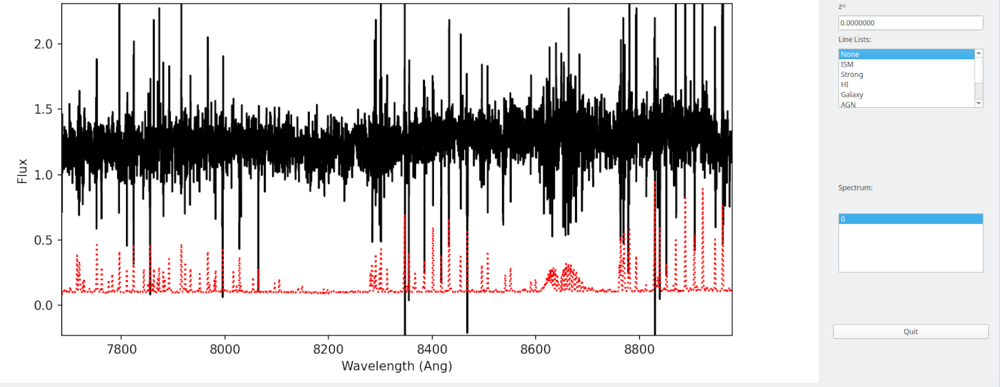

.. _mosfire_howto:

==================
Keck-MOSIFRE HOWTO
==================

Overview
========

This doc goes through a full run of PypeIt on one of the Keck/MOSFIRE datasets in the PypeIt Development Suite,
specifically the ``mask1_K_with_continuum`` multi-slits observations.
The following was performed on a Macbook Pro with 16 GB RAM and took approximately 20 minutes.

Setup
=====

Organize data
-------------

Place all of the files in a single folder, making sure you have
all the calibration files you need, in addition to the science ones.
The dataset used here is in the following folder:
``/PypeIt-development-suite/RAW_DATA/mask1_K_with_continuum``.

The files within this folder are:

.. code-block:: bash

    $ ls
    m121128_0105.fits m121128_0112.fits m121128_0119.fits m121128_0215.fits
    m121128_0106.fits m121128_0113.fits m121128_0120.fits m121128_0216.fits
    m121128_0107.fits m121128_0114.fits m121128_0214.fits m121128_0217.fits

This folder can include data from different datasets (e.g., more than one slitmask
or observations in various filter). The script :ref:`pypeit_setup`
(see next step) will help to parse the desired dataset.

.. important::
    **Note on calibrations**

    The MOSFIRE calibration GUI provides, during your observing night, the option to take flats
    with the lamps off. This is the default in the GUI only for the K-band, but we recommend taking
    these flats for all MOSFIRE spectroscopic observations. The purpose of the flats with the lamps off
    is to remove the increase and/or variation in zero level caused by persistence from the high counts
    in the flats and/or thermal emission from the telescope/dome (in the K-band). See :ref:`mosfire_flats`
    for more info.

    Also, PypeIt generally perform the wavelength calibration using the OH lines in science frames. For this
    reason arc frames are not required for the reduction unless the observations were taken with a
    ``long2pos_specphot`` slitmask. In this case the arc frames are required for a successful wavelength
    calibration. See :ref:`mosfire_wavecalib` for more info.

Run ``pypeit_setup``
--------------------

The first script to run with PypeIt is :ref:`pypeit_setup` which examines your raw files
and generates a sorted list and (when instructed) one :doc:`pypeit_file` per instrument configuration.

See complete instructions are provided in :ref:`setup_doc`.

For this example, we move to the folder where we want to perform the reduction and save the
associated outputs and we run:

.. code-block:: bash

    cd folder_for_reducing   # this is usually *not* the raw data folder
    pypeit_setup -s keck_mosfire -r /PypeIt-development-suite/RAW_DATA/mask1_K_with_continuum -b

This will create in a folder called ``setup_files/`` a ``.sorted`` file that shows the raw file organized
by datasets. We inspect the ``.sorted`` file and identify the dataset that we want to reduced
(in this case it is indicated with the letter ``A`` ) and re-run ``pypeit_setup`` as:

.. code-block:: bash

    pypeit_setup -s keck_mosfire -r /PypeIt-development-suite/RAW_DATA/mask1_K_with_continuum -b -c A

Note that we use the ``-b`` flag because we are dealing with near-IR observations for which a
dither pattern is used to perform background subtraction. The ``-b`` flag adds three columns in the
:ref:`pypeit_file:Data Block` of the ``pypeit_file`` to instruct PypeIt on the desired background subtraction
(see :ref:`setup_doc` and :ref:`a-b_differencing` for more info).

This creates a :ref:`pypeit_file` in a folder called ``keck_mosfire_A/``, which looks like this::

    # Auto-generated PypeIt input file using PypeIt version: 1.10.1.dev218+gefe7d7ef6
    # UTC 2022-10-14T22:04:15.975

    # User-defined execution parameters
    [rdx]
        spectrograph = keck_mosfire

    # Setup
    setup read
    Setup A:
      decker_secondary: ic348_TK_M03A
      dispname: K-spectroscopy
      filter1: K
      slitlength: null
      slitwid: null
    setup end

    # Data block
    data read
     path mask1_K_with_continuum
             filename |                 frametype |          ra |         dec |        target |       dispname |        decker | binning |            mjd |    airmass |  exptime | filter1 | lampstat01 | dithpat | dithpos | dithoff | frameno | calib | comb_id | bkg_id
    m121128_0214.fits |          arc,science,tilt | 56.27484011 | 32.19165488 | ic348_TK_M03A | K-spectroscopy | ic348_TK_M03A |     1,1 |  56259.2716455 | 1.37254788 | 98.92572 |       K |        off |   Stare |       A |     1.5 |     214 |     0 |       1 |      2
    m121128_0215.fits |          arc,science,tilt | 56.27402153 | 32.19170348 | ic348_TK_M03A | K-spectroscopy | ic348_TK_M03A |     1,1 | 56259.27318428 | 1.36213505 | 98.92572 |       K |        off |   Stare |       B |    -1.5 |     215 |     0 |       2 |      1
    m121128_0216.fits |          arc,science,tilt | 56.27402153 | 32.19170348 | ic348_TK_M03A | K-spectroscopy | ic348_TK_M03A |     1,1 | 56259.27469644 | 1.35216515 | 98.92572 |       K |        off |   Stare |       B |    -1.5 |     216 |     0 |       2 |      1
    m121128_0217.fits |          arc,science,tilt | 56.27484011 | 32.19165488 | ic348_TK_M03A | K-spectroscopy | ic348_TK_M03A |     1,1 | 56259.27624622 | 1.34220549 | 98.92572 |       K |        off |   Stare |       A |     1.5 |     217 |     0 |       1 |      2
    m121128_0119.fits |                  arc,tilt |         7.8 |        45.0 |       unknown | K-spectroscopy | ic348_TK_M03A |     1,1 | 56259.14680212 | 1.41291034 |  1.45479 |       K |         Ar |    none |    none |     0.0 |     119 |     0 |      -1 |     -1
    m121128_0120.fits |                  arc,tilt |         7.8 |        45.0 |       unknown | K-spectroscopy | ic348_TK_M03A |     1,1 | 56259.14700351 | 1.41291034 |  1.45479 |       K |         Ne |    none |    none |     0.0 |     120 |     0 |      -1 |     -1
    m121128_0105.fits |              lampoffflats |         7.8 |        45.0 |       unknown | K-spectroscopy | ic348_TK_M03A |     1,1 | 56259.14200914 | 1.41291034 |  14.5479 |       K |        off |    none |    none |     0.0 |     105 |     0 |      -1 |     -1
    m121128_0106.fits |              lampoffflats |         7.8 |        45.0 |       unknown | K-spectroscopy | ic348_TK_M03A |     1,1 | 56259.14231181 | 1.41291034 |  14.5479 |       K |        off |    none |    none |     0.0 |     106 |     0 |      -1 |     -1
    m121128_0107.fits |              lampoffflats |         7.8 |        45.0 |       unknown | K-spectroscopy | ic348_TK_M03A |     1,1 | 56259.14262084 | 1.41291034 |  14.5479 |       K |        off |    none |    none |     0.0 |     107 |     0 |      -1 |     -1
    m121128_0112.fits | pixelflat,illumflat,trace |         7.8 |        45.0 |       unknown | K-spectroscopy | ic348_TK_M03A |     1,1 | 56259.14425684 | 1.41291034 |  14.5479 |       K |         on |    none |    none |     0.0 |     112 |     0 |      -1 |     -1
    m121128_0113.fits | pixelflat,illumflat,trace |         7.8 |        45.0 |       unknown | K-spectroscopy | ic348_TK_M03A |     1,1 | 56259.14450569 | 1.41291034 |  14.5479 |       K |         on |    none |    none |     0.0 |     113 |     0 |      -1 |     -1
    m121128_0114.fits | pixelflat,illumflat,trace |         7.8 |        45.0 |       unknown | K-spectroscopy | ic348_TK_M03A |     1,1 | 56259.14479678 | 1.41291034 |  14.5479 |       K |         on |    none |    none |     0.0 |     114 |     0 |      -1 |     -1
    data end

Inspecting this file, we want to make sure that all the frame types were accurately assigned in the
:ref:`pypeit_file:Data Block`. If not, we can make edits using the instructions in
:ref:`pypeit_file:Edits to the Data Block`. We can also remove any bad (or undesired) calibration
or science frames from the list, by either deleting them altogether or commenting out with a ``#``.

In this example, all the frametypes were accurately assigned. However, as mentioned earlier, we use the
OH lines in science frames for the wavelength calibration, therefore we do not want to keep the arc frames
(*m121128_0119.fits*, *m121128_0120.fits*) in the Data Block list, and we comment them out.

.. tip::
    If the user wants to use the arc frames instead, they can keep the 2 arc frames in the list, but need
    to edit the ``frametype`` for the science frames (*m121128_0214.fits - m121128_0217.fits*), i.e., removing
    the ``arc`` and ``tilt`` frame type. In addition, the changes explained in :ref:`mosfire_wavecalib` will have to
    be added to the :ref:`pypeit_file:Parameter Block`.

Other possible edits to the :ref:`pypeit_file:Data Block` are related to the ``calib``, ``comb_id``, and ``bkg_id``
columns, which instruct PypeIt on the desired frame combination and background subtraction.
For Keck/MOSFIRE data, PypeIt tries to automatically set the ``calib``, ``comb_id``, ``bkg_id`` using the dither
information recorded in the header (also reported in the ``dithpat``, ``dithpos``, and ``dithoff`` columns)
of the science frames (see :ref:`mosfire_config_report`); however, the user can edit these columns according to
the preferred reduction (see :ref:`a-b_differencing` and :ref:`2d_combine` for more info).

Finally, in this example, we also edit the :ref:`pypeit_file:Parameter Block` adding following lines::

    [reduce]
       [[slitmask]]
          use_dither_offset = False
          bright_maskdef_id = 4

Main Run
========

Once the :doc:`pypeit_file` is ready, the main call is
simply::

    cd keck_deimos_A
    run_pypeit keck_deimos_A.pypeit -o

The "-o" specifies to over-write any existing science
output files.  As there are none, it is superflous but we
recommend (almost) always using it.

The :doc:`running` doc describes the process in some
more detail.

Inspecting Files
================

As the code runs, a series of files are written to the disk.

Calibrations
------------

The first set are :doc:`calibrations`.
What follows are a series of screen shots
and :doc:`qa` PNGs produced by *PypeIt*.

Slit Edges
++++++++++

The code will automatically assign edges to each slit on the
detector.  This includes using inform from the slitmask design
recorded in the FITS file, as described in :doc:`dev/slitmask_ids`

Here is a zoom-in screen shot from the first tab in the *ginga*
window after using
the :ref:`pypeit_chk_edges` script, with this explicit call
(be patient with *ginga*)::

    pypeit_chk_edges Masters/MasterEdges_A_1_07.fits.gz

.. image:: figures/deimos_edges_image.png

Note the 07 in the filename refers to the detector 7.

The data is the combined flat images and the green/red
lines indicate the left/right slit edges.  The dark blue
labels are the internal slit identifiers of PypeIt.
The cyan numbers are the user-assigned ID values of the slits.

See :doc:`master_edges` for further details.

Arc
+++

Here is a screen shot of most of the arc image as viewed
with *ginga*::

    ginga Masters/MasterArc_A_1_07.fits

As typical of most arc images, one sees a series
of arc lines, here oriented approximately horizontally.

.. image:: figures/deimos_arc_image.png

See :doc:`master_arc` for further details.

Wavelengths
+++++++++++

One should inspect the :doc:`qa` for the wavelength
calibration.  These are PNGs in the QA/PNG/ folder.

Note:  there are multiple files generated for every slit.
When the reduction is complete, you may prefer to scan
through them by opening the HTML file under QA/.

1D
::

Here is an example of the 1D fits, written to
the QA/PNGs/Arc_1dfit_A_1_07_S0758.png file:

.. image:: figures/deimos_arc1d.png

What you hope to see in this QA is:

 - On the left, many of the blue arc lines marked with green IDs
 - In the upper right, an RMS < 0.1 pixels
 - In the lower right, a random scatter about 0 residuals

See :doc:`master_wvcalib` for further details.

2D
::

There are several QA files written for the 2D fits.
Here is QA/PNGs/Arc_tilts_2d_A_1_07_S0758.png:

.. image:: figures/deimos_arc2d.png

Each horizontal line of black dots is an arc line.
Red points were rejected in the 2D fitting.  Provided
most were not rejected, the fit should be good.
An RMS<0.1 is also desired for this fit.

See :doc:`master_wvcalib` for further details.

Flatfield
+++++++++

The code produces flat field images for correcting
pixel-to-pixel variations and illumination of the detector.

Here is a zoom-in screen shot from the first tab in the *ginga*
window (pixflat_norm) after using
:ref:`pypeit_chk_flats`, with this explicit call::

    pypeit_chk_flats Masters/MasterFlat_A_1_07.fits

.. image:: figures/deimos_flat.png

One notes the pixel-to-pixel variations;  these are
at the percent level.
The slit edges defined by the code
are also plotted (green/red lines).
The regions of the detector beyond the slit
boundaries have been set to unit value.

See :doc:`master_flat` for further details.

Spectra
-------

Eventually (be patient), the code will start
generating 2D and 1D spectra outputs.  One per standard
and science frame, located in the *Science/* folder.

Spec2D
++++++

Slit inspection
:::::::::::::::

It is frequently useful to view a summary of the slits
successfully reduced by PypeIt.  The
:ref:`pypeit_parse_slits`, with this explicit call::

     pypeit_parse_slits Science/spec2d_DE.20170425.50487-dra11_DEIMOS_2017Apr25T140121.014.fits

this prints, detector by detector, the SpatID (internal PypeIt name),
MaskID (user ID), and Flags for each slit.  Those with *None* have been
successfully reduced.

Visual inspection
:::::::::::::::::

Here is a screen shot from the third tab in the *ginga*
window (sky_resid-det07) after using
:ref:`pypeit_show_2dspec`, with this explicit call::

    pypeit_show_2dspec Science/spec2d_DE.20170425.50487-dra11_DEIMOS_20170425T140121.014.fits --det 7

.. image:: figures/deimos_spec2d.png

For DEIMOS masks with many slits, the display time is substantial.
You may prefer to limit viewing only a subset of the `channels`
with the `--channels` option.

The green/red lines are the slit edges.
The orange line shows the *PypeIt* trace
of the object and the orange text is the
*PypeIt* assigned name.  Yellow lines indicate
sources that were auto-magically extracted
based on the mask design (i.e. they had insufficient
S/N for detection).
The night sky and emission lines have been subtracted.

See :doc:`out_spec2D` for further details.

Spec1D
++++++

You can see a summary of all the extracted sources in spec1d*.txt
files in the Science/ folder.  Here is the top of the one I've
produced named spec1d_DE.20170425.50487-dra11_DEIMOS_20170425T140121.014.fits:

.. code-block:: bash

    | slit |                    name | maskdef_id | objname |     objra |   objdec | spat_pixpos | spat_fracpos | box_width | opt_fwhm |   s2n | maskdef_extract | wv_rms |
    |   34 | SPAT0036-SLIT0034-DET07 |    1039404 |    3394 | 260.08018 | 57.96760 |        36.4 |        0.561 |      3.00 |    0.935 | 16.78 |           False |  0.052 |
    |   91 | SPAT0097-SLIT0091-DET07 |    1039403 |    3347 | 260.08404 | 57.94896 |        96.9 |        0.630 |      3.00 |    0.868 | 11.74 |           False |  0.041 |
    |  139 | SPAT0139-SLIT0139-DET07 |    1039402 |    3309 | 260.08660 | 57.97074 |       138.8 |        0.496 |      3.00 |    0.593 |  2.49 |            True |  0.063 |
    |  183 | SPAT0185-SLIT0183-DET07 |    1039401 |    3290 | 260.08949 | 57.94758 |       185.0 |        0.531 |      3.00 |    0.849 | 10.12 |           False |  0.048 |
    |  241 | SPAT0229-SLIT0241-DET07 |    1039400 |    3273 | 260.09227 | 57.94045 |       229.5 |        0.284 |      3.00 |    0.802 |  1.73 |           False |  0.032 |
    |  311 | SPAT0329-SLIT0311-DET07 |    1039399 |    3212 | 260.09824 | 57.98572 |       329.2 |        0.812 |      3.00 |    0.906 | 17.72 |           False |  0.056 |

The *maskdef_id* and *objname* are user supplied in the mask design.
Serendipitous sources will be named SERENDIP.  The *maskdef_extract* flag
indicates whether the extraction was 'forced', i.e. the source was not
detected by PypeIt so extraction was performed based on the mask design.

One can generate a similar, smaller set of output using the --list option
with :ref:`pypeit_show_1dspec`::

    pypeit_show_1dspec spec1d_DE.20170425.50487-dra11_DEIMOS_20170425T140121.014.fits --list

Last, here is a screen shot from the GUI showing the
1D spectrum after using
:ref:`pypeit_show_1dspec`, with this explicit call::

   pypeit_show_1dspec spec1d_DE.20170425.50487-dra11_DEIMOS_20170425T140121.014.fits --exten 23

.. image:: figures/deimos_spec1d.png

This uses the
`XSpecGUI <https://linetools.readthedocs.io/en/latest/xspecgui.html>`_
from the *linetools* package.  The black line is the flux and the
red line is the estimated error.

See :doc:`out_spec1D` for further details.

Fluxing
=======

The results can be flux calibrated using archived sensitivity functions. To do so first create a
fluxing file, named keck_deimos_1200g_m_7750.flux in this example:

.. code-block:: bash

    [fluxcalib]
    use_archived_sens = True

    # User-defined fluxing parameters
    flux read
      Science/spec1d_DE.20170425.50487-dra11_DEIMOS_20170425T140121.014.fits
    flux end

Next run the flux calibration tool::

    pypeit_flux_calib keck_deimos_1200g_m_7750.flux

The results can be viewed by passing *--flux* to pypeit_show_1dspec::

    pypeit_show_1dspec Science/spec1d_DE.20170425.50487-dra11_DEIMOS_20170425T140121.014.fits --exten 23 --flux

The archived sensitivity functions for DEIMOS are currently experimental and should be used with caution.
See :doc:`fluxing` for more details on flux calibration with ``PypeIt``.

Flexure
=======

The default run performs a flexure correction, slit-by-slit
based on analysis of the sky lines to impose a fixed pixel shift
for each detector in the spectral dimension.
For a more accurate solution,
it may be preferred to perform flexure across both detectors.

See :ref:`pypeit_multislit_flexure` for full details on this procedure.

