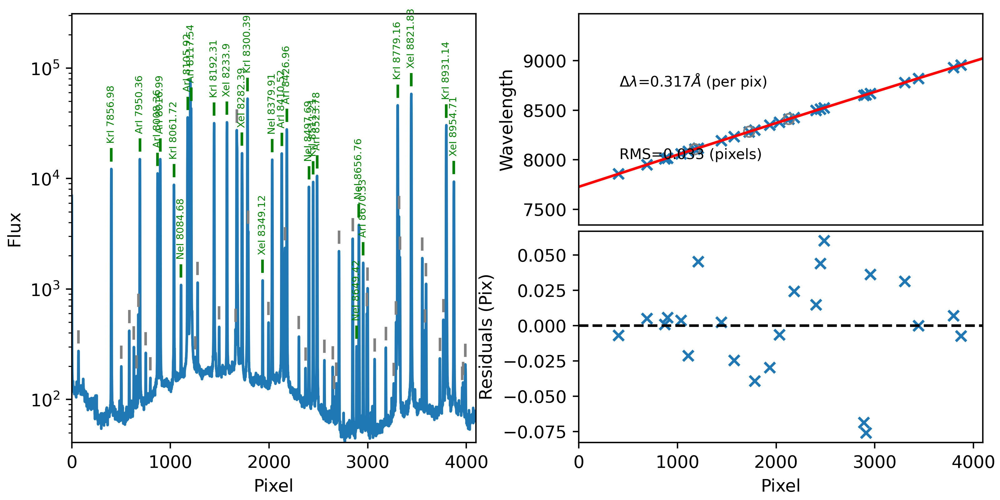
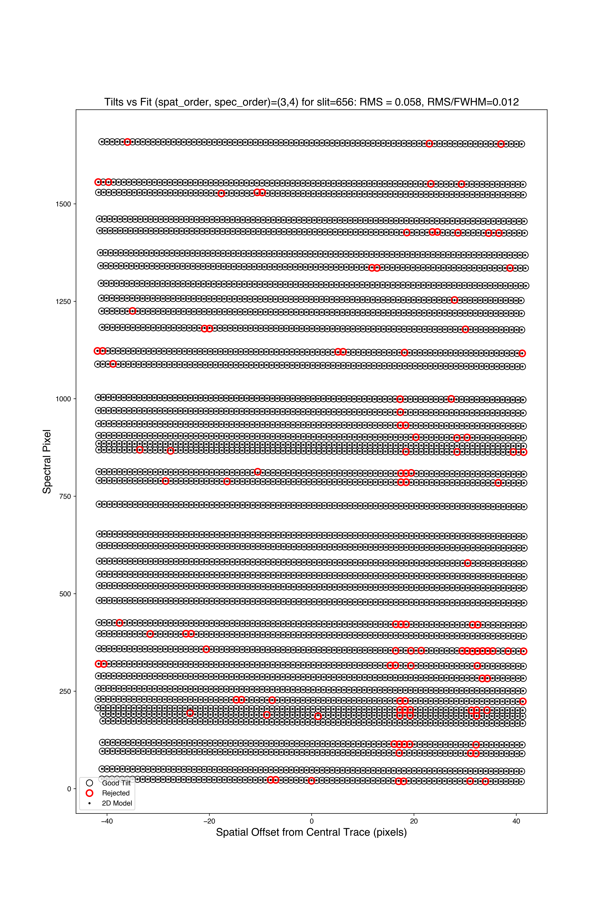
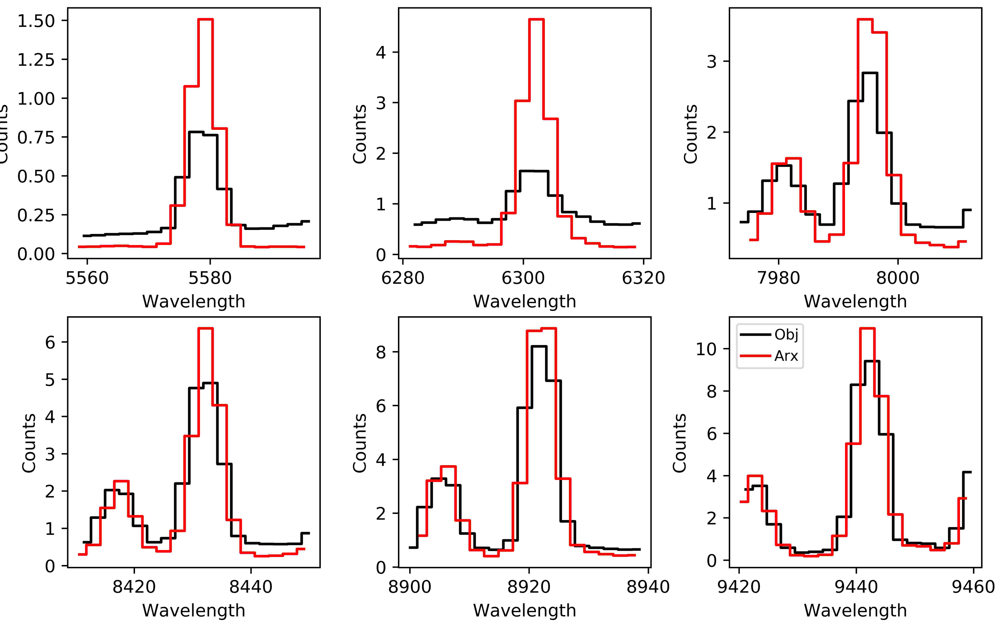

.. TODO: We should expand this page, showing examples of the QA plots and
.. describing them in more detail.

.. _qa:

=========
PypeIt QA
=========

As part of the standard reduction, PypeIt generates a series
of Quality Assurance (QA) files. This document describes
the typical outputs, in the typical order that they appear.

The basic arrangement is that individual PNG files are created
and then a set of HTML files are generated to organize
viewing of the PNGs.

HTML
====

When the code completes (or crashes out), a set of
HTML files are generated in the ``QA/`` folder.  There
is one HTML file per calibration frame set and one
HTML file per science exposure.  Example names are
``MF_A.html``.

Open in your browser and have at 'em.
Quick links are provided to allow one to jump between
the various files.

Calibration QA
==============

The first QA PNG files generated are related
to calibration processing.  There is a unique
one generated for each setup and detector and
(possibly) calibration set.

Generally, the title describes the type of QA and the
sub-title indicates the user who ran PypeIt and the
date of the processing.

.. _qa-wave-fit:

Wavelength Fit QA
-----------------

PypeIt produces plots like the one below showing the result of the wavelength
calibration.

   An example QA plot for Keck/DEIMOS wavelength calibration.  The extracted arc
   spectrum is shown to the left with arc lines used for the wavelength solution
   marked in green.  The upper-right plot shows the best-fit calibration between
   pixel number and wavelength, and the bottom-right plot shows the residuals as
   a function of pixel number.

See :doc:`calibrations/wvcalib` for more discussion of this QA.

.. _qa-wave-tilt:

Wavelength Tilts QA
-------------------

PypeIt produces plots like the one below showing the result of tracing the tilts
in the wavelength as a function of spatial position within the slits.

   An example QA plot for a single slit in a Keck/MOSFIRE tilt QA plot.  Each
   horizontal line of black dots is an OH line.  Red points were rejected in the
   2D fitting.  Provided most were not rejected, the fit should be good.

See :doc:`calibrations/tilts` for more discussion of this QA.

Exposure QA
===========

For each processed, science exposure there are a series of
PNGs generated, per detector and (sometimes) per slit.

Flexure QA
----------

If a flexure correction was performed (default), the fit to the
correlation lags per object
is shown and the adopted shift is listed.  Here is
an example:

.. figure:: figures/qa/flex_corr_armlsd.jpg
   :align: center

There is then a plot showing several sky lines
for the analysis of a single object (brightest)
from the data compared against an archived sky spectrum.
These should coincide well in wavelength.
Here is an example:

