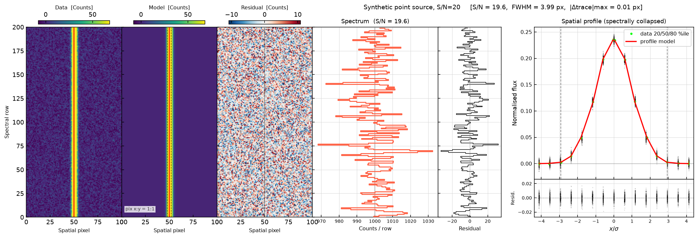
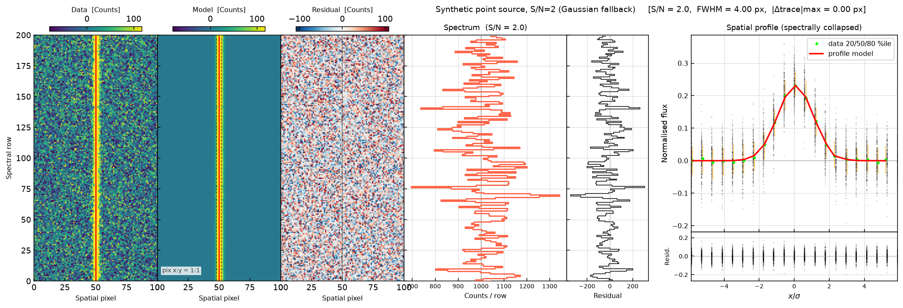

.. include:: include/links.rst

.. _spatprof:

========================
Spatial Profile Fitting
========================

Overview
========

PypeIt fits a non-parametric spatial profile to each detected object as part
of the :ref:`skysub_local_algorithm`.  The fitted profile serves two purposes:

1. It provides the optimal-extraction weights used by the Horne algorithm
   (see :ref:`extraction-optimal`).
2. It refines the object trace position and FWHM for use in the next
   iteration of local sky subtraction.

The algorithm is implemented in
:func:`~pypeit.core.spatialprofile.fit_profile` and is invoked once per
object per iteration inside
:func:`~pypeit.core.skysub.local_skysub_extract`.

.. _spatprof-algorithm:

Algorithm
=========

.. _spatprof-sn-decision:

S/N Decision
------------

The first step after fitting a B-spline model to the extracted 1D spectrum is
to compute the median signal-to-noise squared, :math:`\overline{(S/N)^2}`.
This single number controls all subsequent branching:

- :math:`\sqrt{\overline{(S/N)^2}} < \texttt{sn\_gauss}` (default 4.0) →
  :ref:`Gaussian fallback <spatprof-gaussian>`.
- :math:`\sqrt{\overline{(S/N)^2}} \ge \texttt{sn\_gauss}` →
  :ref:`B-spline profile fit <spatprof-bspline>`.

.. _spatprof-bspline:

B-Spline Profile Fitting
------------------------

For objects with sufficient S/N the profile is modelled as a non-parametric
fourth-order B-spline in the normalised spatial coordinate

.. math::

    \sigma_x \;=\; \frac{x_{\rm spat} - x_{\rm trace}}{\sigma} \;-\; \delta_{\rm trace}

where :math:`x_{\rm spat}` is the spatial pixel position, :math:`x_{\rm trace}`
is the current trace estimate, :math:`\sigma = \texttt{FWHM}/2.3548` is the
object width, and :math:`\delta_{\rm trace}` is a running trace-correction
offset.

**Normalised object image.** The 2D science image is divided by a spectral
flux model :math:`F(\lambda)` to produce a normalised object image
:math:`\hat{I}(\sigma_x)` that is nearly independent of wavelength.  The
flux model is built from two B-splines: a fine-knot fit for high S/N pixels
and a coarse continuum fit to fill gaps.

**Knot grid.** The interior knots of the profile B-spline are spaced
logarithmically (sinh spacing) between :math:`-\Lambda` and :math:`+\Lambda`,
where :math:`\Lambda` is determined from the inverse complementary error
function of a threshold set by ``prof_nsigma`` (when provided) or from the
measured FWHM otherwise.  This concentrates knots where the profile gradient
is steepest while keeping the fit well-conditioned in the wings.

.. _spatprof-iteration:

Iterative Trace and Width Correction
-------------------------------------

After an initial profile B-spline fit, three correction iterations are
performed.  Each iteration simultaneously estimates a trace shift and a width
stretch:

1. **Trace shift.** The current profile :math:`P(\sigma_x)` is evaluated at
   :math:`\sigma_x` and at :math:`\sigma_x \pm 0.5`.  A two-component fit
   (profile + its derivative) is performed via
   :func:`~pypeit.core.fitting.iterative_bspline_fit`.  The ratio of the
   derivative coefficient to the profile coefficient yields
   :math:`\delta_{\rm trace}`, the correction to the centroid position.

2. **Width stretch.** The profile is re-evaluated at :math:`\sigma_x / 1.3`,
   and a similar two-component fit extracts a width-correction factor
   :math:`f_\sigma`.  The object width is updated as
   :math:`\sigma \leftarrow \sigma / f_\sigma`.

3. **Profile re-fit.** The B-spline is re-fitted on the updated
   :math:`\sigma_x` grid, ready for the next correction iteration.

After the correction loop the trace correction is applied only if

.. math::

    \operatorname{median}(|\delta_{\rm trace}| \cdot \sigma) <
    \texttt{max\_trace\_corr}

(default 2.0 pixels), preventing runaway corrections on noisy data.

.. _spatprof-apodization:

Apodization
-----------

The final B-spline profile must go smoothly to zero in the wings; otherwise
the discontinuity at the profile boundary leaks flux into the sky model.
PypeIt applies an exponential apodization:

1. Starting from the inner edge of each wing, walk outward until the
   logarithmic derivative :math:`d(\ln P)/d(\ln |\sigma_x|)` satisfies
   a threshold that ensures a smooth exponential can be matched.

2. Outside the matched point, replace :math:`P(\sigma_x)` with an
   exponential :math:`A\,e^{b|\sigma_x|}` whose value and first derivative
   are continuous with the B-spline at the join.

If the wing derivative condition cannot be satisfied (e.g., the profile is
too noisy), the apodization step is skipped and the raw B-spline value is
used to the boundary.

.. _spatprof-gaussian:

Gaussian Fallback
-----------------

When S/N is below the threshold, or when fitting fails, or when
``gauss=True``, the profile is set to a unit-normalised Gaussian evaluated
from the pixel-integrated complementary error function:

.. math::

    P_i \;=\; \frac{1}{2}\left[
        \operatorname{erfc}\!\left(\frac{x_i - x_{\rm trace} - \tfrac{1}{2}}
                                  {\sqrt{2}\,\sigma}\right)
        -
        \operatorname{erfc}\!\left(\frac{x_i - x_{\rm trace} + \tfrac{1}{2}}
                                  {\sqrt{2}\,\sigma}\right)
    \right]

This form integrates exactly to unity over the pixel grid and avoids biases
from the discretisation of a continuous Gaussian.  No trace or width
correction is applied in this path.

.. _spatprof-normalization:

Profile Normalization
---------------------

After apodization (B-spline path) or after constructing the Gaussian model,
the profile is multiplied by the S/N-dependent area weight :math:`pb` that
accounts for the fraction of the object flux captured within the fitted region.
Each spectral row is then divided by its own sum so that the rows integrate
to unity, ensuring that optimal extraction is correctly flux-conserved.

.. _spatprof-outputs:

Outputs
=======

:func:`~pypeit.core.spatialprofile.fit_profile` returns four arrays:

``profile_model`` : :class:`numpy.ndarray`, shape (nspec, nspat)
    The normalised spatial profile.  Each row sums to 1 (or 0 for rows
    with no valid pixels).

``xnew`` : :class:`numpy.ndarray`, shape (nspec,)
    The corrected object trace in spatial pixel units.

``fwhmfit`` : :class:`numpy.ndarray`, shape (nspec,)
    The fitted FWHM in pixels, one value per spectral row.

``med_sn2`` : float
    The median :math:`(S/N)^2` used for the S/N decision above.

.. _spatprof-qa:

QA Output
=========

When running :ref:`run-pypeit`, a diagnostic figure is written to
``QA/PNGs/`` at the end of the final profile-fitting iteration.  The
filename follows the pattern::

    {basename}_{det}_S{slit:04d}_O{obj:03d}_spat_prof.png

The figure has two halves.  The left half shows three 2D image panels (sky-
subtracted data, profile model, and residual) at the same colour scale.  The
right half shows four 1D panels: the extracted spectrum, the spectrum residual,
the normalised-object scatter in :math:`\sigma_x` space with 20/50/80th
percentile bands and the profile model overplotted, and the per-pixel profile
residual.

To display the figure interactively during a reduction (for debugging),
add the following to your :ref:`pypeit_file`:

.. code-block:: ini

    [reduce]
       [[skysub]]
          show_profile = True

.. note::

    ``show_profile = True`` opens a matplotlib window after *every*
    profile-fitting iteration for every object and blocks execution
    until the window is closed.  It is intended for debugging only.

.. _spatprof-qa-bspline:

Example: B-Spline Path (S/N = 20)
----------------------------------

The following figure is generated from a synthetic 200-row × 100-pixel
image with a Gaussian spatial profile (FWHM = 4 px), flat spectrum, and
S/N = 20.  The B-spline fit recovers the profile accurately.

   QA figure for the B-spline path.  **Left**: sky-subtracted data (top),
   profile model (middle), and residual (bottom).  **Right**: extracted
   spectrum (top-left), spectrum residual (top-right), normalised spatial
   profile vs. :math:`\sigma_x` with binned percentiles and the B-spline
   model (bottom-left), and profile residuals (bottom-right).

.. _spatprof-qa-gaussian:

Example: Gaussian Fallback (S/N = 2)
--------------------------------------

At S/N = 2, :math:`\sqrt{\overline{(S/N)^2}} < \texttt{sn\_gauss} = 4.0`,
so the Gaussian fallback path is taken.  No trace or width correction is
performed.

   QA figure for the Gaussian fallback path.  The right panels show
   significantly more scatter than the B-spline case because the low S/N
   makes the individual pixel measurements unreliable.

.. _spatprof-parameters:

Key Parameters
==============

``sn_gauss`` : float
    S/N threshold (applied to :math:`\sqrt{\overline{(S/N)^2}}`) below which
    the Gaussian fallback is used.  Default is 4.0.

``thisfwhm`` : float
    Initial FWHM estimate in pixels, taken from the object-finding step.
    The profile fit refines this value iteratively.

``prof_nsigma`` : float or None
    If set, forces the profile fitting region to extend to
    ``prof_nsigma`` :math:`\times \sigma` on each side of the trace.
    Useful for extended-object spectroscopy.  Default is None (uses
    the profile-derived extent).

``gauss`` : bool
    If True, always use the Gaussian fallback regardless of S/N.
    Default is False.

``max_trace_corr`` : float
    Maximum allowed median trace correction in pixels.  Larger corrections
    are discarded.  Default is 2.0.

``no_deriv`` : bool
    If True, skip the trace-shift and width-stretch correction iterations
    and go directly to the final profile fit.  Implied by ``prof_nsigma``.
    Default is False.

These parameters are exposed at the user level through the PypeIt parameter
system; see :ref:`extractionpar` for the full list.
