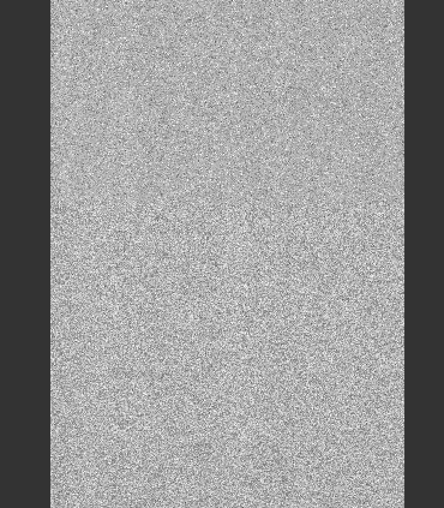
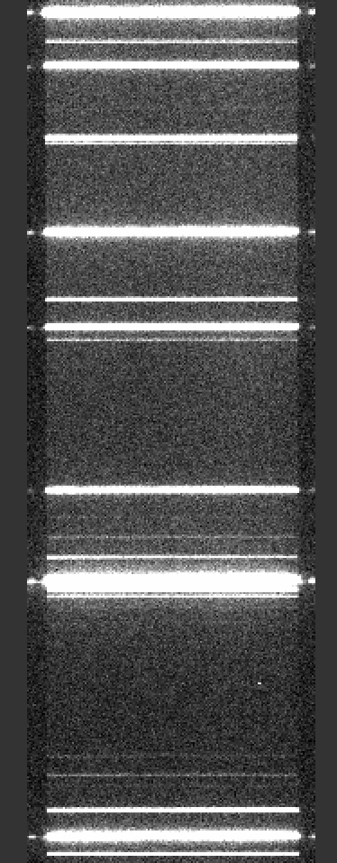
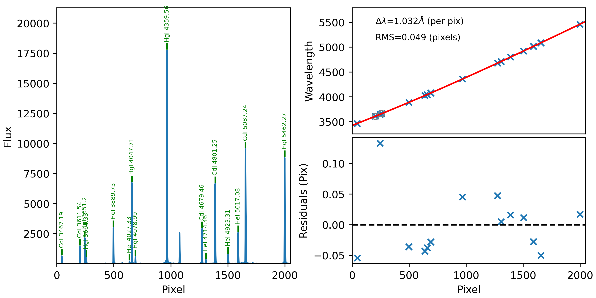
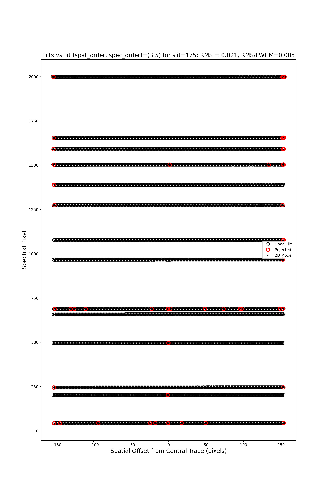
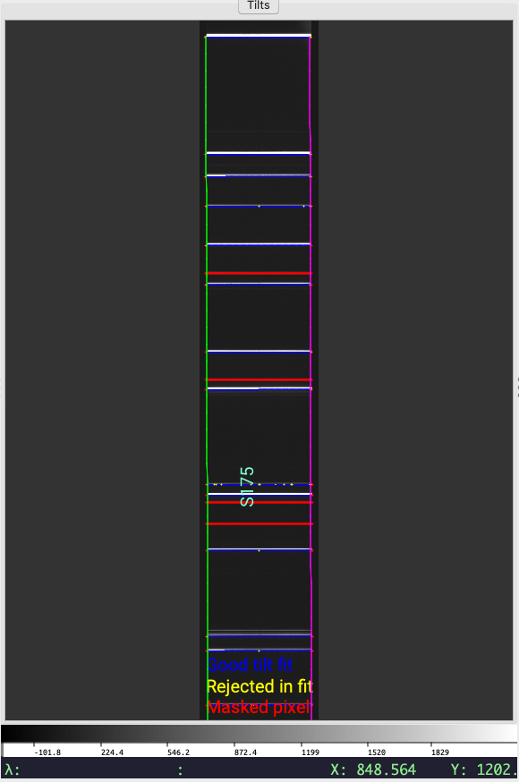
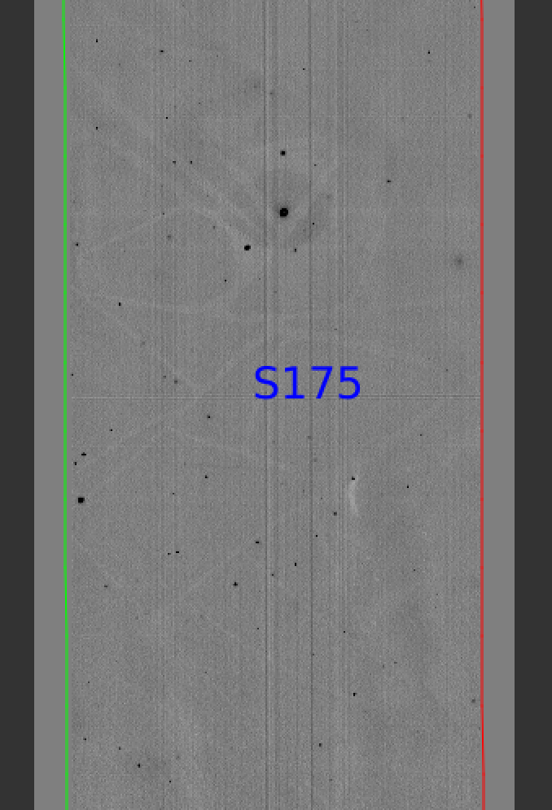
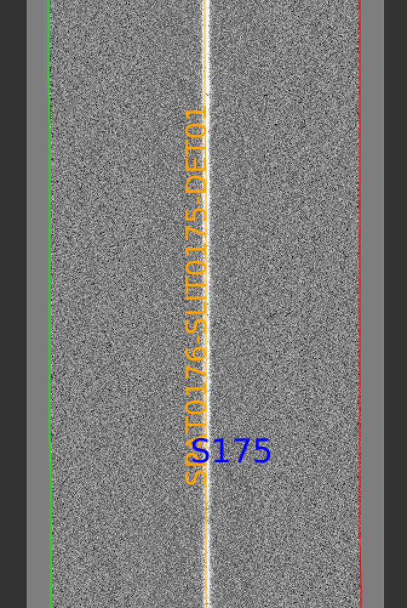
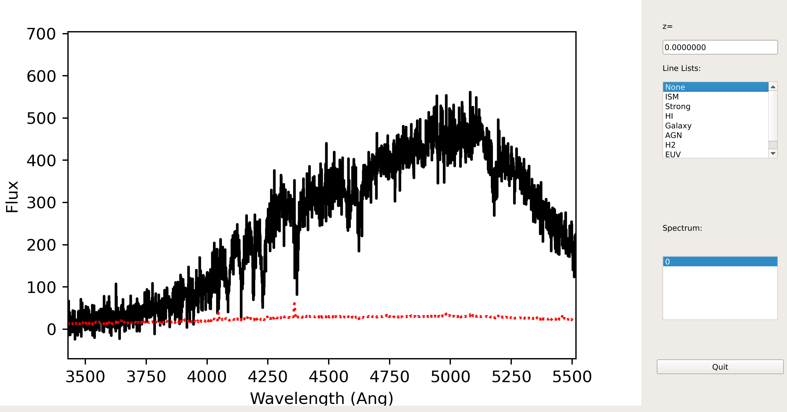
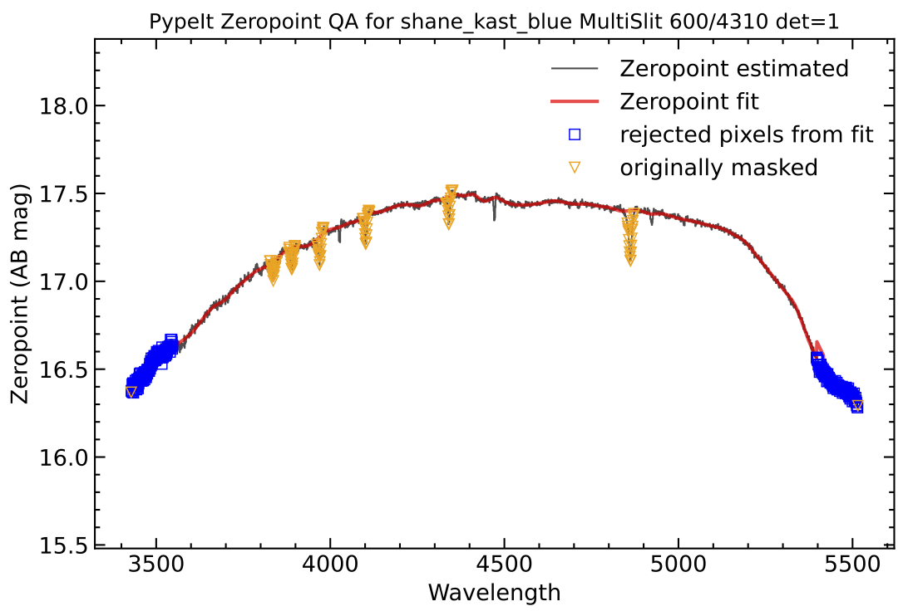

.. include:: ../include/links.rst

.. _kast_howto:

================
Shane-Kast HOWTO
================

Overview
========

This doc goes through a full run of PypeIt on one of the Shane Kast *blue*
datasets in the :ref:`dev-suite`.

Setup
=====

Organize the data
-----------------

Place all of the files in a single folder. Mine is named
``/home/xavier/Projects/PypeIt-development-suite/RAW_DATA/shane_kast_blue/600_4310_d55``
(which I will refer to as ``RAW_PATH``) and the files within are:

.. code-block:: bash

    $ ls
    b1.fits.gz   b14.fits.gz  b19.fits.gz  b24.fits.gz  b5.fits.gz
    b10.fits.gz  b15.fits.gz  b20.fits.gz  b27.fits.gz  b6.fits.gz
    b11.fits.gz  b16.fits.gz  b21.fits.gz  b28.fits.gz  b7.fits.gz
    b12.fits.gz  b17.fits.gz  b22.fits.gz  b3.fits.gz   b8.fits.gz
    b13.fits.gz  b18.fits.gz  b23.fits.gz  b4.fits.gz   b9.fits.gz

Run ``pypeit_setup``
--------------------

The first script you will run with PypeIt is :ref:`pypeit_setup`, which
examines your raw files and generates a sorted list and (when instructed)
one :doc:`../pypeit_file` per instrument configuration.

Complete instructions are provided in :doc:`../setup`.

Here is my call for these data:

.. code-block:: bash

    cd folder_for_reducing   # this is usually *not* the raw data folder
    pypeit_setup -r ${RAW_PATH}/b -s shane_kast_blue -c A

This creates a :doc:`../pypeit_file` in the folder named ``shane_kast_blue_A``
beneath where the script was run.  Note that ``$RAW_PATH`` should be the *full*
path (i.e., as given in the example above).  Note that I have selected a single
configuration (using the ``-c A``) option.  There is only one instrument
configuration for this dataset, meaning using ``--c A`` and ``-c all`` are
equivalent; see :doc:`../setup`.

The ``shane_kast_blue_A.pypeit`` files looks like this:

.. include:: ../include/shane_kast_blue_A.pypeit.rst

For some instruments (especially Kast), it is common for frametypes to be
incorrectly assigned owing to limited or erroneous headers.  However, in this
example, all of the frametypes were accurately assigned in the
:doc:`../pypeit_file`.

.. note::

    This is the rare case when the observation of a standard star is correctly
    typed.  Generally, it will be difficult for the automatic frame-typing code
    to distinguish standard-star observations from science targets, meaning that
    you'll need to edit the pypeit file directly to designate standard-star
    observations as such.

Main Run
========

Once the :doc:`../pypeit_file` is ready, the main call is
simply:

.. code-block:: bash

    cd shane_kast_blue_A
    run_pypeit shane_kast_blue_A.pypeit

If you find you need to re-run the code, you can use the ``-o`` option to ensure
the code overwrites any existing output files (excluding processed calibration
frames).  If you find you need to re-build the calibrations, it's best to remove
the relevant (or all) files from the ``Calibrations/`` directory **instead** of
using the ``-m`` option.

The :doc:`../running` doc describes the process in some
more detail.

Inspecting Files
================

As the code runs, a series of files are written to the disk.

Calibrations
------------

The first set are :doc:`../calibrations/calibrations`.
What follows are a series of screen shots
and :doc:`../qa` PNGs produced by PypeIt.

Bias
++++

Here is a screen shot of a portion of the bias image as viewed
with `ginga`_:

.. code-block:: bash

    ginga Calibrations/Bias_A_0_DET01.fits

As typical of most bias images, it is featureless
(effectively noise from the readout).

See :doc:`../calibrations/bias` for further details.

Arc
+++

Here is a screen shot of a portion of the arc image as viewed
with `ginga`_:

.. code-block:: bash

    ginga Calibrations/Arc_A_0_DET01.fits

As typical of most arc images, one sees a series
of arc lines, here oriented horizontally (as always in PypeIt).

See :doc:`../calibrations/arc` for further details.

Slit Edges
++++++++++

The code will automatically assign edges to each slit on the detector.  For this
example, which used the standard long-slit of the Kast instrument, there is only
one slit.

Here is a screen shot from the first tab in the `ginga`_
window after using
the :ref:`pypeit_chk_edges` script, with this explicit call:

.. code-block:: bash

    pypeit_chk_edges Calibrations/Edges_A_0_DET01.fits.gz

.. figure:: ../figures/kastb_edges_image.png
   :width: 40%

The data is the combined flat images and the green/red
lines indicate the left/right slit edges (green/magenta in more recent versions).  The S174 label
indicates the slit name.

See :doc:`../calibrations/edges` for further details.

Wavelengths
+++++++++++

One should inspect the :doc:`../qa` for the wavelength
calibration.  These are PNGs in the ``QA/PNG/`` folder.

1D
::

Here is an example of the 1D fits, written to
the ``QA/PNGs/Arc_1dfit_A_0_DET01_S0175.png`` file:

What you hope to see in this QA is:

 - On the left, many of the blue arc lines marked with *green* IDs
 - That the green IDs span the full spectral range.
 - In the upper right, an RMS < 0.1 pixels
 - In the lower right, a random scatter about 0 residuals

See :doc:`../calibrations/wvcalib` for further details.

2D
::

There are several QA files written for the 2D fits.
Here is ``QA/PNGs/Arc_tilts_2d_A_0_DET01_S0175.png``:

Each horizontal line of circles traces the arc line centroid as a function of
spatial position along the slit length.  These data are used to fit the tilt in
the spectral position.  "Good" measurements included in the parametric trace are
shown as black points; rejected points are shown in red.  Provided most were not
rejected, the fit should be good.  An RMS<0.1 is also desired.

We also provide a script so that the arcline traces can be assessed against the
image using `ginga`_, similar to checking the slit edge tracing.

.. code-block:: bash

    pypeit_chk_tilts Calibrations/Tilts_A_0_DET01.fits.gz

   Main `ginga`_ window produced by ``pypeit_chk_tilts``.  The arc image is
   shown in gray scale, the slit edges are shown in green/magenta, masked pixels
   are highlighted in red, good centroids are shown in blue, and centroids
   rejected during the fit are shown in yellow.

See :doc:`../calibrations/wvcalib` for further details.

Flatfield
+++++++++

The code produces flat-field images for correcting
pixel-to-pixel variations and illumination of the detector.

Here is a screen shot from the first tab in the `ginga`_
window (``pixflat_norm``) after using
:ref:`pypeit_chk_flats`, with this explicit call:

.. code-block:: bash

    pypeit_chk_flats Calibrations/Flat_A_0_DET01.fits

One notes the pixel-to-pixel variations;  these are
at the percent level.
The slit edges defined by the code
are also plotted (green/red lines; green/magenta in more recent versions).
The region of the detector beyond these images
has been set to unity.

See :doc:`../calibrations/flat` for further details.

Spectra
-------

Eventually (be patient), the code will start generating 2D and 1D spectra
outputs.  One per standard and science frame, located in the ``Science/``
folder.

For reference, full processing of this dataset on my circa 2020 Macbook
Pro took a little more than 2 minutes.

Spec2D
++++++

Here is a screen shot from the third tab in the `ginga`_
window (``sky_resid-det01``) after using
:ref:`pypeit_show_2dspec`, with this explicit call:

.. code-block:: bash

    pypeit_show_2dspec Science/spec2d_b27-J1217p3905_KASTb_20150520T045733.560.fits

The green/red lines are the slit edges (green/magenta in more recent versions).
The brighter pixels down the center of the slit is the object.  The orange line
shows the PypeIt trace of the object and the orange text is the PypeIt assigned
name.  The night sky and emission lines have been subtracted.

See :doc:`../out_spec2D` for further details.

Spec1D
++++++

Here is a screen shot from the GUI showing the
1D spectrum after using
:ref:`pypeit_show_1dspec`, with this explicit call:

.. code-block:: bash

    pypeit_show_1dspec Science/spec1d_b27-J1217p3905_KASTb_20150520T045733.560.fits

This uses the `XSpecGUI
<https://linetools.readthedocs.io/en/latest/xspecgui.html>`__ from the
`linetools`_ package.  With your mouse hovering over the window, type ``?`` to
open a webpage with the set of available commands used to interact with the
plot.  The spectrum can also be ingested into a `specutils.Spectrum1D`_ object
using our :ref:`spec1D-specutils`.

See :doc:`../out_spec1D` for further details.

Fluxing
=======

This dataset includes observations of a spectrophotometric standard, Feige 66,
which is reduced alongside the science target observations.

Now that we have a reduced standard star spectrum, we can
use that to generate a sensitivity file.  Here is the
call for this example:

.. code-block:: bash

    pypeit_sensfunc Science/spec1d_b24-Feige66_KASTb_20150520T041246.960.fits -o Kastb_feige66_sens.fits

This produces the sensitivity function (saved to ``Kastb_feige66_sens.fits``)
and three QA (pdf) plots.  The main QA plot looks like this:

   QA plot from the sensitivity calculation.  Black is the observed zeropoints,
   red is the best-fit model, orange are points masked *before* fitting, blue
   are points masked *during* fitting.

The other two plots show the flux-calibrated standard-star spectrum against the
archived spectrum and the full system (top of atmosphere) throughput.

See :doc:`../fluxing` for further details.

