.. include:: ../include/links.rst

.. _lris_howto:

=================
Keck-LRIS HOWTO
=================

Overview
========

This doc goes through a full run of PypeIt on one of our :ref:`lris`
**multi-object** datasets, specifically the ``keck_lris_red_mark4/multi_600_10000_slitmask``
dataset. These are Keck LRIS RED multi-slit observations taken with the new
Mark IV detector and the 600/10000 grating. See :ref:`here <dev-suite>`
to find the example dataset.

.. note::
    This doc shows the reduction steps for a **multi-slit** dataset. For **long-slit**
    datasets, the reduction steps are the same, but the setup is *considerably simpler*.
    In the text below, we will point out the differences.

If you're having trouble reducing your data, we encourage you to try going
through this tutorial using this example dataset first. Please join our
`PypeIt Users Slack <pypeit-users.slack.com>`__ (using
`this invitation link
<https://join.slack.com/t/pypeit-users/shared_invite/zt-1kc4rxhsj-vKU1JnUA~8PZE~tPlu~aTg>`__)
to ask for help, and/or `Submit an issue`_ to Github if you find a bug!

The following was performed on a Macbook Pro with 16 GB RAM and took approximately 30 minutes.

Setup
=====

Organize data
-------------

Identify the folder where the raw data are stored and make sure you have
all the calibration files you need, in addition to the science ones.
In this example, the raw data are stored in the folder
``/PypeIt-development-suite/RAW_DATA/keck_lris_red_mark4/multi_600_10000_slitmask``.

The files within this folder are:

.. code-block:: bash

    $ ls -1
    r230417_01033.fits
    r230417_01064.fits
    r230417_01072_with_maskinfo.fits

This folder can include data from different datasets (e.g., more than one slitmask
or observations in various gratings). The script :ref:`pypeit_setup`
(see next step) will help to parse the desired dataset.

.. note::

        **The following is only for multi-slit datasets. For long-slit observations,
        the user can skip this step.**

        Pypeit is able to incorporate slitmask information in the reduction routine,
        (similarly to how it is done for Keck/DEIMOS observations).
        However, unlike DEIMOS, LRIS slitmask information is not included in the raw data,
        and the user needs to add it to the raw data before running PypeIt. The software
        `TILSOTUA <https://github.com/jsulli27/tilsotua>`__ can help with that, but the
        user needs first to obtain the mask design files. The files needed are two
        output files produced by `autoslit <https://www2.keck.hawaii.edu/inst/lris/autoslit_WMKO.html>`__
        when creating the slitmask for the observations, and The ASCII object list file fed as input to
        `autoslit <https://www2.keck.hawaii.edu/inst/lris/autoslit_WMKO.html>`__. Those files are processed by
        TILSOTUA and converted into binary tables, containing the slitmask design information,
        the object catalog and the mapping between the two. The user, subsequently, needs to
        append the binary tables to the raw flat field image file. See :ref:`lris_slitmask`
        for more details. In this example, the raw file ``r230417_01072_with_maskinfo.fits``
        already includes the slitmask information.

        If the slitmask information is not found in the raw data file, Pypeit will
        still be able to reduce the data but will not be able to use the slitmask information.

Run ``pypeit_setup``
--------------------

The first script to run with PypeIt is :ref:`pypeit_setup`, which examines the raw files
and generates a sorted list and (when instructed) one :ref:`pypeit_file` per instrument configuration.

See complete instructions provided in :ref:`setup_doc`.

.. important::

    Know the spectrograph you need to use! LRIS went through different upgrades
    (FITS file format and detectors, see :ref:`lris`) and PypeIt uses different spectrograph
    names to differentiate between them. In this example, we are using observations taken
    with the new Mark IV detector in the red arm, so we use the spectrograph name
    ``keck_lris_red_mark4``. PypeIt will throw an error if you use the wrong **LRIS** spectrograph name.

For this example, we move to the folder where we want to perform the reduction and save the
associated outputs and we run:

.. code-block:: bash

    cd folder_for_reducing
    pypeit_setup -s keck_lris_red_mark4 -r /PypeIt-development-suite/RAW_DATA/keck_lris_red_mark4/multi_600_10000_slitmask

This creates, in a folder called ``setup_files/``, a ``.sorted`` file that shows the raw files organized
by datasets. We inspect the ``.sorted`` file and identify the dataset that we want to reduced
(in this case it is indicated with the letter ``A`` ) and re-run ``pypeit_setup`` as:

.. code-block:: bash

    pypeit_setup -s keck_lris_red_mark4 -r /PypeIt-development-suite/RAW_DATA/keck_lris_red_mark4/multi_600_10000_slitmask -c A

This creates a :ref:`pypeit_file` called ``keck_lris_red_mark4_A.pypeit`` inside a folder called
``keck_lris_red_mark4_A/``, and it looks like this:

.. include:: ../include/keck_lris_red_mark4_A.pypeit.rst

Inspecting this file, we want to make sure that all the frame types were accurately assigned in the
:ref:`data_block`.  If not, these can be fixed by editing the :ref:`pypeit_file` directly; see instructions
:ref:`here<data_block>`. We can also remove any bad (or undesired) calibration
or science frames from the list, by either deleting them altogether or commenting them out with a ``#``.

In this example, all the frametypes were accurately assigned. We only make edits to the :ref:`parameter_block`.
The edited version looks like this (pulled directly from the :ref:`dev-suite`):

.. include:: ../include/keck_lris_red_mark4_A_edited.pypeit.rst

The parameters ``use_maskdesign``, ``use_alignbox``, ``assign_obj``, and ``extract_missing_objs``
are all parameters that are specific to the slitmask design ingestion (see :ref:`slitmask_ids_report`,
:ref:`radec_object_report`, and :ref:`add_missing_obj_report`). **These are not used for long-slit
observations, therefore the user can ignore them.**

The other parameters are set to improve the object finding and extraction, and to instruct PypeIt
not to use bias frames for the reduction (given that no bias frames are provided). See :ref:`parameters`
for more details.

.. note::

    PypeIt has a long list of parameters that can be set by the user to customize the reduction. This
    makes PypeIt very flexible and able to reduce a wide range of data from many instruments. Most
    parameters are set by default for the specific instrument, see  :ref:`instr_par-keck_lris_red_mark4`.
    Moreover, there are some parameters that are set by default for a specific configuration within
    the same instrument. For example, in many cases, PypeIt uses by default different wavelength templates
    for different gratings (see :ref:`lrisr_wavesol`). The default parameters are not shown in the
    :ref:`pypeit_file`, therefore it may be sometime difficult to know which parameters to set
    and which ones to leave as default.
    To help with this, the user can inspect the ``.par`` file, which is generated at the very beginning
    of the main run (see below). This file contains every single available parameter with the assigned
    value, giving the user an idea of what are the values of the default parameters.

Main Run
========

Once the :ref:`pypeit_file` is ready, the main call is simply:

.. code-block:: bash

    cd keck_lris_red_mark4_A
    run_pypeit keck_lris_red_mark4_A.pypeit -o

The ``-o`` flag indicates that any existing output files should be overwritten.  As
there are none, it is superfluous but we recommend (almost) always using it.

The code will run uninterrupted until the basic data-reduction procedures
(wavelength calibration, field flattening, object finding, sky subtraction, and
spectral extraction) are complete; see :doc:`../running`.

As the code processes the data, it will produce a number of files and QA plots
that can be inspected. A number of :ref:`inspect_scripts` are available to help
with this process.  We present some of these below.

Calibrations
------------

Slit Edges
++++++++++

The code first uses the ``trace`` frames to find the slit edges on the detector.
When available, the slitmask design information is used to help find the slit edges
(**not for long-slit observations**).

To check that PypeIt correctly identified every slits, we can run the :ref:`pypeit_chk_edges` script,
with this explicit call:

.. code-block:: bash

    pypeit_chk_edges Calibrations/Edges_A_0_DET01.fits.gz

which opens the `ginga`_ image viewer. Here is a zoom-in screenshot from the first tab
in the `ginga`_ window:

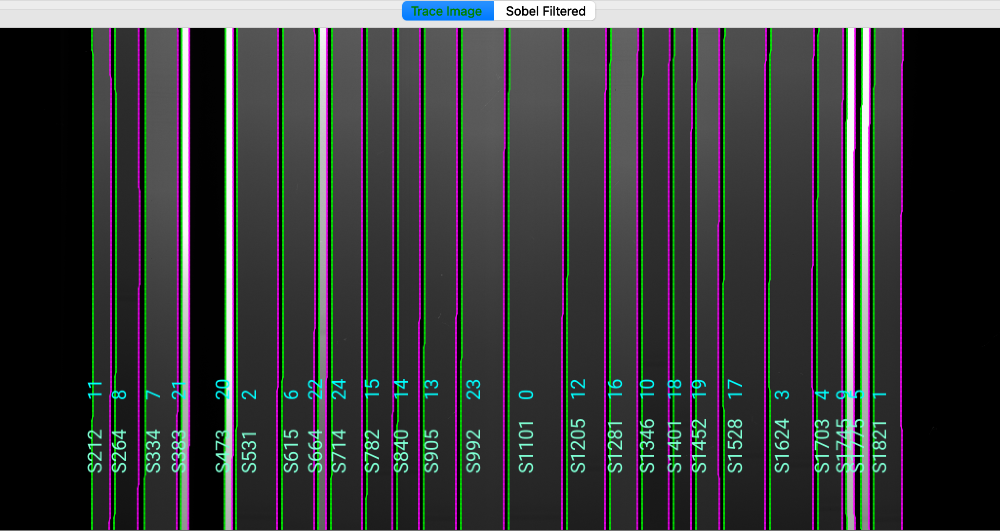

The data shown is the *Trace Image*, i.e., the flat image.
The green/magenta lines indicate the left/right slit edges.  The aquamarine labels starting with an
``S`` are the internal slit identifiers of PypeIt, while the cyan numbers are the slit ID values
from the slitmask design, which within the Pypeit framework are called ``maskdef_id``. **The
maskdef_id values are never shown for long-slit observations.**

See :ref:`edges` for further details.

We can also inspect the ``Slits`` file, which contains the main information on the traced slit edges,
organized into left-right slit pairs. This is a FITS file containing one or two `astropy.io.fits.BinTableHDU`_
extensions. The second extension, called ``MASKDEF_DESIGNTAB``, **which is available only for multi-slit observations
and if the slitmask design information is provided**, contains all the relevant slitmask design information.
In this example, the first few rows of ``MASKDEF_DESIGNTAB`` looks like this:

.. code-block:: python

    from astropy.io import fits
    from astropy.table import Table

    hdu=fits.open('Calibrations/Slits_A_0_DET01.fits.gz')
    Table(hdu['MASKDEF_DESIGNTAB'].data)

    TRACEID TRACESROW     TRACELPIX          TRACERPIX      SPAT_ID MASKDEF_ID SLITLMASKDEF SLITRMASKDEF       SLITRA             SLITDEC            SLITLEN            SLITWID             SLITPA       ALIGN OBJID       OBJRA               OBJDEC       OBJNAME   OBJMAG OBJMAG_BAND    OBJ_TOPDIST        OBJ_BOTDIST
     int64    int64        float64            float64        int64    int64      float64      float64         float64             float64            float64            float64            float64       int16 int64      float64             float64        str32   float64    str32         float64            float64
    ------- --------- ------------------ ------------------ ------- ---------- ------------ ------------ ------------------ ------------------- ------------------ ------------------ ------------------ ----- ----- ------------------ ------------------- -------- ------- ----------- ------------------ ------------------
          0      1032 193.60062170028687 231.29763960838318     212         11        211.0        247.0 203.89075232578443 -28.092169267295024  9.822391510009766 0.9919275641441345 15.412363052368164     0    11 203.89072727254896  -28.09230361665466   gal172  22.353           r  4.424071886416087  5.398871433622549
          1      1032 241.12293437753794 288.52713346481323     265          8        257.0        306.0  203.8415716281879  -28.07607209753345 13.274372100830078 0.9922505021095276 15.440143585205078     0     8 203.84147689509808 -28.076401475507694   gal227  22.567           r  5.414064692172961  7.860407169533709
          2      1032   302.332216322422 367.47612684965134     335          7        318.0        382.0  203.9166660875971 -28.089147654373047 17.321680068969727 0.9887152314186096 15.405740737915039     0     7 203.91661609856362 -28.089363864800017   gal158  21.796           r  7.868456854365888   9.45355797935212
          3      1032 375.55078342556953  391.8777657151222     384         21        392.0        407.0  203.8961977293406 -28.080303275622498  3.998490333557129 3.9599761962890625 15.393735885620117     1    21 203.89621037750157 -28.080305533949872    star6  15.653           r 2.0029598959835964  1.996361115945478
          4      1032  465.5582481622696 481.88689267635345     474         20        480.0        495.0 203.92635312081273 -28.080791243205006 3.9996068477630615 3.9622230529785156 15.388344764709473     1    20 203.92636894459946 -28.080795440193242   star10  15.728           r  1.999165077712833  2.001801640220989

See :ref:`slits` for a description of all the columns of this table.

Arc
+++

You can view the ``Arc`` image used for the wavelength calibration of the science frame with `ginga`_:

.. code-block:: bash

    ginga Calibrations/Arc_A_0_DET01.fits

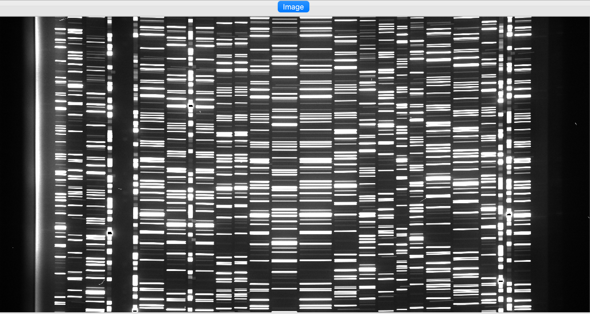

As typical of most arc images, we can see a series of arc lines, here oriented approximately horizontally.
It is important to inspect the arc image to make sure it looks good, ensuring to get a good wavelength calibration.

See :ref:`arc` for further details.

Wavelengths
+++++++++++

It is, also, very important to inspect the :ref:`qa` for the wavelength calibration.
These are PNG files in the ``QA/PNG/`` folder.

1D
::

Here is an example of the 1D fits for one of the slit on the detector,
written to the ``QA/PNGs/Arc_1dfit_A_0_DET01_S0212.png`` file:

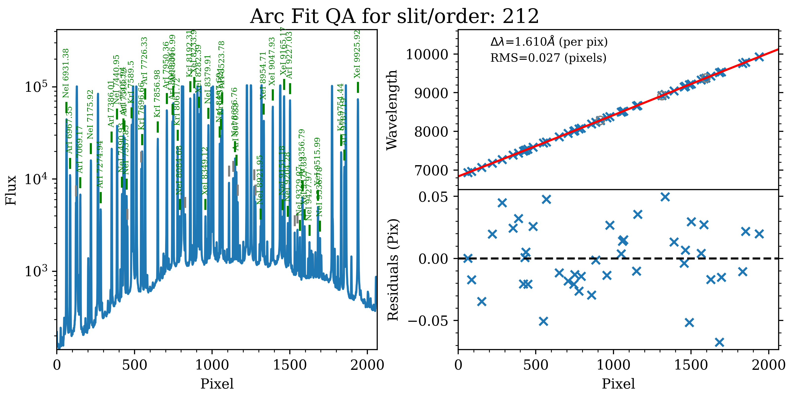

The left panel shows the arc spectrum extracted down the center of the slit, with the lines
used by the wavelength calibration marked in green.  Gray lines mark detected features that were
*not* included in the wavelength solution.  The top-right panel shows the fit (red) to the
observed trend in wavelength as a function of spectral pixel (blue crosses); gray circles
are features that were rejected by the wavelength solution.  The bottom-right panel shows the
fit residuals (i.e., data - model).

What you hope to see in this QA is:

 - On the left, many of the arc lines marked with green IDs
 - In the upper right, an RMS < 0.1 pixels
 - In the lower right, a random scatter about 0 residuals

In addition, the script :ref:`pypeit-chk-wavecalib` provides a summary of the wavelength calibration
for all the spectra. We can run it with this simple call:

.. code-block:: bash

    pypeit_chk_wavecalib Calibrations/WaveCalib_A_0_DET01.fits

and it prints on screen the following (here truncated) table:

.. code-block:: bash

     N. SpatID minWave Wave_cen maxWave dWave Nlin     IDs_Wave_range    IDs_Wave_cov(%) measured_fwhm  RMS
    --- ------ ------- -------- ------- ----- ---- --------------------- --------------- ------------- -----
      0    212  6835.4   8469.9 10121.3 1.610   43  6931.379 -  9925.919            91.1           2.7 0.027
      1    265  6038.3   7674.1  9327.6 1.612   45  6336.179 -  9227.030            87.9           2.7 0.025
      2    335  7169.5   8831.4 10485.5 1.611   39  7427.339 - 10472.923            91.8           2.7 0.348
      3    384     0.0      0.0     0.0 0.000    0     0.000 -     0.000             0.0           0.0 0.000
      4    474     0.0      0.0     0.0 0.000    0     0.000 -     0.000             0.0           0.0 0.000

See :ref:`pypeit-chk-wavecalib` for a detailed description of all the columns.
Note that the slits with ``SpatID`` 384 and 474 have all the values set to 0.0. This is because
these slits are actually alignment boxes and they are not reduced by the pipeline.

Tilts
:::::

Wavelength tilts are measured performing a 2D fit to the traced arc lines.
There are several QA files written for the 2D fits. One example is
``QA/PNGs/Arc_tilts_2d_A_0_DET01_S0212.png``:

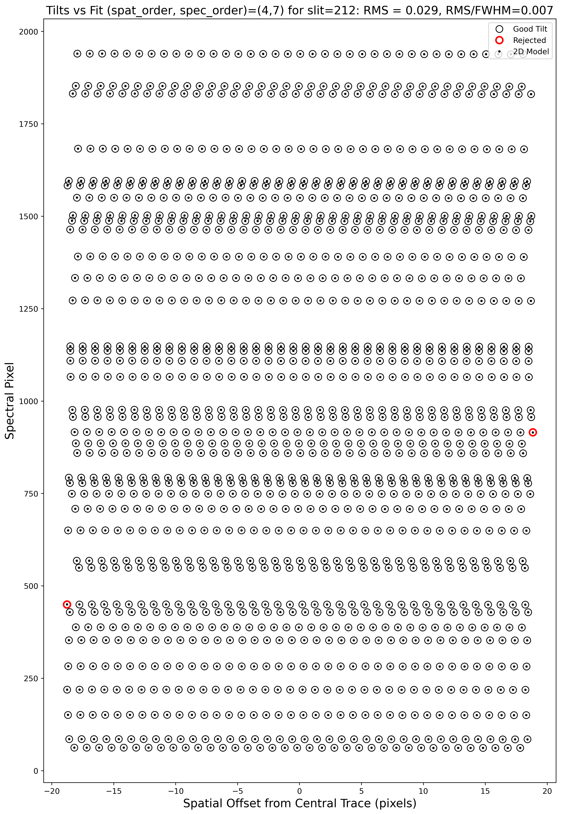

Each horizontal line of black open circles identifies a traced arc line.
Red circles shows the points that were rejected in the 2D fitting, and the
black points show the model predicted position.  The text across the top of
the figure gives the RMS of the 2D wavelength solution, which should be less than 0.1 pixels.

The 2D fit for the wavelength tilts can also be inspected using the script :ref:`pypeit_chk_tilts`,
which shows a :ref:`tiltimg` image in a `ginga`_ or `matplotlib`_ window with the
traced and 2D fitted tilts over-plotted. Here is an example:

.. code-block:: bash

    pypeit_chk_tilts Calibrations/Tilts_A_0_DET01.fits

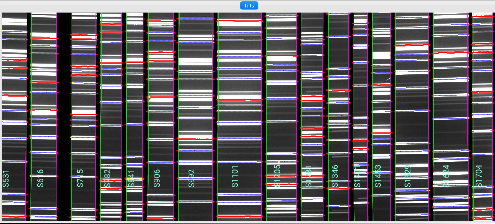

This shows a zoom-in of a :ref:`tiltimg` image in a `ginga`_ window with overlaid
the 2D fitted tilts (blue), the masked pixels (red), and the pixels rejected in the 2D fitting (yellow).
The lines that are not overlaid with any colored tilts are the ones that were not detected for the purpose of the
performing the 2D fitting.

See :ref:`tilts` for further details.

Flatfield
+++++++++

PypeIt computes a number of multiplicative corrections to correct the 2D spectral response
for pixel-to-pixel detector throughput variations and lower-order spatial and spectral illumination
and throughput corrections.  We collectively refer to these as flat-field corrections; see
:ref:`here <flat_fielding>` and :ref:`here <flat>`.
To inspect the ``Flat`` images we can use the script :ref:`pypeit_chk_flats`, with this explicit call:

.. code-block:: bash

    pypeit_chk_flats Calibrations/Flat_A_0_DET01.fits

Here is a zoom-in screenshot from the first tab in the `ginga`_ window (``pixflat_norm``):

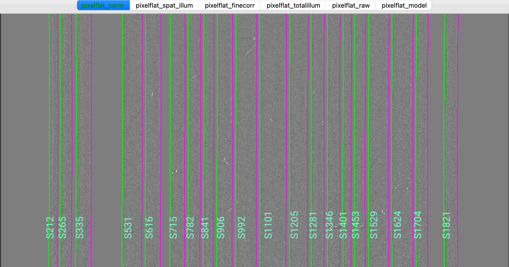

This shows the normalized flat field image. The green/magenta lines are the slit edges, which are
tweaked using the illumination flat field.

See :ref:`flat` and :ref:`flat_fielding` for further details.

Object finding
--------------

After the above calibrations are complete, PypeIt will iteratively identify
sources, perform global and local sky subtraction, and perform 1D spectral
extractions.  This process is fully described here: :ref:`object_finding`.

PypeIt produces QA files that allow you to assess the detection of the objects.
One example is ``QA\PNGs\r230417_01033-frb22022_LRISr_20230417T082242.672_DET01_S0212_obj_prof.png``:

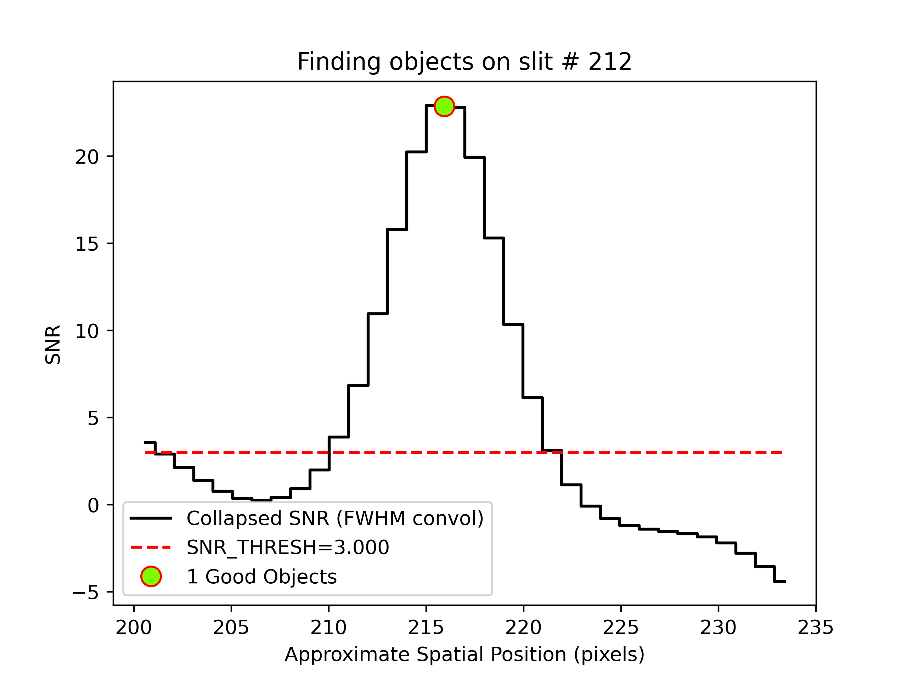

This shows the spatial profile of the object's S/N collapsed along the spectral direction.
The dashed red line is the S/N threshold set by the :ref:`findobjpar`, and the green circle
marks the spatial position of the detected object. This plot is useful to assess if the object
was correctly detected and if the S/N threshold (``snr_thresh``) set is appropriate for the
observation. See :ref:`object_finding` for further details.

Flexure
-------

PypeIt also measures a spectral flexure correction, by performing a cross-correlation
between the sky spectrum extracted in each slit and an archived sky spectrum.
The relative shift between the two spectra is then used to correct the wavelength solution
for each slit (see :ref:`flexure-spectral`).
Two flexure corrections are computed, one (called ``global``) using the sky lines
extracted at the center of the slit, and one (called ``local``) using the sky lines
extracted at the location of the science object.

There are two QA files (two for the ``global`` and two for the ``local`` correction)
that can be used to assess the flexure correction. Here is an example of two QA files
for the ``global`` correction, called
``QA/PNGs/r230417_01033-frb22022_LRISr_20230417T082242.672_global_DET01_S0212_spec_flex_corr.png`` and
``QA/PNGs/r230417_01033-frb22022_LRISr_20230417T082242.672_global_DET01_S0212_spec_flex_sky.png``:

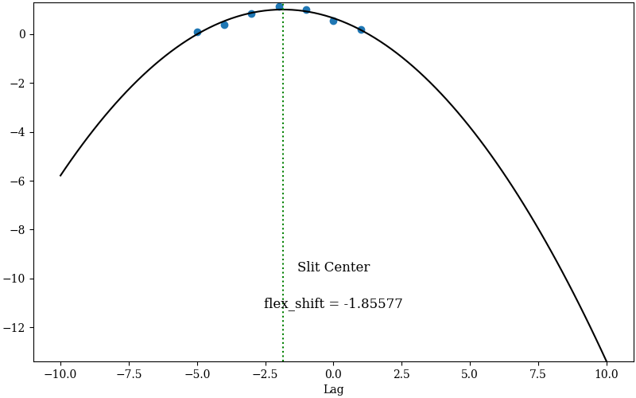
.. image:: ../figures/lris_flexure_qa.png
   :scale: 90%

The first plot shows the polynomial fit (black line) between the top seven highest cross-correlation values
(y-axis) and the corresponding shift in pixels (x-axis). The value of the shift with the highest
cross-correlation is the flexure correction applied to the wavelength solution (also printed in the plot).
The user should inspect this plot to make sure that the fit is good and that the value of the flexure shift
is comparable to what expected for the observations.
The second plot shows sky spectrum cutouts around some of the sky lines used for the flexure correction.
The black line is the sky spectrum extracted at the center of the slit shifted by the
computed flexure correction, while the red line is the archived sky spectrum. This is another way to
assess that the computed flexure correction is good. The user should hope to see a good match between
the two spectra.

Outputs
=======

The primary science output from :ref:`run-pypeit` are 2D spectral images and 1D
spectral extractions, located in the ``Science/`` folder.; see :ref:`outputs`.

Spec2D
------

Slit inspection
+++++++++++++++

It is frequently useful to view a summary of the slits successfully reduced by PypeIt, by
running the script :ref:`pypeit_parse_slits`.
In this example, we can inspect the reduced 2D spectrum with this explicit call:

.. code-block:: bash

     pypeit_parse_slits Science/spec2d_r230417_01033-frb22022_LRISr_20230417T082242.672.fits

which print the following (here truncated) table in the terminal:

.. code-block:: bash

    ============================== DET01 ==============================
    SpatID   MaskID   MaskOFF (pix)  Flags
    0212     0011     0.42           None
    0265     0008     0.42           None
    0335     0007     0.42           None
    0384     0021     0.42           BOXSLIT
    0474     0020     0.42           BOXSLIT

The four columns printed to screen are ``SpatID`` (the internal PypeIt ID), ``MaskID``,
(the slit ID from the slitmask design), ``MaskOFF`` (the dither offset) and ``Flags`` for each slit.
Slits with ``Flags`` set to ``BOXSLIT`` are alignment boxes and are not reduced by PypeIt. If the
calibration failed for some slits, the ``Flags`` column will show the reason for the failure.
Those slits with *None* in the ``Flags`` column have been successfully reduced.
**Note that the MaskID and MaskOFF columns are not printed for long-slit observations.**

Visual inspection
+++++++++++++++++

The 2D spectrum can be visually inspected using the script :ref:`pypeit_show_2dspec`.
In this example, we can visualize the 2D spectrum with this explicit call:

.. code-block:: bash

    pypeit_show_2dspec Science/spec2d_r230417_01033-frb22022_LRISr_20230417T082242.672.fits --removetrace

The ``--removetrace`` only shows the object trace in the first channel (the channel showing the
calibrated science image), but does not include it in the remaining channels. It is helpful to
to use the ``--removetrace`` option to better visualize the object traces (especially for faint
objects).

We show here a zoom-in screenshot from three (``sciimg-DET01``, ``sky_resid-DET01``, ``resid-DET01``) of the
four tabs in the `ginga`_ window:

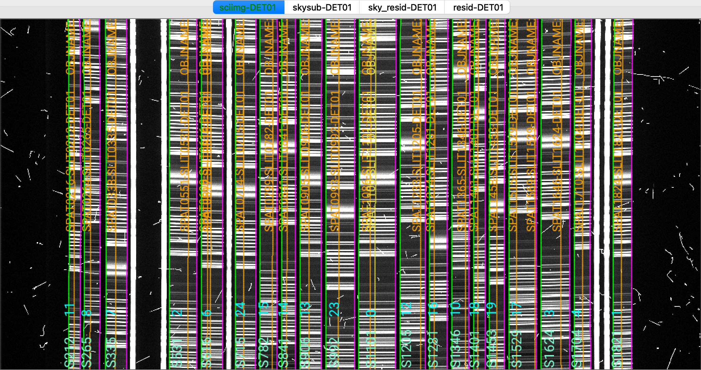
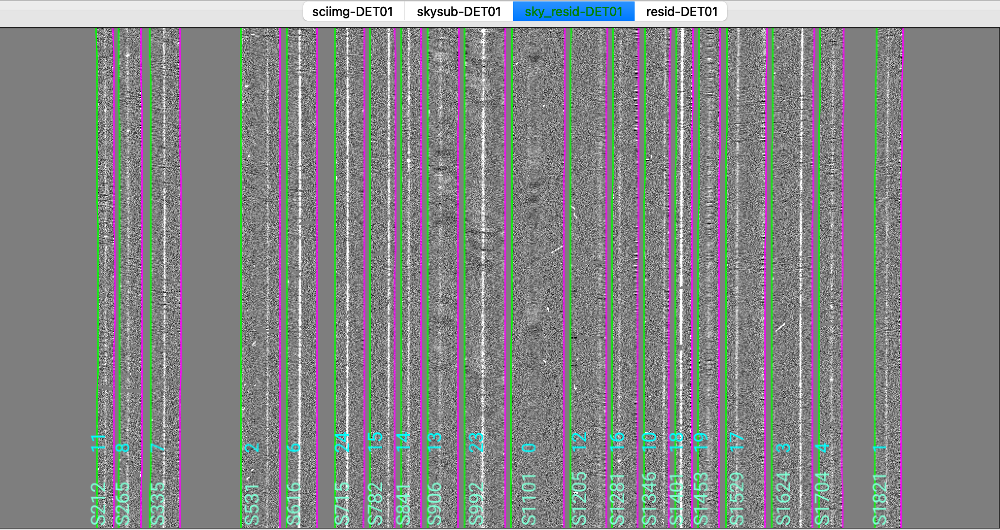
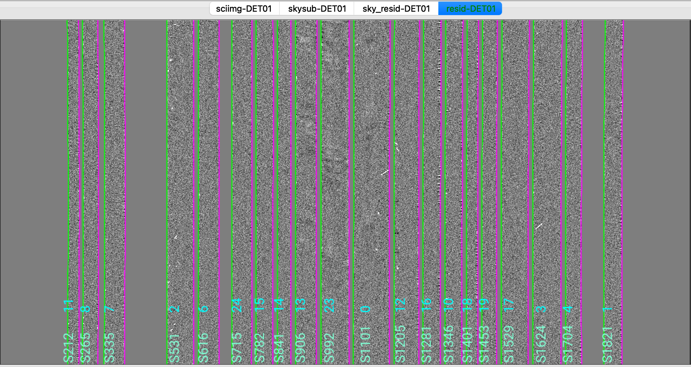

This shows on the top the calibrated science image, in the middle the sky residual image (sky-subtracted
calibrated image divided by the uncertainties), and on the right the residual image.
The green/magenta lines are the slit edges.  The orange lines (shown only in the first channel)
are the object traces and the orange text is the PypeIt assigned name (starting with ``SPAT``).
**Only for multi-slit observations, and if the slitmask design information is provided,**
The orange text also includes the object name from the slitmask design information (starting with ``OBJNAME``).
Yellow lines, if present, indicate sources that, although not detected, have been extracted
at the expected location using the slitmask design information (still **only for multi-slit observations**).
See :ref:`spec-2d-output` for further details.

The main assessments to perform are to make sure that the object is well traced,
that there are little to no strong sky residuals in the ``sky_resid`` channel,
and that the data in the ``resid`` channel looks like pure noise (see also :ref:`pypeit_chk_noise_2dspec`).

Spec1D
------

You can see a summary of all the extracted sources in the ``spec1d*.txt`` files saved
in the ``Science/`` folder.  For this example, here are the first few lines of the file
``Science/spec1d_r230417_01033-frb22022_LRISr_20230417T082242.672.txt``:

.. code-block:: console

    | slit |                    name | maskdef_id |  objname |     objra |    objdec | spat_pixpos | spat_fracpos | box_width | opt_fwhm |   s2n | maskdef_extract | wv_rms |
    |  212 | SPAT0216-SLIT0212-DET01 |         11 |   gal172 | 203.89073 | -28.09230 |       216.3 |        0.454 |      3.00 |    1.184 |  2.21 |           False |  0.027 |
    |  265 | SPAT0264-SLIT0265-DET01 |          8 |   gal227 | 203.84148 | -28.07640 |       263.5 |        0.384 |      3.00 |    1.240 |  2.19 |           False |  0.025 |
    |  335 | SPAT0338-SLIT0335-DET01 |          7 |   gal158 | 203.91662 | -28.08936 |       338.1 |        0.458 |      3.00 |    0.829 |  4.22 |           False |  0.348 |

It shows a table with the PypeIt names of the extracted spectra in each slit and all the associated
information about the extraction and the object. See :ref:`spec1d-extract_info` for a detailed description of this file.
**Note that the maskdef_id, objname, objra, objdec and maskdef_extract columns are not
printed for long-slit observations.**

To inspect the 1D spectrum, we can use the script :ref:`pypeit_show_1dspec`, with a call like this:

.. code-block:: bash

    pypeit_show_1dspec Science/spec1d_r230417_01033-frb22022_LRISr_20230417T082242.672.fits --exten 3

Since ``spec1d*.fits`` is a multi-extension FITS file that contains all the 1D extracted spectra
(one per each extension), we need to specify which 1D spectrum (i.e., extension) we want to inspect
by passing ``--exten 3`` to the call. To help decide which 1D spectrum to visualize,
we can run beforehand the following:

.. code-block:: bash

    pypeit_show_1dspec Science/spec1d_r230417_01033-frb22022_LRISr_20230417T082242.672.fits --list

which lists all the extensions with the associated 1D spectrum PypeIt name and a few other information.

This is a screenshot from the GUI showing the 1D spectrum:

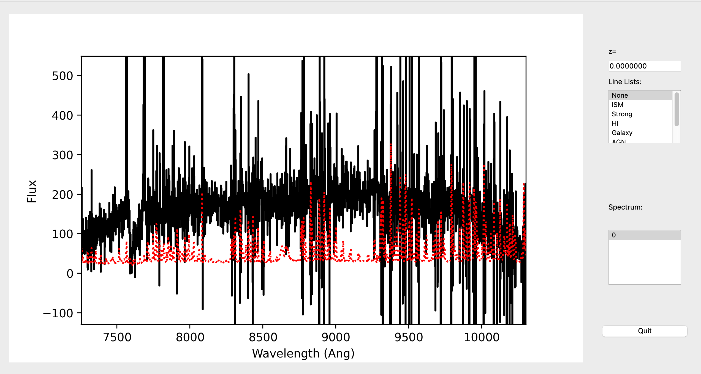

This uses the `XSpecGUI`_ from the `linetools`_ package.  The black line is the
flux and the red line is the estimated error. In the window, the user can press ``?`` to open
a webpage with the `XSpecGUI keystrokes`_ that help you navigate through the spectrum.

See :ref:`spec-1d-output` for further details.

