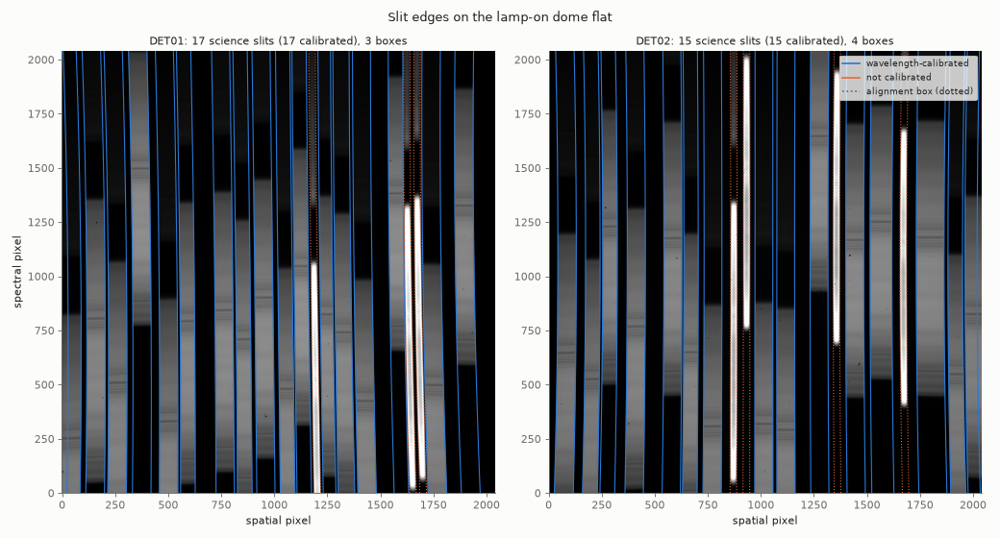
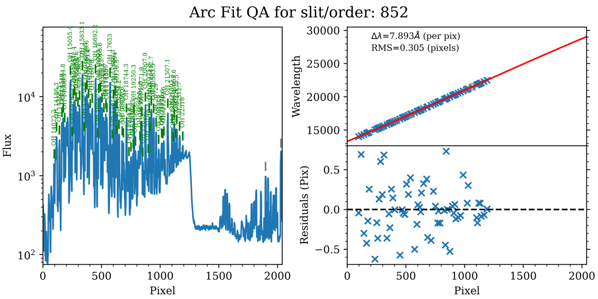
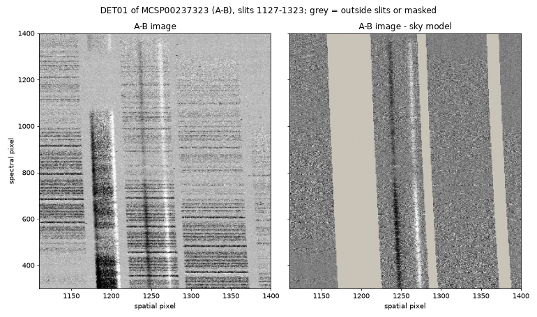
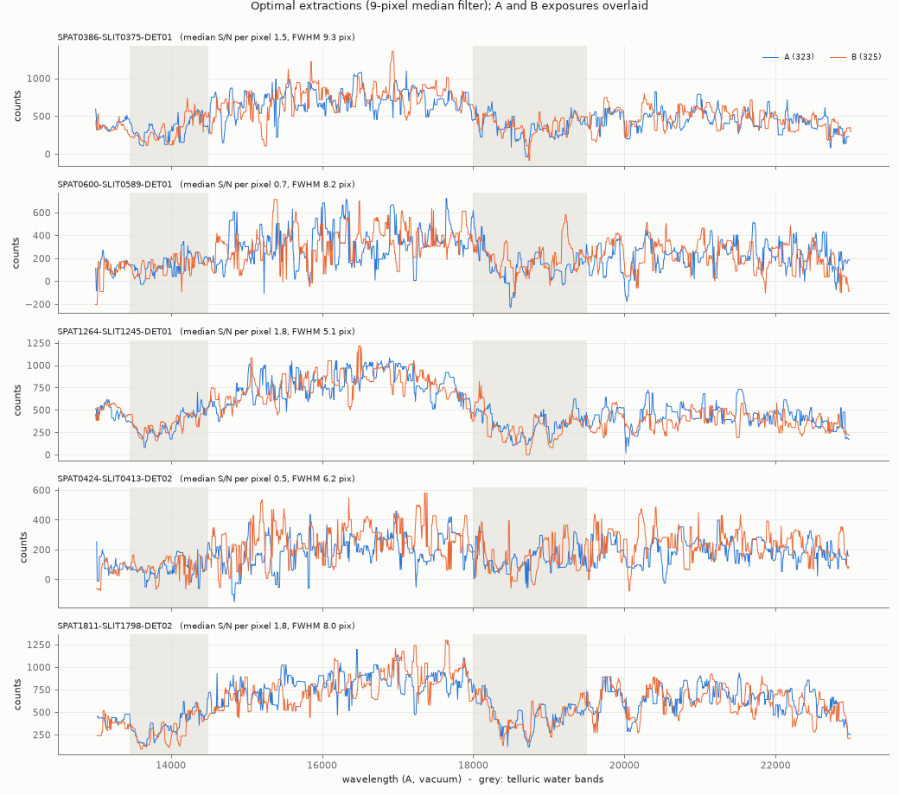

.. include:: ../include/links.rst

.. _moircs_howto:

===================
Subaru-MOIRCS HOWTO
===================

Overview
========

This doc goes through a full run of PypeIt on one of our :ref:`moircs`
**multi-object** datasets, specifically the ``subaru_moircs/HK500`` dataset:
one MOS mask (``MO17A_COSMOS2``) observed with the ``HK500`` grism.  See
:ref:`here <dev-suite>` to find the example dataset.

If you're having trouble reducing your data, we encourage you to try going
through this tutorial using this example dataset first.  Please join our
`PypeIt Users Slack <https://pypeit-users.slack.com>`__ using `this
invitation link <invite_>`_ to ask for help, and/or `Submit an issue`_ to
Github if you find a bug!

Setup
=====

Organize data
-------------

Place all of the raw files of your dataset in one folder: the science
frames, the lamp-on and lamp-off dome flats and, if available, standard
stars.  MOIRCS writes each exposure as **two files**, one per detector
(chip 1 has the odd frame number, chip 2 the next even number).  Keep both
files of every exposure, in the same folder; PypeIt needs both to reduce
both detectors (see :ref:`moircs_detectors`).

In this example, the raw data are in
``PypeIt-development-suite/RAW_DATA/subaru_moircs/HK500``:

.. code-block:: bash

    $ ls -1 *.fits
    MCSP00237163.fits   # dome flat, lamp on   (chip 1)
    MCSP00237164.fits   # dome flat, lamp on   (chip 2)
    MCSP00237165.fits
    MCSP00237166.fits
    MCSP00237167.fits
    MCSP00237168.fits
    MCSP00237177.fits   # dome flat, lamp off  (chip 1)
    MCSP00237178.fits   # dome flat, lamp off  (chip 2)
    MCSP00237179.fits
    MCSP00237180.fits
    MCSP00237181.fits
    MCSP00237182.fits
    MCSP00237201.fits   # mask image (chip 1)
    MCSP00237202.fits   # mask image (chip 2)
    MCSP00237323.fits   # science, dither position A (chip 1)
    MCSP00237324.fits   # science, dither position A (chip 2)
    MCSP00237325.fits   # science, dither position B (chip 1)
    MCSP00237326.fits   # science, dither position B (chip 2)

The two science exposures are 180 s each, taken as an A-B pair with a
3 arcsec dither along the slits.

Run ``pypeit_setup``
--------------------

The first script to run with PypeIt is :ref:`pypeit_setup`, which examines
the raw files and generates a sorted list and (when instructed) one
:ref:`pypeit_file` per instrument configuration.  See complete instructions
in :ref:`setup_doc`.

We move to the folder where we want to perform the reduction (usually *not*
the raw-data folder) and run:

.. code-block:: bash

    cd folder_for_reducing
    pypeit_setup -s subaru_moircs -r /path/to/RAW_DATA/subaru_moircs/HK500 -b

The ``-b`` flag is needed for near-IR data taken with a dither pattern: it
adds the ``calib``, ``comb_id`` and ``bkg_id`` columns to the
:ref:`data_block`, which set the A-B background subtraction (see
:ref:`setup_doc` and :doc:`../A-B_differencing`).

PypeIt warns that it removes the chip-2 files from the metadata table:

.. code-block:: console

    [WARNING] - The following frames have configurations that cannot be reduced by PypeIt and will be removed from the metadata table (pypeit file):
        MCSP00237164.fits
        MCSP00237166.fits
        ...
        MCSP00237326.fits

This is expected.  Each chip-2 file is read automatically, together with
its chip-1 companion, when PypeIt reduces the second detector.

The ``setup_files/subaru_moircs.sorted`` file shows two configurations:

.. code-block:: console

    ##########################################################
    Setup A
        dispname: HK500
          decker: MO17A_COSMOS2
         binning: 1,1
    #---------------------------------------------------------
             filename |                 frametype | ... |       target | ... | exptime | lampstat01 | dithpat | dithpos | dithoff | ...
    MCSP00237163.fits | pixelflat,illumflat,trace | ... |     DOMEFLAT | ... |     5.0 |         on |    none |    none |     0.0 | ...
    ...
    ##########################################################
    Setup B
        dispname: K_CONT
          decker: MO17A_COSMOS2
         binning: 1,1
    #---------------------------------------------------------
               filename | frametype | ... |    target | ...
    # MCSP00237201.fits |      None | ... | MASKIMAGE | ...
    ##end

Setup B holds only the mask image, which PypeIt does not use (it is not
typed).  We generate the :ref:`pypeit_file` for setup A:

.. code-block:: bash

    pypeit_setup -s subaru_moircs -r /path/to/RAW_DATA/subaru_moircs/HK500 -b -c A

This creates ``subaru_moircs_A/subaru_moircs_A.pypeit``:

.. code-block:: console

    # User-defined execution parameters
    [rdx]
        spectrograph = subaru_moircs

    # Setup
    setup read
    Setup A:
      binning: 1,1
      decker: MO17A_COSMOS2
      dispname: HK500
    setup end

    # Data block
    data read
     path /path/to/RAW_DATA/subaru_moircs/HK500
             filename |                 frametype |                 ra |                dec |       target | dispname |        decker | binning |               mjd | airmass | exptime | lampstat01 | dithpat | dithpos | dithoff |      frameno | calib | comb_id | bkg_id
    MCSP00237323.fits |          arc,science,tilt | 149.76983749999997 |            1.79965 |      COSMOS2 |    HK500 | MO17A_COSMOS2 |     1,1 | 57853.28436814342 |   1.055 |   180.0 |        off |   LINE2 |       A |    -1.5 | MCSA00237323 |     0 |       1 |      2
    MCSP00237325.fits |          arc,science,tilt | 149.76899999999995 | 1.7998416666666666 |      COSMOS2 |    HK500 | MO17A_COSMOS2 |     1,1 | 57853.28689131467 |   1.054 |   180.0 |        off |   LINE2 |       B |     1.5 | MCSA00237325 |     0 |       2 |      1
    MCSP00237177.fits |              lampoffflats |        103.0039625 |  19.85227777777778 | DOMEFLAT_OFF |    HK500 | MO17A_COSMOS2 |     1,1 | 57853.16683944874 |     1.0 |     5.0 |        off |    none |    none |     0.0 | MCSA00237177 |     0 |      -1 |     -1
    MCSP00237179.fits |              lampoffflats | 103.06746666666666 | 19.852380555555555 | DOMEFLAT_OFF |    HK500 | MO17A_COSMOS2 |     1,1 | 57853.16702463385 |     1.0 |     5.0 |        off |    none |    none |     0.0 | MCSA00237179 |     0 |      -1 |     -1
    MCSP00237181.fits |              lampoffflats | 103.13432083333333 | 19.852486111111112 | DOMEFLAT_OFF |    HK500 | MO17A_COSMOS2 |     1,1 | 57853.16719825659 |     1.0 |     5.0 |        off |    none |    none |     0.0 | MCSA00237181 |     0 |      -1 |     -1
    MCSP00237163.fits | pixelflat,illumflat,trace | 102.12359583333331 |  19.85086388888889 |     DOMEFLAT |    HK500 | MO17A_COSMOS2 |     1,1 | 57853.16443201806 |     1.0 |     5.0 |         on |    none |    none |     0.0 | MCSA00237163 |     0 |      -1 |     -1
    MCSP00237165.fits | pixelflat,illumflat,trace | 102.19253749999999 | 19.850975000000002 |     DOMEFLAT |    HK500 | MO17A_COSMOS2 |     1,1 | 57853.16458248114 |     1.0 |     5.0 |         on |    none |    none |     0.0 | MCSA00237165 |     0 |      -1 |     -1
    MCSP00237167.fits | pixelflat,illumflat,trace | 102.25228333333331 | 19.851072222222225 |     DOMEFLAT |    HK500 | MO17A_COSMOS2 |     1,1 | 57853.16475609224 |     1.0 |     5.0 |         on |    none |    none |     0.0 | MCSA00237167 |     0 |      -1 |     -1
    data end

Check the PypeIt file
---------------------

.. warning::

    PypeIt's automatic frame typing is **not fool-proof**.  It relies on the
    ``DATA-TYP`` and ``OBJECT`` header cards and on the exposure time (see
    :ref:`moircs_frames_report`), which depend on how your observations were
    taken and named.  **Always inspect every row of the** :ref:`data_block`
    **before running the reduction**, and correct it where needed.  A
    single mis-typed frame (e.g. a lamp-off flat typed as a flat) can
    silently degrade the whole reduction.

Go through the :ref:`data_block` column by column:

``frametype``
    - The science frames should be ``arc,science,tilt``: the OH sky lines
      in the science frames provide the wavelength calibration and the
      tilts.
    - The lamp-on dome flats should be ``pixelflat,illumflat,trace``, and the
      lamp-off dome flats ``lampoffflats``.  The lamp-off flats are
      recognized only by ``OBJECT = DOMEFLAT_OFF`` (the ``target`` column).
      If yours are named differently, they will appear as lamp-on flats;
      change them to ``lampoffflats``.
    - Science and standard frames are told apart by their exposure time
      only (above or below 20 s).  Check that your standards are typed
      ``standard`` (and ``arc,tilt``) and your science frames ``science``.
    - Frames PypeIt could not type are written commented out with
      ``frametype = None`` (e.g. mask images or ThAr arcs; see
      :ref:`moircs_thar` to use ThAr arcs).  Check that nothing you need was
      left out.

``target``, ``dispname``, ``decker``
    Check that all frames in the setup belong to the same mask and grism, and
    that the flats were taken with the same mask as the science frames.

``dithpat``, ``dithpos``, ``dithoff``
    These are read from the ``K_DITPAT``, ``K_DITCNT`` and ``K_DITWID``
    header cards.  For the ``LINE2`` pattern, the first position is A
    (``dithoff = -K_DITWID/2``) and the second B (``+K_DITWID/2``).  Other
    patterns are not paired automatically (see :ref:`moircs_dither`).

``calib``, ``comb_id``, ``bkg_id``
    PypeIt pairs each A frame with the closest-in-time B frame for
    background subtraction.  Here, frame 1 (A) uses frame 2 (B) as its
    background and vice versa, so PypeIt produces an A-B and a B-A image.
    For longer sequences (ABBA, ABAB, ...), or if you want to combine the
    frames at each position before subtraction, edit these columns (see
    :doc:`../A-B_differencing` and :ref:`2d_combine`).  If you have
    several masks or nights, make sure that each science frame shares its
    ``calib`` value with the right flats.

Then **update your PypeIt file**: correct any wrong ``frametype``, comment
out (with ``#``) or delete any bad frames, and edit ``comb_id``/``bkg_id`` as
needed.  You can also add parameters to the :ref:`parameter_block`.  For
example, to reduce only the second detector, add ``detnum``:

.. code-block:: ini

    [rdx]
        spectrograph = subaru_moircs
        detnum = 2

In this example, all the frame types and dither pairs are correct, so no
edits are needed.

.. note::

    The default parameters for MOIRCS are listed in
    :ref:`instr_par-subaru_moircs`, and some are set per grism (see
    :ref:`moircs`).  They are not shown in the :ref:`pypeit_file`.  The
    ``.par`` file written at the start of the main run lists every parameter
    with the value used.

Main Run
========

Once the :ref:`pypeit_file` is ready, the main call is simply:

.. code-block:: bash

    cd subaru_moircs_A
    run_pypeit subaru_moircs_A.pypeit -o

The ``-o`` flag indicates that any existing output files should be
overwritten.  Both detectors are reduced in the same run.

As the code processes the data, it produces a number of files and QA plots
that can be inspected; a number of :ref:`inspect_scripts` are available to
help with this.  We present some of these below.

Calibrations
============

Slit Edges
----------

The slit edges are traced on the lamp-on dome flats, after the lamp-off flats
have been subtracted.  Inspect them with:

.. code-block:: bash

    pypeit_chk_edges Calibrations/Edges_A_0_DET01.fits.gz

In this example, PypeIt finds 20 slits on DET01 (17 science slits and 3
alignment-star boxes) and 19 on DET02 (15 science slits and 4 boxes):

Each slit is drawn in blue if it was wavelength calibrated and in orange if
not; dotted lines mark the alignment-star boxes, which are flagged as box
slits and not reduced as science slits.  Note that many spectra cover only
part of the detector in the spectral (vertical) direction: depending on its
position in the mask, a slit's spectrum runs off the detector at one end.
This is expected.

Wavelengths
-----------

Get a summary of the wavelength solutions with:

.. code-block:: bash

    pypeit_chk_wavecalib Calibrations/WaveCalib_A_0_DET01.fits

In this example, every science slit on both detectors is calibrated, with
50--72 OH lines and an RMS of 0.24--0.43 pixels (the dispersion is about
7.6 Å per pixel).  The alignment-star boxes are not calibrated.  Here is the
QA plot for one slit (``QA/PNGs/Arc_1dfit_A_0_DET01_S0852.png``):

The sky emission cuts off sharply at about 2.3 µm (pixel ~1250 for this
slit); the wavelength solution is an extrapolation beyond that.

Flatfield
---------

Inspect the flat field with:

.. code-block:: bash

    pypeit_chk_flats Calibrations/Flat_A_0_DET01.fits

The pixel-to-pixel variations in the normalized pixel flat
(``pixflat_norm``) are about 1%.  Look for artefacts at the ends of each
slit's spectral coverage, where the illumination drops.

Spectra
=======

Spec2D
------

View the processed 2D images with :ref:`pypeit_show_2dspec`:

.. code-block:: bash

    pypeit_show_2dspec Science/spec2d_MCSP00237323-COSMOS2_MOIRCS_20170410T064929.408.fits --det 1

Here is a zoom on a portion of DET01 of the A-B image, before (left) and
after (right) subtraction of PypeIt's sky model:

The A-B difference alone (left) leaves strong OH residuals, because the sky
changes between the A and B exposures; the sky model removes them (right).
The bright stripe at spatial pixel ~1190 is an alignment-star box.  The
object in slit 1245 appears as a positive (white) trace from the A exposure,
with a negative (dark) trace 26 pixels (3 arcsec) away from the B exposure.
After sky subtraction, the image should be consistent with noise; here the
distribution of residuals divided by their errors has a standard deviation
of ~0.9.

Spec1D
------

The spec1d file of each exposure holds the extracted spectra from both
detectors.  List them with:

.. code-block:: console

    $ cat Science/spec1d_MCSP00237323-COSMOS2_MOIRCS_20170410T064929.408.txt
    | slit |                    name | ... | box_width | opt_fwhm |  s2n | wv_rms |
    ...

and view them with :ref:`pypeit_show_1dspec`:

.. code-block:: bash

    pypeit_show_1dspec Science/spec1d_MCSP00237323-COSMOS2_MOIRCS_20170410T064929.408.fits --exten 1

In this example, PypeIt finds 5 objects in each exposure (3 on DET01 and 2
on DET02).  Here are their optimal extractions, with the A and B exposures
overlaid:

The targets are faint (median S/N 0.5--2 per pixel in 180 s), and most
slits have no object detected in this single A-B pair.  Combining more
exposures (see :ref:`coadd2d`) or extracting at the expected positions
manually (see :doc:`../manual`) can help.

Next steps
==========

- Flux-calibrate with a standard star; see :doc:`../fluxing` and
  :doc:`../telluric`.
- Combine the 1D spectra of the A and B exposures (and of more exposures);
  see :doc:`../coadd1d`.
