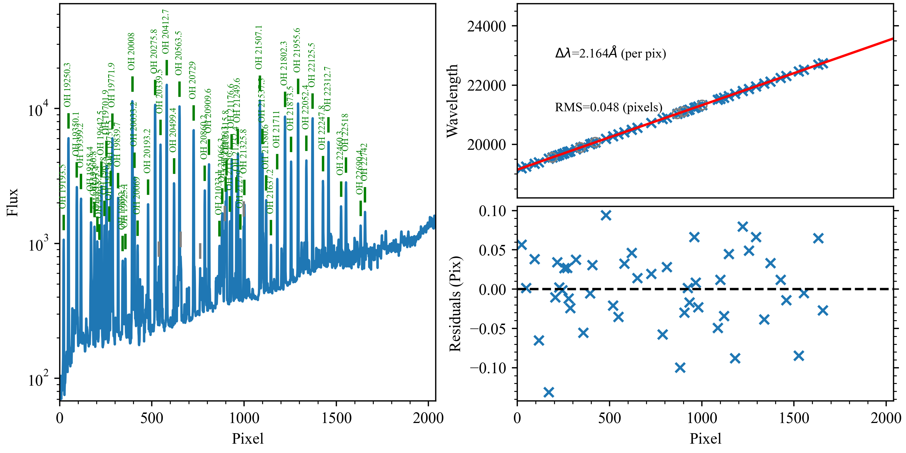
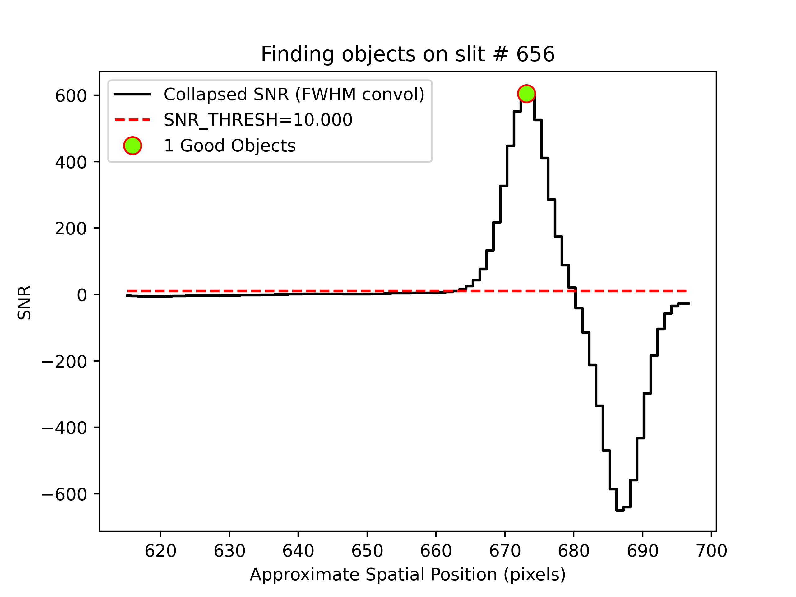
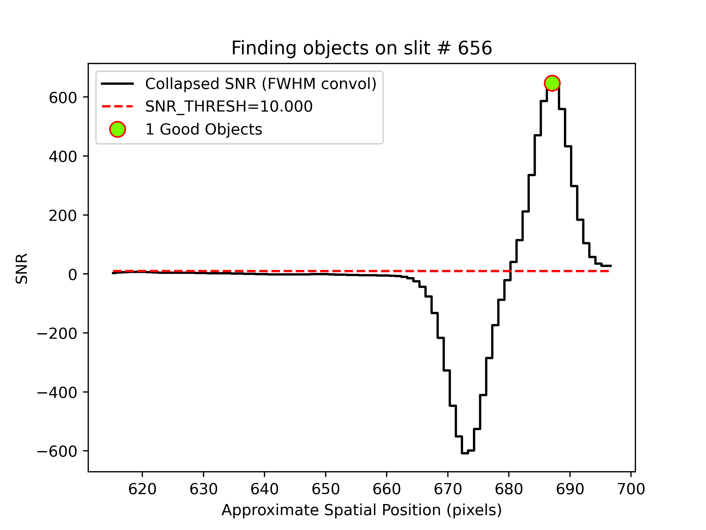

.. include:: ../include/links.rst

.. _mosfire_howto:

==================
Keck-MOSFIRE HOWTO
==================

Overview
========

This doc goes through a full run of PypeIt on one of the Keck/MOSFIRE datasets
in the `PypeIt Development Suite`_ (see :ref:`dev-suite`), specifically the
``mask1_K_with_continuum`` multi-slits observations.  The following was
performed on a Macbook Pro with 16 GB RAM and took approximately 20 minutes.

Setup
=====

Organize data
-------------

Place all of the files in a single folder, making sure you have
all the calibration files you need, in addition to the science ones.
The dataset used here is in the following folder:
``/PypeIt-development-suite/RAW_DATA/mask1_K_with_continuum``.

The files within this folder are:

.. code-block:: bash

    $ ls
    m121128_0105.fits m121128_0112.fits m121128_0119.fits m121128_0215.fits
    m121128_0106.fits m121128_0113.fits m121128_0120.fits m121128_0216.fits
    m121128_0107.fits m121128_0114.fits m121128_0214.fits m121128_0217.fits

This folder can include data from different datasets (e.g., more than one slitmask
or observations in various filter). The script :ref:`pypeit_setup`
(see next step) will help to parse the desired dataset.

.. important::
    **Note on calibrations**

    The MOSFIRE calibration GUI provides, during your observing night, the option to take flats
    with the lamps off. This is the default in the GUI only for the K-band, but we recommend taking
    these flats for *all* MOSFIRE spectroscopic observations. The purpose of the flats with the lamps off
    is to remove the increase and/or variation in zero level caused by persistence from the high counts
    in the flats and/or thermal emission from the telescope/dome (in the K-band). See :ref:`mosfire_flats`
    for more info.

    Also, PypeIt generally perform the wavelength calibration using the OH lines in the science frames. For this
    reason arc frames are not required for the reduction unless the observations were taken with a
    ``long2pos_specphot`` slitmask. If ``long2pos_specphot`` slitmask is used, the arc frames *are required* for
    a successful wavelength calibration. See :ref:`mosfire_wavecalib` for more info.

Run ``pypeit_setup``
--------------------

The first script to run with PypeIt is :ref:`pypeit_setup`, which examines the raw files
and generates a sorted list and (when instructed) one :ref:`pypeit_file` per instrument configuration.

See complete instructions provided in :ref:`setup_doc`.

For this example, we move to the folder where we want to perform the reduction and save the
associated outputs and we run:

.. code-block:: bash

    cd folder_for_reducing   # this is usually *not* the raw data folder
    pypeit_setup -s keck_mosfire -r /PypeIt-development-suite/RAW_DATA/mask1_K_with_continuum -b

This creates, in a folder called ``setup_files/``, a ``.sorted`` file that shows the raw files organized
by datasets. We inspect the ``.sorted`` file and identify the dataset that we want to reduced
(in this case it is indicated with the letter ``A`` ) and re-run ``pypeit_setup`` as:

.. code-block:: bash

    pypeit_setup -s keck_mosfire -r /PypeIt-development-suite/RAW_DATA/mask1_K_with_continuum -b -c A

Note that we use the ``-b`` flag because we are dealing with near-IR observations for which a
dither pattern is used to perform background subtraction. The ``-b`` flag adds three columns in the
:ref:`data_block` of the ``pypeit_file``, and these columns hold instructions on the
desired background subtraction (see :ref:`setup_doc` and :ref:`a-b_differencing` for more info).

This creates a :ref:`pypeit_file` called ``keck_mosfire_A.pypeit`` inside a folder called
``keck_mosfire_A/``, and it looks like this:

.. code-block:: console

    # Auto-generated PypeIt input file using PypeIt version: 1.10.1.dev218+gefe7d7ef6
    # UTC 2022-10-14T22:04:15.975

    # User-defined execution parameters
    [rdx]
        spectrograph = keck_mosfire

    # Setup
    setup read
    Setup A:
      decker_secondary: ic348_TK_M03A
      dispname: K-spectroscopy
      filter1: K
      slitlength: null
      slitwid: null
    setup end

    # Data block
    data read
     path mask1_K_with_continuum
             filename |                 frametype |          ra |         dec |        target |       dispname |        decker | binning |            mjd |    airmass |  exptime | filter1 | lampstat01 | dithpat | dithpos | dithoff | frameno | calib | comb_id | bkg_id
    m121128_0214.fits |          arc,science,tilt | 56.27484011 | 32.19165488 | ic348_TK_M03A | K-spectroscopy | ic348_TK_M03A |     1,1 |  56259.2716455 | 1.37254788 | 98.92572 |       K |        off |   Stare |       A |     1.5 |     214 |     0 |       1 |      2
    m121128_0215.fits |          arc,science,tilt | 56.27402153 | 32.19170348 | ic348_TK_M03A | K-spectroscopy | ic348_TK_M03A |     1,1 | 56259.27318428 | 1.36213505 | 98.92572 |       K |        off |   Stare |       B |    -1.5 |     215 |     0 |       2 |      1
    m121128_0216.fits |          arc,science,tilt | 56.27402153 | 32.19170348 | ic348_TK_M03A | K-spectroscopy | ic348_TK_M03A |     1,1 | 56259.27469644 | 1.35216515 | 98.92572 |       K |        off |   Stare |       B |    -1.5 |     216 |     0 |       2 |      1
    m121128_0217.fits |          arc,science,tilt | 56.27484011 | 32.19165488 | ic348_TK_M03A | K-spectroscopy | ic348_TK_M03A |     1,1 | 56259.27624622 | 1.34220549 | 98.92572 |       K |        off |   Stare |       A |     1.5 |     217 |     0 |       1 |      2
    m121128_0119.fits |                  arc,tilt |         7.8 |        45.0 |       unknown | K-spectroscopy | ic348_TK_M03A |     1,1 | 56259.14680212 | 1.41291034 |  1.45479 |       K |         Ar |    none |    none |     0.0 |     119 |     0 |      -1 |     -1
    m121128_0120.fits |                  arc,tilt |         7.8 |        45.0 |       unknown | K-spectroscopy | ic348_TK_M03A |     1,1 | 56259.14700351 | 1.41291034 |  1.45479 |       K |         Ne |    none |    none |     0.0 |     120 |     0 |      -1 |     -1
    m121128_0105.fits |              lampoffflats |         7.8 |        45.0 |       unknown | K-spectroscopy | ic348_TK_M03A |     1,1 | 56259.14200914 | 1.41291034 |  14.5479 |       K |        off |    none |    none |     0.0 |     105 |     0 |      -1 |     -1
    m121128_0106.fits |              lampoffflats |         7.8 |        45.0 |       unknown | K-spectroscopy | ic348_TK_M03A |     1,1 | 56259.14231181 | 1.41291034 |  14.5479 |       K |        off |    none |    none |     0.0 |     106 |     0 |      -1 |     -1
    m121128_0107.fits |              lampoffflats |         7.8 |        45.0 |       unknown | K-spectroscopy | ic348_TK_M03A |     1,1 | 56259.14262084 | 1.41291034 |  14.5479 |       K |        off |    none |    none |     0.0 |     107 |     0 |      -1 |     -1
    m121128_0112.fits | pixelflat,illumflat,trace |         7.8 |        45.0 |       unknown | K-spectroscopy | ic348_TK_M03A |     1,1 | 56259.14425684 | 1.41291034 |  14.5479 |       K |         on |    none |    none |     0.0 |     112 |     0 |      -1 |     -1
    m121128_0113.fits | pixelflat,illumflat,trace |         7.8 |        45.0 |       unknown | K-spectroscopy | ic348_TK_M03A |     1,1 | 56259.14450569 | 1.41291034 |  14.5479 |       K |         on |    none |    none |     0.0 |     113 |     0 |      -1 |     -1
    m121128_0114.fits | pixelflat,illumflat,trace |         7.8 |        45.0 |       unknown | K-spectroscopy | ic348_TK_M03A |     1,1 | 56259.14479678 | 1.41291034 |  14.5479 |       K |         on |    none |    none |     0.0 |     114 |     0 |      -1 |     -1
    data end

Inspecting this file, we want to make sure that all the frame types were accurately assigned in the
:ref:`data_block`.  If not, these can be fixed by editing the :ref:`pypeit_file` directly; see instructions
:ref:`here<data_block>`. We can also remove any bad (or undesired) calibration
or science frames from the list, by either deleting them altogether or commenting out with a ``#``.

In this example, all the frametypes were accurately assigned. However, as mentioned earlier, we use the
OH lines in science frames for the wavelength calibration, therefore we do not want to keep the arc frames
(*m121128_0119.fits*, *m121128_0120.fits*) in the Data Block list, and we comment them out.

.. tip::
    If the user wants to use the arc frames instead, they can keep the 2 arc frames in the list, but need
    to edit the ``frametype`` for the science frames (*m121128_0214.fits - m121128_0217.fits*), i.e., remove
    the ``arc`` and ``tilt`` frame type. In addition, the changes explained in :ref:`mosfire_wavecalib` will have to
    be added to the :ref:`parameter_block`.

Other possible edits to the :ref:`data_block` are related to the ``comb_id`` and ``bkg_id``
columns, which instruct PypeIt on the desired frame combination and background subtraction.
For Keck/MOSFIRE data, PypeIt tries to automatically set the ``comb_id`` and ``bkg_id`` using the dither
information (reported here in the ``dithpat``, ``dithpos``, and ``dithoff`` columns) recorded in the header
of the science frames (see :ref:`mosfire_combid_bkgid`); however,
the user can edit these columns according to the preferred reduction (see :ref:`a-b_differencing` and
:ref:`2d_combine` for more info).

Finally, in this example, we also edit the :ref:`parameter_block` adding the following lines:

.. code-block:: ini

    [reduce]
        [[slitmask]]
            use_dither_offset = False
            bright_maskdef_id = 4

The dither offset, in conjunction with the MOSFIRE slitmask design information, is used by PypeIt to
find the targeted objects on the slit and to force the extraction of undetected objects at the expected location
(see :ref:`radec_object_report` and :ref:`add_missing_obj_report`). As default (i.e., if we did not add the
lines above in the :ref:`parameter_block`), PypeIt uses the dither offset recorded in the header of
the science frames for this purpose; however, it is known that MOSFIRE observations show small drifts of the
objects position with time, which are not recorded in the header. For this reason, a better approach would be
to let PypeIt compute the offset using a bright object in one of the slits in the slitmask. To do so, we need
to instruct PypeIt not to read the dither offset recorded in the header (``use_dither_offset = False``) and
to provide the ``Slit_Number`` of the slit containing the bright object we want to use to compute the offset
(``bright_maskdef_id = 4``, which means that we are using the bright object in the slit with ``Slit_Number=4``).

The final ``pypeit_file``, after all the edits, looks like this:

.. code-block:: console

    # Auto-generated PypeIt input file using PypeIt version: 1.10.1.dev218+gefe7d7ef6
    # UTC 2022-10-14T22:04:15.975

    # User-defined execution parameters
    [rdx]
        spectrograph = keck_mosfire
    [reduce]
       [[slitmask]]
          use_dither_offset = False
          bright_maskdef_id = 4

    # Setup
    setup read
    Setup A:
      decker_secondary: ic348_TK_M03A
      dispname: K-spectroscopy
      filter1: K
      slitlength: null
      slitwid: null
    setup end

    # Data block
    data read
     path mask1_K_with_continuum
             filename |                 frametype |          ra |         dec |        target |       dispname |        decker | binning |            mjd |    airmass |  exptime | filter1 | lampstat01 | dithpat | dithpos | dithoff | frameno | calib | comb_id | bkg_id
    m121128_0214.fits |          arc,science,tilt | 56.27484011 | 32.19165488 | ic348_TK_M03A | K-spectroscopy | ic348_TK_M03A |     1,1 |  56259.2716455 | 1.37254788 | 98.92572 |       K |        off |   Stare |       A |     1.5 |     214 |     0 |       1 |      2
    m121128_0215.fits |          arc,science,tilt | 56.27402153 | 32.19170348 | ic348_TK_M03A | K-spectroscopy | ic348_TK_M03A |     1,1 | 56259.27318428 | 1.36213505 | 98.92572 |       K |        off |   Stare |       B |    -1.5 |     215 |     0 |       2 |      1
    m121128_0216.fits |          arc,science,tilt | 56.27402153 | 32.19170348 | ic348_TK_M03A | K-spectroscopy | ic348_TK_M03A |     1,1 | 56259.27469644 | 1.35216515 | 98.92572 |       K |        off |   Stare |       B |    -1.5 |     216 |     0 |       2 |      1
    m121128_0217.fits |          arc,science,tilt | 56.27484011 | 32.19165488 | ic348_TK_M03A | K-spectroscopy | ic348_TK_M03A |     1,1 | 56259.27624622 | 1.34220549 | 98.92572 |       K |        off |   Stare |       A |     1.5 |     217 |     0 |       1 |      2
    # m121128_0119.fits |                  arc,tilt |         7.8 |        45.0 |       unknown | K-spectroscopy | ic348_TK_M03A |     1,1 | 56259.14680212 | 1.41291034 |  1.45479 |       K |         Ar |    none |    none |     0.0 |     119 |     0 |      -1 |     -1
    # m121128_0120.fits |                  arc,tilt |         7.8 |        45.0 |       unknown | K-spectroscopy | ic348_TK_M03A |     1,1 | 56259.14700351 | 1.41291034 |  1.45479 |       K |         Ne |    none |    none |     0.0 |     120 |     0 |      -1 |     -1
    m121128_0105.fits |              lampoffflats |         7.8 |        45.0 |       unknown | K-spectroscopy | ic348_TK_M03A |     1,1 | 56259.14200914 | 1.41291034 |  14.5479 |       K |        off |    none |    none |     0.0 |     105 |     0 |      -1 |     -1
    m121128_0106.fits |              lampoffflats |         7.8 |        45.0 |       unknown | K-spectroscopy | ic348_TK_M03A |     1,1 | 56259.14231181 | 1.41291034 |  14.5479 |       K |        off |    none |    none |     0.0 |     106 |     0 |      -1 |     -1
    m121128_0107.fits |              lampoffflats |         7.8 |        45.0 |       unknown | K-spectroscopy | ic348_TK_M03A |     1,1 | 56259.14262084 | 1.41291034 |  14.5479 |       K |        off |    none |    none |     0.0 |     107 |     0 |      -1 |     -1
    m121128_0112.fits | pixelflat,illumflat,trace |         7.8 |        45.0 |       unknown | K-spectroscopy | ic348_TK_M03A |     1,1 | 56259.14425684 | 1.41291034 |  14.5479 |       K |         on |    none |    none |     0.0 |     112 |     0 |      -1 |     -1
    m121128_0113.fits | pixelflat,illumflat,trace |         7.8 |        45.0 |       unknown | K-spectroscopy | ic348_TK_M03A |     1,1 | 56259.14450569 | 1.41291034 |  14.5479 |       K |         on |    none |    none |     0.0 |     113 |     0 |      -1 |     -1
    m121128_0114.fits | pixelflat,illumflat,trace |         7.8 |        45.0 |       unknown | K-spectroscopy | ic348_TK_M03A |     1,1 | 56259.14479678 | 1.41291034 |  14.5479 |       K |         on |    none |    none |     0.0 |     114 |     0 |      -1 |     -1
    data end

Main Run
========

Once the ``pypeit_file`` is ready, the main call is simply:

.. code-block:: bash

    run_pypeit keck_mosfire_A/keck_mosfire_A.pypeit -o

The "-o" specifies to over-write any existing science output files.  As there are none, it is superfluous but we
recommend (almost) always using it.

The :doc:`../running` doc describes the process in some more detail.

Inspecting Files
================

As the code runs, a series of files are written to the disk.

Calibrations
------------

The first set are :doc:`../calibrations/calibrations`. What follows are a series of screenshots
and :doc:`../qa` PNGs produced by PypeIt.

Slit Edges
++++++++++

The code will automatically assign edges to each slit on the detector.
This includes using information from the slitmask design recorded in the FITS file,
as described in :ref:`slitmask_ids_report`.

To check that PypeIt correctly identified every slits, we can run the :ref:`pypeit_chk_edges` script,
with this explicit call:

.. code-block:: bash

    pypeit_chk_edges Calibrations/Edges_A_1_DET01.fits.gz

which opens the `ginga`_ image viewer. Here is a zoom-in screenshot from the first tab
in the `ginga`_ window:

.. image:: ../figures/mosfire_edges_image.png
   :scale: 40%

The data shown is the *Trace Image*, i.e., the combined flat images with the lamp off flats subtracted.
The green/magenta lines indicate the left/right slit edges.  The aquamarine labels starting with an
``S`` are the internal slit identifiers of PypeIt, while the cyan numbers are the ``Slit_Number`` values
from the slitmask design, which within the Pypeit framework are called ``maskdef_id``.

See :doc:`../calibrations/edges` for further details.

We can also inspect the ``Slits`` file, which contains the main information on the traced slit edges,
organized into left-right slit pairs. This is a multi-extension FITS file with two
`astropy.io.fits.BinTableHDU`_ (for MOSFIRE). The second extension, called ``MASKDEF_DESIGNTAB``, includes
all the relevant slitmask design information. In this example, ``MASKDEF_DESIGNTAB`` looks like this:

.. code-block:: python

    from astropy.io import fits
    from astropy.table import Table

    hdu=fits.open('Calibrations/Slits_A_1_DET01.fits.gz')
    Table(hdu['MASKDEF_DESIGNTAB'].data)

    TRACEID TRACESROW     TRACELPIX          TRACERPIX      SPAT_ID MASKDEF_ID SLITLMASKDEF SLITRMASKDEF       SLITRA            SLITDEC       SLITLEN SLITWID  SLITPA ALIGN OBJID       OBJRA              OBJDEC       OBJNAME  OBJMAG OBJMAG_BAND OBJ_TOPDIST OBJ_BOTDIST
     int64    int64        float64            float64        int64    int64      float64      float64         float64            float64       float64 float64 float64 int16 int64      float64            float64        str32  float64    str32      float64     float64
    ------- --------- ------------------ ------------------ ------- ---------- ------------ ------------ ------------------ ------------------ ------- ------- ------- ----- ----- ------------------ ------------------ ------- ------- ----------- ----------- -----------
          0      1020                5.0  607.2395066097379     306          8          1.0        617.0  56.23137499999999  32.17076944444444  110.73     0.7  -176.0     0     0 56.246249999999996 32.169777777777774     486   15.13        None     100.845       9.885
          1      1020  613.8501725513488  697.6312689429615     656          7        622.0        705.0 56.252666666666656           32.20635   14.99     0.7  -176.0     0     0  56.25416666666666 32.206250000000004     319   13.03        None      12.025       2.965
          2      1020   701.421142488718  829.8306682892144     766          6        710.0        838.0 56.258958333333325  32.18079722222222   22.97     0.7  -176.0     0     0  56.25633333333333 32.180972222222216      79   10.88        None       3.425      19.545
          3      1020  835.2663683814462  918.9480155208148     877          5        843.0        926.0           56.26575  32.20384166666667   14.99     0.7  -176.0     0     0  56.26504166666666  32.20388888888889     906   15.78        None       5.315       9.675
          4      1020  924.0418631769717 1096.8624577845912    1010          4        931.0       1103.0  56.27362499999999 32.204458333333335   30.95     0.7  -176.0     0     0  56.27216666666666  32.20455555555556     456   13.96        None      11.045      19.905
          5      1020 1100.3442191183567  1494.650315925479    1297          3       1108.0       1502.0  56.29033333333332  32.17389722222222   70.84     0.7  -176.0     0     0  56.28170833333333  32.17447222222222      20    9.41        None        9.09       61.75
          6      1020 1499.9742311891168  1806.507759778495    1653          2       1507.0       1812.0 56.311583333333324 32.202536111111115   54.88     0.7  -176.0     0     0  56.30754166666666  32.20280555555556     904   12.91        None       15.13       39.75
          7      1020 1810.4302772426022 2029.2203606069088    1920          1       1817.0       2034.0  56.32729166666665  32.20144166666667   38.93     0.7  -176.0     0     0  56.32429166666666 32.201638888888894   10120   11.99        None      10.355      28.575

See :ref:`slits` for a description of all the columns of this table.

Arc
+++

As mentioned before, we use the OH lines in the science frames to perform the wavelength calibration,
therefore, the ``Arc`` image is made by the combined science frames.

Here is a zoom-in screenshot of the ``Arc`` image as viewed with `ginga`_:

.. code-block:: bash

    ginga Calibrations/Arc_A_1_DET01.fits

.. image:: ../figures/mosfire_arc_image.png
   :scale: 40%

where we can see several OH lines oriented approximately horizontally.

See :doc:`../calibrations/arc` for further details.

Wavelengths
+++++++++++

It is important to inspect the :doc:`../qa` for the wavelength calibration.  These are PNGs in the ``QA/PNG/`` folder.

Note:  there are multiple files generated for every slit. When the reduction is complete, you may prefer to scan
through them by opening the HTML file under ``QA/``.

1D
::

Here is an example of the 1D fits, written to
the ``QA/PNGs/Arc_1dfit_A_1_DET01_S0656.png`` file:

What you hope to see in this QA is:

 - On the left, many of the blue OH lines marked with green IDs
 - In the upper right, an RMS < 0.1 pixels
 - In the lower right, a random scatter about 0 residuals

In addition, the script :ref:`pypeit-chk-wavecalib` provides a summary of the wavelength calibration
for all the spectra. We can run it with this simple call:

.. code-block:: bash

    pypeit_chk_wavecalib Calibrations/WaveCalib_A_1_DET01.fits

and it prints on screen the following:

.. code-block:: bash

     N. SpatID minWave Wave_cen maxWave dWave Nlin     IDs_Wave_range    IDs_Wave_cov(%) measured_fwhm  RMS
    --- ------ ------- -------- ------- ----- ---- --------------------- --------------- ------------- -----
      0    306 20252.3  22473.7 24689.0 2.167   32 20275.839 - 23914.989            82.0           2.7 0.041
      1    656 19145.6  21364.7 23574.6 2.164   49 19193.537 - 22741.961            80.1           2.6 0.048
      2    766 19963.1  22181.5 24392.9 2.163   33 20007.951 - 23914.989            88.2           2.6 0.028
      3    877 19232.6  21450.8 23659.5 2.163   48 19250.306 - 22741.961            78.9           2.5 0.050
      4   1010 19213.0  21430.9 23641.0 2.163   48 19250.306 - 22741.961            78.9           2.6 0.047
      5   1297 20173.6  22392.2 24603.7 2.164   32 20193.227 - 23914.989            84.0           2.6 0.036
      6   1653 19244.3  21465.0 23678.2 2.166   49 19250.306 - 22741.961            78.7           2.7 0.060
      7   1920 19251.7  21475.0 23689.8 2.169   47 19350.119 - 22741.961            76.4           2.7 0.042

See :ref:`pypeit-chk-wavecalib` for a detailed description of all the columns.

2D
::

There are several QA files written for the 2D fits.
Here is ``QA/PNGs/Arc_tilts_2d_A_1_DET01_S0656.png``:

.. image:: ../figures/mosfire_arc2d.png
  :scale: 20%

Each horizontal line of black dots is an OH line.
Red points were rejected in the 2D fitting.  Provided
most were not rejected, the fit should be good.
An RMS<0.1 is also desired for this fit.

See :doc:`../calibrations/tilts` for further details.

Flatfield
+++++++++

The code produces flat field images for correcting pixel-to-pixel variations and illumination of the detector.
To inspect the ``Flat`` images we can use the script :ref:`pypeit_chk_flats`, with this explicit call:

.. code-block:: bash

    pypeit_chk_flats Calibrations/Flat_A_1_DET01.fits

Here is a zoom-in screenshot from the first tab in the `ginga`_ window (``pixflat_norm``):

.. image:: ../figures/mosfire_flat.png
   :scale: 40%

In this example, for all the ``Flat`` images the flats with the lamps off have been subtracted.
Note that the pixel-to-pixel variations are expressed at the percent level.
The slit edges defined during the `Slit Edges`_ tracing process and tweaked using the illumination flat field
are also plotted (green/magenta lines).

See :doc:`../calibrations/flat` for further details.

Object finding
--------------

We can also inspect the :doc:`../qa` for the object finding process. Plots saved in *PNG* files with suffix
*"_obj_prof"* show the object profile collapse along the spectral direction. Here is an example for
an ``A-B`` frame and a ``B-A`` frame:

showing the object detected above the SNR threshold.

Spectra
-------

Eventually (be patient), the code will start generating 2D and 1D science spectra outputs
located in the ``Science/`` folder.

Spec2D
++++++

Slit inspection
:::::::::::::::

It is frequently useful to view a summary of the slits successfully reduced by PypeIt, by
running the script :ref:`pypeit_parse_slits`.
In this example, we can inspect the ``A-B`` 2D spectrum with this explicit call:

.. code-block:: bash

     pypeit_parse_slits Science/spec2d_m121128_0214-ic348_TK_M03A_MOSFIRE_20121128T063110.171.fits

which print the following in the terminal:

.. code-block:: bash

    ============================== DET01 ==============================
    SpatID   MaskID   MaskOFF (pix)  Flags
    0306     0008     -6.87          None
    0656     0007     -6.87          None
    0766     0006     -6.87          None
    0877     0005     -6.87          None
    1010     0004     -6.87          None
    1297     0003     -6.87          None
    1653     0002     -6.87          None
    1920     0001     -6.87          None

Similarly, we can run the same script for the ``B-A`` 2D spectrum and obtaining:

.. code-block:: bash

    ============================== DET01 ==============================
    SpatID   MaskID   MaskOFF (pix)  Flags
    0306     0008     6.93           None
    0656     0007     6.93           None
    0766     0006     6.93           None
    0877     0005     6.93           None
    1010     0004     6.93           None
    1297     0003     6.93           None
    1653     0002     6.93           None
    1920     0001     6.93           None

The four columns printed to screen are ``SpatID`` (the internal PypeIt ID), ``MaskID`` (the MOSFIRE ``Slit_Number``,
or also called ``maskdef_id``), ``MaskOFF`` (the dither offset) and ``Flags`` for each slit.  Those
slits with *None* in the ``Flags`` column have been successfully reduced.

We can check here that the measured dither offset in the ``MaskOFF`` column looks correct.

Visual inspection
:::::::::::::::::

The 2D spectrum can be visually inspected using the script :ref:`pypeit_show_2dspec`.
In this example, we can visualize the ``A-B`` 2D spectrum with this explicit call:

.. code-block:: bash

    pypeit_show_2dspec Science/spec2d_m121128_0214-ic348_TK_M03A_MOSFIRE_20121128T063110.171.fits

We show here a zoom-in screenshot from the third tab in the `ginga`_ window (``sky_resid-DET01``):

.. image:: ../figures/mosfire_spec2d.png
   :scale: 40%

This shows the sky residual image, which is the reduced MOSFIRE detector, with the sky lines subtracted,
divided by the uncertainties.
The green/magenta lines are the slit edges. The orange lines show the object positive traces
and the orange text is the PypeIt assigned name (starting with ``SPAT``) plus the object name from
the slitmask design information (stating with ``OBJNAME``).  Yellow lines, if present, indicate
sources that, although not detected, have been extracted at the expected location from the slitmask design.
See :doc:`../out_spec2D` for further details.

Spec1D
++++++

You can see a summary of all the extracted sources in the ``spec1d*.txt`` files saved
in the ``Science/`` folder.  Here is ``spec1d_m121128_0214-ic348_TK_M03A_MOSFIRE_20121128T063110.171.txt``
generated for this dataset:

.. code-block:: console

    | slit |                    name | maskdef_id |  objname |    objra |   objdec | spat_pixpos | spat_fracpos | box_width | opt_fwhm |    s2n | maskdef_extract | wv_rms |
    |  306 | SPAT0094-SLIT0306-DET01 |          8 | SERENDIP | 56.23222 | 32.18100 |        93.9 |        0.148 |      3.00 |    0.635 |   3.29 |           False |  0.041 |
    |  306 | SPAT0544-SLIT0306-DET01 |          8 |      486 | 56.24625 | 32.16978 |       543.6 |        0.896 |      3.00 |    0.759 |   7.65 |           False |  0.041 |
    |  656 | SPAT0674-SLIT0656-DET01 |          7 |      319 | 56.25417 | 32.20625 |       673.7 |        0.703 |      3.00 |    0.770 |  43.36 |           False |  0.048 |
    |  766 | SPAT0714-SLIT0766-DET01 |          6 |       79 | 56.25633 | 32.18097 |       713.8 |        0.080 |      3.00 |    0.775 | 139.07 |           False |  0.028 |
    |  877 | SPAT0858-SLIT0877-DET01 |          5 |      906 | 56.26504 | 32.20389 |       858.2 |        0.259 |      3.00 |    0.746 |   4.46 |           False |  0.050 |
    |  877 | SPAT0906-SLIT0877-DET01 |          5 | SERENDIP | 56.26560 | 32.20207 |       905.8 |        0.851 |      3.00 |    0.821 |   0.67 |           False |  0.050 |
    | 1010 | SPAT0979-SLIT1010-DET01 |          4 |      456 | 56.27217 | 32.20456 |       978.9 |        0.308 |      3.00 |    0.750 |  19.96 |           False |  0.047 |
    | 1297 | SPAT1146-SLIT1297-DET01 |          3 |       20 | 56.28171 | 32.17447 |      1146.1 |        0.124 |      3.00 |    0.693 | 207.27 |           False |  0.036 |
    | 1653 | SPAT1578-SLIT1653-DET01 |          2 |      904 | 56.30754 | 32.20281 |      1578.2 |        0.170 |      3.00 |    0.616 |  11.74 |           False |  0.060 |
    | 1653 | SPAT1709-SLIT1653-DET01 |          2 | SERENDIP | 56.31133 | 32.19943 |      1708.6 |        0.643 |      3.00 |    1.473 |   1.13 |           False |  0.060 |
    | 1920 | SPAT1861-SLIT1920-DET01 |          1 |    10120 | 56.32429 | 32.20164 |      1860.9 |        0.230 |      3.00 |    0.615 |  43.96 |           False |  0.042 |

See :ref:`spec1d-extract_info` for a detailed description of this file.

To inspect the 1D spectrum, we can use the script :ref:`pypeit_show_1dspec`, with a call like this:

.. code-block:: bash

    pypeit_show_1dspec Science/spec1d_m121128_0214-ic348_TK_M03A_MOSFIRE_20121128T063110.171.fits --exten 3

Since ``spec1d*.fits`` is a multi-extension FITS file that contains all the 1D extracted spectra
(one per each extension), we need to specify which 1D spectrum (i.e., extension) we want to inspect
by passing ``--exten 3`` to the call. To help decide which 1D spectrum to visualize,
we can run beforehand the following:

.. code-block:: bash

    pypeit_show_1dspec Science/spec1d_m121128_0214-ic348_TK_M03A_MOSFIRE_20121128T063110.171.fits --list

which lists all the extensions with the associated 1D spectrum PypeIt name and a few other information.

This is a screenshot from the GUI showing the 1D spectrum:

.. image:: ../figures/mosfire_spec1d.png

This uses the `XSpecGUI`_ from the `linetools`_ package.  The black line is the
flux and the red line is the estimated error.

See :doc:`../out_spec1D` for further details.

Coadd2D
=======

The main reduction of this Keck/MOSFIRE dataset produces two output spectra, one for the ``A-B`` frame
and one for the ``B-A`` frame. To combine these 2D spectra, we suggest to use the
script :ref:`pypeit-coadd-2dspec`. See :ref:`coadd2d` for more information and :ref:`coadd2d_howto` for examples
on how to run ``pypeit_coadd_2dspec``.

