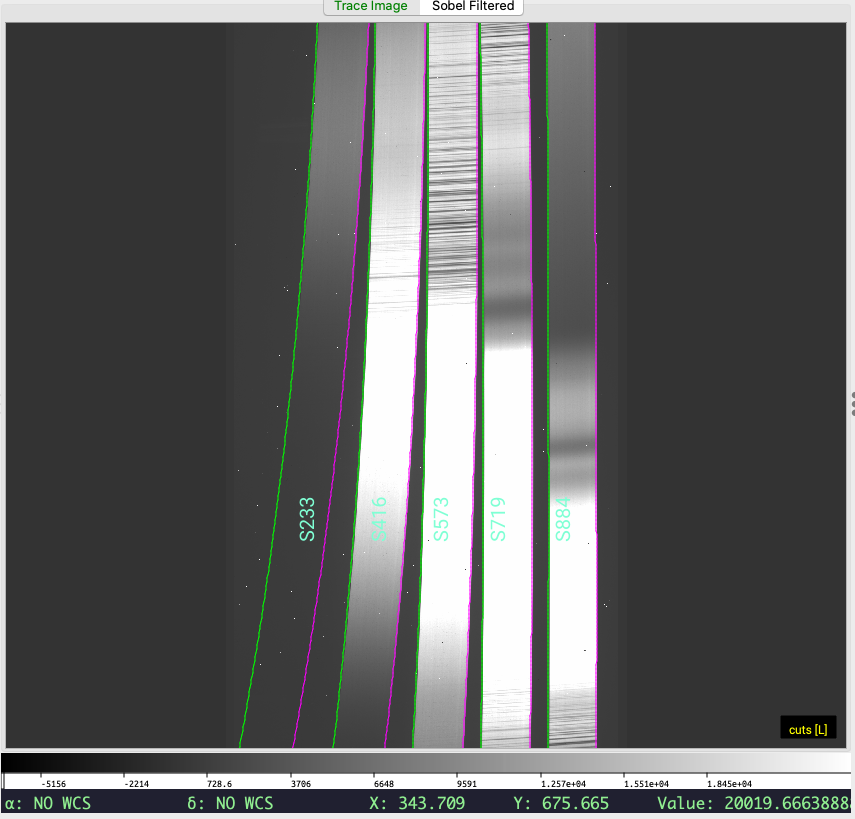
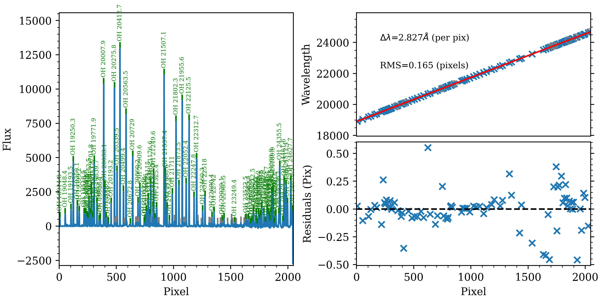
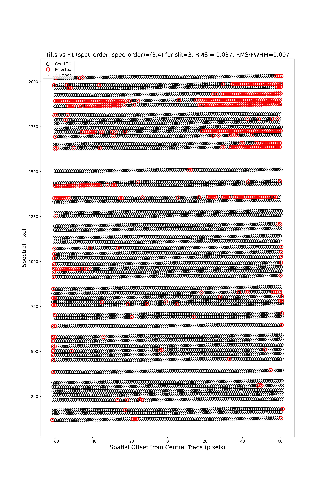
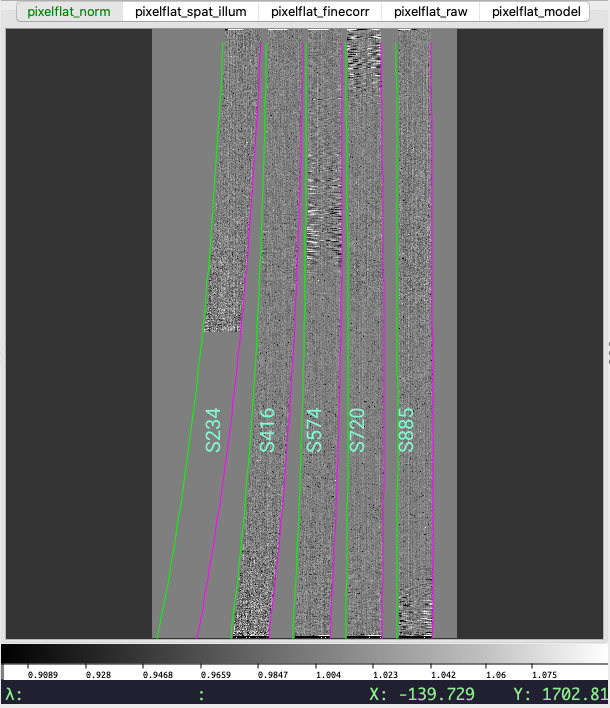
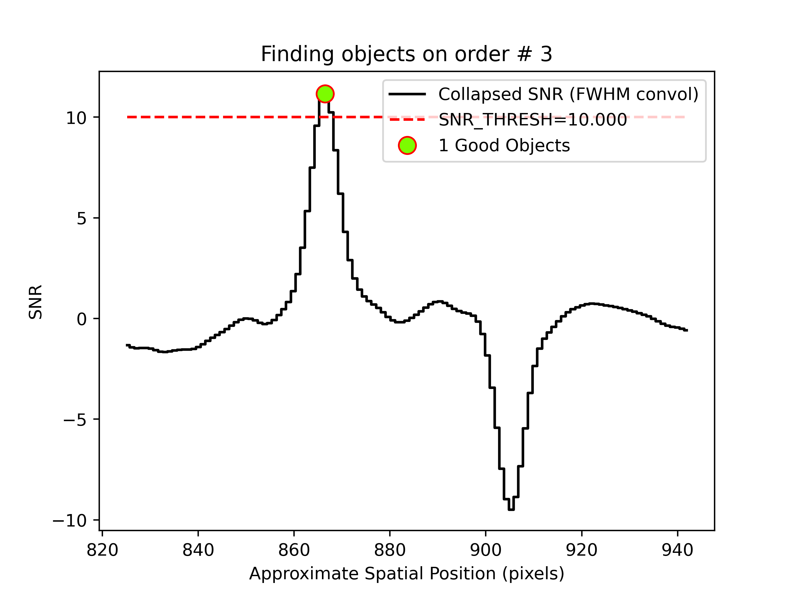
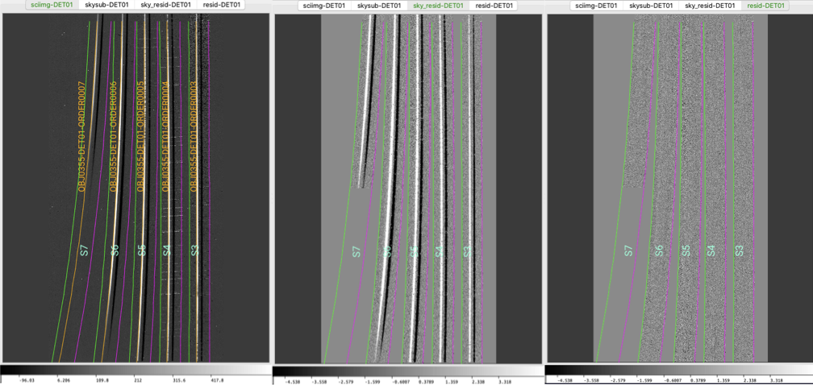
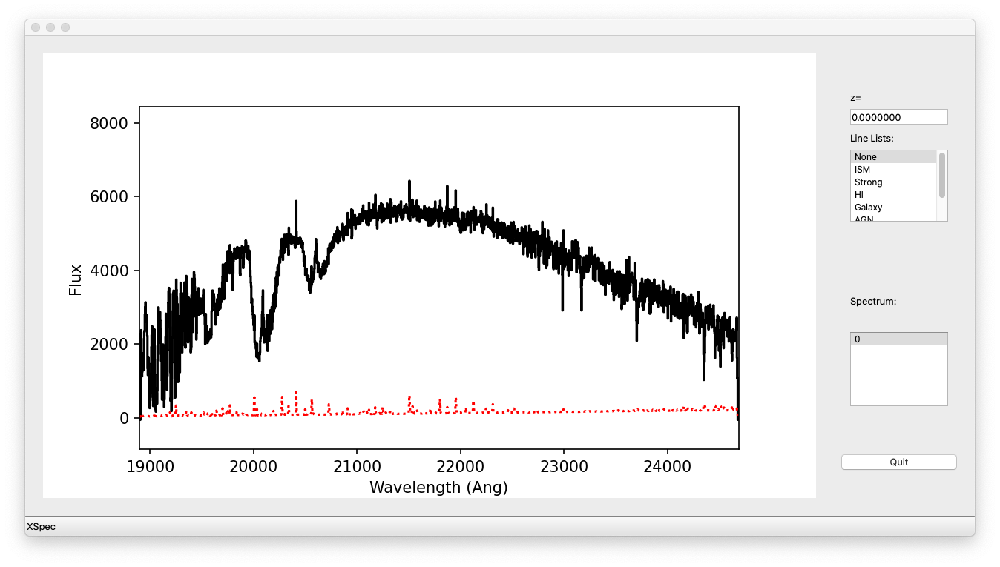

.. include:: ../include/links.rst

.. _nires_howto:

================
Keck/NIRES HOWTO
================

Overview
========

This doc goes through a full run of PypeIt on one of our example Keck/NIRES
datasets (specifically the ``ABBA_wstandard`` dataset).  If you're having trouble
reducing your data, we encourage you to try going through this tutorial using
this example dataset first.  See :ref:`here <dev-suite>` to find the example
dataset, please join our `PypeIt Users Slack <pypeit-users.slack.com>`__ (using
`this invitation link
<https://join.slack.com/t/pypeit-users/shared_invite/zt-1kc4rxhsj-vKU1JnUA~8PZE~tPlu~aTg>`__)
to ask for help, and/or `Submit an issue`_ to Github if you find a bug!

----

Setup
=====

Before reducing your data with PypeIt, you first have to prepare a
:ref:`pypeit_file` by running :ref:`pypeit_setup`:

.. code-block:: bash

    pypeit_setup -r $HOME/Work/packages/PypeIt-development-suite/RAW_DATA/keck_nires/ABBA_wstandard/ -s keck_nires -b -c A

where the ``-r`` argument should be replaced by your local directory and the
``-b`` indicates that the data uses background images and should include the
``calib``, ``comb_id``, ``bkg_id`` in the pypeit file.  This directory only has
one instrument configuration (NIRES only has one configuration anyway), so
setting ``-c A`` and ``-c all`` is equivalent.

This will make a directory called ``keck_nires_A`` that holds a pypeit file
called ``keck_nires_A.pypeit`` that looks like this:

.. include:: ../include/keck_nires_A.pypeit.rst

For this example dataset, the details of the default pypeit file are not
completely correct; see :ref:`here <nires_config_report>` for an example where the frame
typing and dither pattern determinations *are* correct by default.

The issue with this dataset is that only two pointings in the ABBA pattern for
the standard star observations are available, the exposure time of the standard
observations is longer than expected (and PypeIt set it as science frame),
and the dither pattern of the science frames are set to MANUAL.
PypeIt attempts to assign ``comb_id`` and ``bkg_id`` to the two standard star
pointings, however, you need to edit the pypeit file to
correct the other errors.  The corrections needed are:

    - Set the frametypes for ``s190519_0059.fits`` and ``s190519_0060.fits`` to
      ``standard``.

    - Assign the same calibration group to the standard and science frames
      (i.e., same ``calib`` value).

    - Set the ``bkg_id`` for the ``science`` frames; see below
      and :ref:`a-b_differencing`.

The corrected version looks like this (pulled directly from the :ref:`dev-suite`):

.. include:: ../include/keck_nires_A_corrected.pypeit.rst

Use of the standard frame
-------------------------

By setting the science frames to also be ``arc`` and ``tilt``
frames, we're indicating that the OH sky lines should be used to perform the
wavelength calibration. Generally the standard star observations are not
sufficiently long to have good signal in the sky lines to perform the
wavelength calibration. This is why, generally, we do not
set the standard frames to be also ``arc`` and ``tilt`` frames, but we use
the wavelength calibration obtained from the science frame (this is why we
give to the standard frames the same ``calib`` value as the science frames).

We note, however, that in this specific case the observations of the standard star
are sufficiently long to allow for good signal in the sky lines. Therefore, if
desired, you could set the standard frames to be also ``arc`` and ``tilt`` frames.

The main data-reduction script (:ref:`run-pypeit`) does *not* perform the
telluric correction; this is done by a separate script.  Even if you don't
intend to telluric-correct or flux-calibrate your data, it's useful to include
the standard star observations along with the reductions of your main science
target, particularly if the science target is faint.  If your object is faint,
tracing the object spectrum for extraction can be difficult using only the
signal from the source itself.  PypeIt will resort to a "tracing crutch" if the
source signal becomes too weak.  Without the bright standard star trace, the
tracing crutch used is the slit/order edge, which will not include the effects
of differential atmospheric refraction on the object centroid and therefore
yield a poorer spectral extraction.

Dither sequence
---------------

In this example dataset, the science object and the standard star are both only
observed at two offset positions. Although PypeIt is able to correctly assign
``comb_id`` and ``bkg_id`` for the standard frames (by using the information
on the dither pattern and dither offset), the same is not possible for the
science frames, for which a "MANUAL" dither pattern was used.
We, therefore, edit the :ref:`pypeit_file` (see the
corrected version above) to assign ``comb_id`` and ``bkg_id`` to the science frames
as described by :ref:`a-b_differencing` (specifically, see
:ref:`ab-image-differencing`).

By setting ``comb_id=3`` and ``bkg_id=4`` for frame ``s190519_0067.fits``, we
are indicating that this frame should be treated as frame A and that frame
B should be used as its background.  We reverse the values of ``comb_id``
and ``bkg_id`` for frame ``s190519_0068.fits``, which indicates that this frame
should be treated as frame B and that frame A should be used as its
background.  I.e., the ``comb_id`` column effectively sets the numeric identity
of each frame, and the ``bkg_id`` column selects the numeric identity of the
frame that should be used as the background image.

When PypeIt reduces the frames in this example, it constructs two images, A-B
and B-A, such that the positive residuals in each image are the observed
source flux for that observation, which can be combined using :ref:`2D coadding
<coadd2d>`.

The use of the ``comb_id`` and ``bkg_id`` integers is very flexible, allowing
for many, more complicated dithering scenarios; see :ref:`a-b_differencing`.

----

Core Processing
===============

To perform the core processing of the NIRES data, use :ref:`run-pypeit`:

.. code-block:: bash

    run_pypeit keck_nires_A.pypeit

The code will run uninterrupted until the basic data-reduction procedures
(wavelength calibration, field flattening, object finding, sky subtraction, and
spectral extraction) are complete; see :doc:`../running`.  Processing of this
example dataset takes roughly 10 minutes (on a 2020 MacBook Pro with 16 GB of
RAM and a 2GHz i5 processor).

As the code processes your data, it will produce a number of files and QA plots
for you to inspect:

Order Edges
-----------

The code first uses the ``trace`` frames to find the order edges.  NIRES is a
fixed-format echelle, meaning that the trace results should always look the
same.  To show the results of the trace, run, e.g.:

.. code-block:: bash
    
    pypeit_chk_edges Calibrations/Edges_A_7_DET01.fits.gz

which will show the image and overlay the traces (green is the left edge;
magenta is the right edge); this should open a `ginga`_ window for you if one
is not open already.  Here is the result from this example dataset:

An important check is to ensure that the code has correctly traced the bluest
(left-most) order.  PypeIt currently expects to find all 5 orders and will fault
if it does not.  
    
.. tip::

    If PypeIt faults because it did not find all 5 orders, try adjusting the
    ``edge_thresh`` parameter; see the :ref:`parameters` and specifically the
    :ref:`edgetracepar`.

Wavelength Calibration
----------------------

Next the code performs the wavelength calibration.  Via the :ref:`pypeit_file`,
we designated two sets of wavelength calibration frames, one for the standard
star and one for the science frame.  You should inspect the results for both.

First, it's important to understand PypeIt's :ref:`calib-naming` convention,
specifically the calibration group bit identities used in the output file names.
In this example, two :ref:`arc` files are produced:
``Calibrations/Arc_A_2_DET01.fits`` and ``Calibrations/Arc_A_4_DET01.fits``.
The ``2`` and ``4`` are the bits associated with the calibration group and link
back to which files are associated with each frame type.  The
:ref:`calibrations-calibfile` provides the direct association of input frame
with output calibration file.

Combined Arc Frame
++++++++++++++++++

You can view the combined arc frame used for, e.g., the standard star
observations with `ginga`_:

.. code-block:: bash

    ginga Calibrations/sArc_A_2_DET01.fits

1D Wavelength Solution
++++++++++++++++++++++

More importantly, you should check the result of the wavelength calibration
using the automatically generated QA file; see :ref:`qa-wave-fit`.  Below is the
wavelength-calibration QA plot for the reddest order (order=3).  The RMS of the
wavelength solution should be of order 0.1-0.2 pixels.  Such a plot is produced
for each order of each the combined arc image used for each calibration group.

   The wavelength-calibration QA plot for the reddest Keck/NIRES order
   (order=3), called ``Arc_1dfit_A_2_DET01_S0003.png``.  The left panel shows
   the arc spectrum extracted down the center of the order, with green text and
   lines marking lines used by the wavelength calibration.  Gray lines mark
   detected features that were *not* included in the wavelength solution.  The
   top-right panel shows the fit (red) to the observed trend in wavelength as a
   function of spectral pixel (blue crosses); gray circles are features that
   were rejected by the wavelength solution.  The bottom-right panel shows the
   fit residuals (i.e., data - model).

In addition, the script :ref:`pypeit-chk-wavecalib` provides a summary of the
wavelength calibration for all orders. We can run it with this simple call:

.. code-block:: bash

    pypeit_chk_wavecalib Calibrations/WaveCalib_A_2_DET01.fits

and it prints on screen the following (you may need to expand the width of your
terminal to see the full output):

.. TODO: Add the following to a script so that it is automatically produced!

.. code-block:: bash

     N. SpatID minWave Wave_cen maxWave dWave Nlin     IDs_Wave_range    IDs_Wave_cov(%) measured_fwhm  RMS
    --- ------ ------- -------- ------- ----- ---- --------------------- --------------- ------------- -----
      0    234  8131.7   9408.9 10646.5 1.225   30  9793.676 - 10527.657            29.2           2.1 0.085
      1    416  9496.8  10961.4 12401.6 1.419   91  9793.676 - 12351.597            88.1           2.1 0.078
      2    574 11380.8  13133.2 14860.1 1.699   95 11439.783 - 14833.093            97.5           2.1 0.129
      3    720 14203.1  16389.5 18547.8 2.122  106 14227.201 - 18526.181            98.9           2.2 0.106
      4    885 18895.7  21806.9 24686.8 2.827   84 18914.824 - 24627.748            98.6           2.0 0.165

See :ref:`pypeit-chk-wavecalib` for a detailed description of all the columns.

.. warning::

    A common failure mode for wavelength calibration that uses the sky lines is
    that the exposures are too short.  When **collecting** NIRES observations,
    either (1) make sure at least some of the on-sky exposures are sufficiently
    long to provide good signal in the sky lines *in all orders* or (2) take arc
    lamp exposures.  If you've already collected your data and you didn't do
    either of these, you can try using archive observations or ask the Keck
    staff to take arc lamps for you, given that NIRES is a fixed-format
    spectrograph.
    
    **PypeIt currently does not have a pre-cooked arc-lamp wavelength solution
    for NIRES.**  If you want to perform wavelength calibration with arc lamp
    spectra, you'll need to change the default approach; see :ref:`wave_calib`,
    and see :ref:`instr_par-keck_nires` for the current default wavelength
    calibration approach.

2D Wavelength Solution
++++++++++++++++++++++

Finally, PypeIt traces the position of each spectral line as a function of the
spatial position within each order to create a 2D wavelength solution for the
slit/order image.  The primary QA plot for this shows the measured and modeled
locations of each line.

   The 2D wavelength-calibration QA plot for the reddest Keck/NIRES order
   (order=3).  Each open circle is the measured center of an arc (sky) line;
   black circles are included in the 2D model, whereas red circles have been
   rejected.  Black points show the model predicted position.  The text across
   the top of the figure gives the RMS of the 2D wavelength solution, which
   should be less than 0.1 pixels.

Field Flattening
----------------

PypeIt computes a number of multiplicative corrections to correct the 2D
spectral response for pixel-to-pixel detector throughput variations and
lower-order spatial and spectral illumination and throughput corrections.  We
collectively refer to these as flat-field corrections; see :ref:`here
<flat_fielding>` and :ref:`here <flat>`. For NIRES observations, flats
with lamps off, if available, are also subtracted.

You can inspect the flat-field corrections using the following script:

.. code-block:: bash

    pypeit_chk_flats Calibrations/Flat_A_7_DET01.fits

Note that the calibration group number for this image is ``7`` (instead of 2 or
4) because the flat field images were used for all calibration groups.  The
first channel in the resulting `ginga`_ window looks as follows:

   The first channel (``pixelflat_norm``) in the PypeIt flat-field calibration,
   showing the normalized pixel flat.  The edges of the slits are marked the
   same as for the trace image (see above).  The values in this image should all
   be near unity.

.. TODO: What is causing the large fluctuations in S574 and near the end of
         S720.  Errors in the tilts?  Low flux in the flat?

Object Finding and Extraction
-----------------------------

After the above calibrations are complete, PypeIt will iteratively identify
sources, perform local and global sky subtraction, and perform 1D spectral
extractions.  This process is fully described here: :ref:`object_finding`.

PypeIt produces QA files that allow you to assess the detection of the objects.
For example, here is the QA plot for the faint object found in order 3: 

   Detection of a source spectrum in order 3.  The black line shows the
   spectrally collapsed S/N as a function of position within the slit/order.
   The dashed red line is the S/N threshold set by the :ref:`findobjpar`, and
   the green circle marks the spatial position of the detected object.  The name
   of this file is
   ``pos_s190519_0068-J1450+3302_NIRES_20190519T095754.265_DET01_S0003_obj_prof.png``.

We are using difference imaging, so PypeIt produces such plots for both the
positive and negative traces.  Also, given that NIRES produces multi-order
echelle data, PypeIt will attempt to extract the object spectrum across all
orders, even if it is only detected in a single order.  Here, PypeIt uses the
provided standard spectrum as a crutch to trace the relative spatial position of
the faint object spectrum in all orders, even though it is only detected with S/N
> 10 in the reddest order.

----

Core Processing Outputs
=======================

The primary science output from :ref:`run-pypeit` are 2D spectral images and 1D
spectral extractions; see :ref:`outputs`.

2D Spectral Images
------------------

Each "combination group" will produce a calibrated 2D spectral image; see
:ref:`spec-2d-output` for more information about these images.  In this example,
each science and standard frame are assigned their own unique combination group
(``comb_id`` in the pypeit file).  For A-B differencing, an image is typically
created for each dither position, which can be combined using our 2D coadding
algorithms (see :ref:`coadd2d`).

The calibrated 2D spectral images can be visually inspected using
:ref:`pypeit_show_2dspec`, which displays the images in a `ginga`_ window.  For
example, the figure below shows 3 of the 4 image channels derived from one of
the standard star observations, displayed by executing:

.. code-block:: bash

    pypeit_show_2dspec Science/spec2d_s190519_0059-GD153_NIRES_20190519T083811.995.fits --removetrace

The ``--removetrace`` option is particularly useful for faint sources; this
option only shows the object trace in the first channel (the channel showing the
calibrated science image), but does not include it in the remaining 3 channels.

   Three of the four `ginga`_ channels displayed when using
   ``pypeit_show_2dspec`` for one of the standard star frames.  Specifically,
   this is the A-B image.  Note that the object trace is only in the first
   `ginga`_ channel.

The main assessments to perform are to make sure that the object is well traced
(e.g., in the ``sciimg`` channel), that there are little to no strong sky
residuals in the ``sky_resid`` channel, and that the data in the ``resid``
channel looks like pure noise (see also :ref:`pypeit_chk_noise_2dspec`).

1D Spectral Extractions
-----------------------

Each "combination group" will also produce a fits file containing 1D spectral
extractions; see :ref:`spec-1d-output` for more information about these files
(including the nameing convention).  The name of the file is:
``spec1d_s190519_0059-GD153_NIRES_20190519T083811.995.fits``.  An ASCII text
file, named ``spec1d_s190519_0059-GD153_NIRES_20190519T083811.995.txt`` (i.e.,
the same name but with the extension changed from ``.fits`` to ``.txt``), is also
produced that provides a summary of the extracted spectra.  For the same
standard star frame shown above, the file looks like this:

.. code-block:: bash

    | order |          name | spat_pixpos | spat_fracpos | box_width | opt_fwhm |   s2n | wv_rms |
    |     7 | OBJ0355-DET01 |       215.0 |        0.355 |      1.50 |    0.965 |  0.00 |  0.085 |
    |     6 | OBJ0355-DET01 |       398.3 |        0.355 |      1.50 |    0.903 | 61.86 |  0.078 |
    |     5 | OBJ0355-DET01 |       556.4 |        0.355 |      1.50 |    0.877 | 51.53 |  0.129 |
    |     4 | OBJ0355-DET01 |       702.7 |        0.355 |      1.50 |    0.878 | 51.61 |  0.106 |
    |     3 | OBJ0355-DET01 |       867.7 |        0.355 |      1.50 |    0.764 | 31.38 |  0.165 |

This shows that a single spectrum was extracted for each order.  Each spectrum
is given its own extension in the fits file, where the extension name is based
on the object name identified in the file and the order number; e.g.,
`OBJ0355-DET01-ORDER0007`.

You can plot the spectrum using :ref:`pypeit_show_1dspec`:

.. code-block:: bash

    pypeit_show_1dspec Science/spec1d_s190519_0059-GD153_NIRES_20190519T083811.995.fits --exten 5

The ``--exten 5`` argument specifies to use the fifth extension in the fits file, which selects the reddest (order=3) spectrum.
This uses the `XSpecGUI`_ from the `linetools`_ package, and the result looks like this:

   `XSpecGUI`_ produced by calling :ref:`pypeit_show_1dspec` for the order=3
   spectrum.  The black line is the flux and the red line is the estimated
   error.

In the window, press ``?`` to open a webpage with the `XSpecGUI keystrokes`_
that help you navigate through the spectrum.  See :doc:`../out_spec1D` for
further details.

----

.. TODO: Include more "follow-up" scripts: telluric correction, fluxing,
   coadding, etc.

2D Coadding
===========

The main reduction of this Keck/NIRES dataset produces two output spectra, one
for the ``A-B`` frame and one for the ``B-A`` frame. To combine these 2D
spectra, we suggest using :ref:`pypeit-coadd-2dspec`. See :ref:`coadd2d` for
more information and :ref:`coadd2d_howto` for usage examples.

