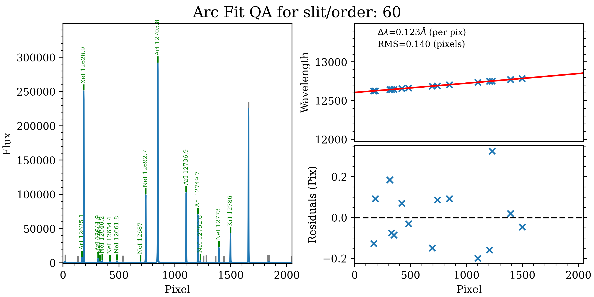
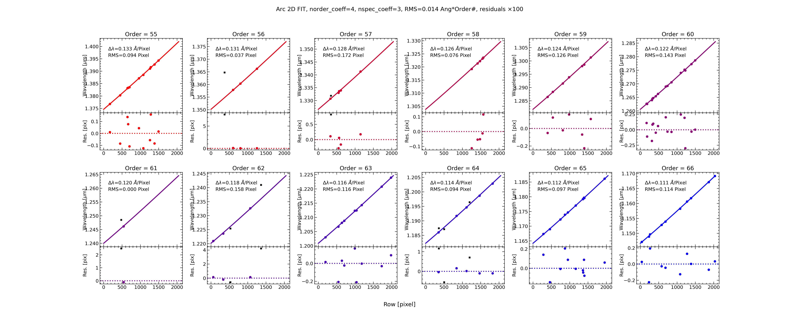
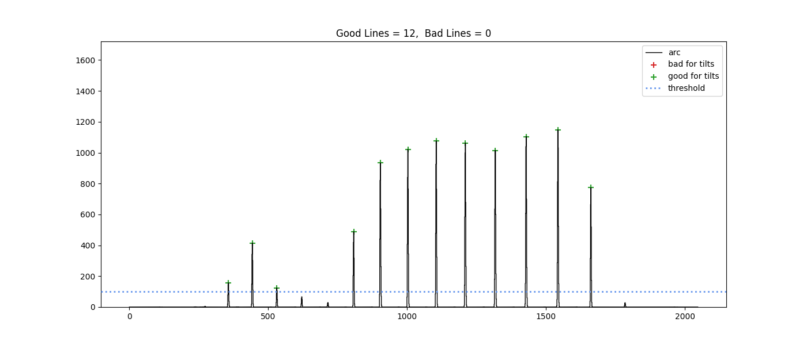
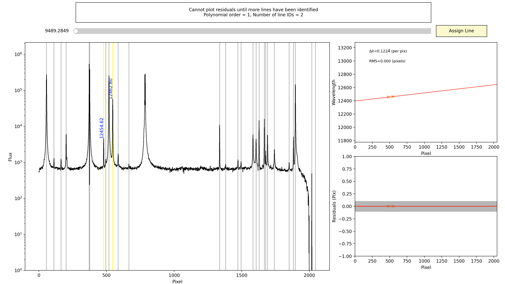

.. include:: ../include/links.rst

.. _nirspec_high_howto:

==================================
Keck/NIRSPEC High Resolution HOWTO
==================================

Overview
========

This tutorial is written to serve as both a guide and documentation for reducing
Keck/NIRSPEC high resolution spectra using PypeIt. We will begin with a
reduction of the sample J Band dataset and include recommendations for reducing
other sample datasets (Y, H, and K bands).

See :ref:`here <dev-suite>` to find the example dataset, please join our `PypeIt
Users Slack <pypeit-users.slack.com>`__ (using `this invitation link
<https://join.slack.com/t/pypeit-users/shared_invite/zt-1kc4rxhsj-vKU1JnUA~8PZE~tPlu~aTg>`__)
to ask for help, and/or `Submit an issue`_ to Github if you find a bug!

----------------------

Directory Organization
======================

Before starting the reduction, we recommend creating a directory in which to
store all of the PypeIt output files. PypeIt will create its own directory
structure within that, but it is good to have a dedicated place to work. PypeIt
will also reuse directory names so creating a dedicated directory for a given
reduction run is recommended. 

-----

Setup
=====

PypeIt uses a special input file, the :ref:`pypeit_file`, to organize any user
supplied keywords, the locations of the input data files, and the metadata
corresponding to each file. This file is created and automatically populated by
running :ref:`pypeit_setup` and pointing it to the directory where the data are
stored, ``<data_dir>``:

.. code-block:: bash

    pypeit_setup -r <data_dir> -s keck_nirspec_high -b -c all

where the ``-r`` argument should be replaced by your local directory and the
``-b`` indicates that the data uses background images and should include the
``calib``, ``comb_id``, ``bkg_id`` in the pypeit file.  In the event that you
are reducing data with multiple configurations, using ``-c all`` will create an
output directory for each configuration. In this case, since the dataset only
has one configuration, using ``-c A`` would be equivalent. 

This will make a directory called ``keck_nirspec_high_A`` that holds a pypeit file
called ``keck_nirspec_high_A.pypeit`` that looks like this:

.. include:: ../include/keck_nirspec_high_A.pypeit.rst

At the moment, NIRSPEC does not keep track of the nod pattern that was used in
observing and where in the nod pattern the exposure was taken. This means that
setting AB pairs in the data for background subtraction must be done manually. 

The corrections we'll need to make are:

    - Set the frametypes for ``nspec***.fits`` to only ``science`` (i.e. remove
      both the ``arcs`` and ``tilts``. Since we already have arclamp spectra for
      this dataset, we want to use those, rather than the sky lines. If you
      would like to use the sky lines, leave the ``arc`` and ``tilts`` in and
      remove the lamp spectrum from the file list. We will discuss other changes
      you'll need to make to the parameter file below, in the Wavelength
      Calibration section.

    - Assign the appropriate A/B nod combinations by setting the ``bkg_id`` of
      each A exposure to the ``comb_id`` of its B counterpart and vice versa.
      See :ref:`a-b_differencing` for other options for differencing and
      background subtraction.

The corrected version looks like this (pulled directly from the :ref:`dev-suite`):

.. include:: ../include/keck_nirspec_high_A_corrected.pypeit.rst

The importance of standard frames
---------------------------------

We recommend the observer always take standard frames during the night, ideally 
frequently enough to sample the airmass throughout the night, which will make
the standards more useful for telluric removal later on. Note that the main
data-reduction script (:ref:`run-pypeit`) does *not* perform the telluric
correction. For that, users will use the :ref:`pypeit_tellfit` script or perform
the removal using their standards, following the procedure discussed below. 

However, even if you don't intend to telluric-correct or flux-calibrate your
data, it's useful to include the standard star observations along with the
reductions of your main science target, particularly if the science target is
faint.  If your object is faint, tracing the object spectrum for extraction can
be difficult using only the signal from the source itself.  PypeIt will resort
to a "tracing crutch" if the source signal becomes too weak.  Without the bright
standard star trace, the tracing crutch used is the slit/order edge, which will
not include the effects of differential atmospheric refraction on the object
centroid and therefore yield a poorer spectral extraction.

Dither sequence
---------------

In this example dataset, the science object and the standard star are both only
observed at two offset positions. Since NIRSPEC does not identify which exposure
is taken in which position, we have to fill that information in manually, as
discussed above.

By setting ``comb_id=3`` and ``bkg_id=4`` for frame ``s190519_0067.fits``, we
are indicating that this frame should be treated as frame A and that frame
B should be used as its background.  We reverse the values of ``comb_id``
and ``bkg_id`` for frame ``s190519_0068.fits``, which indicates that this frame
should be treated as frame B and that frame A should be used as its
background.  I.e., the ``comb_id`` column effectively sets the numeric identity
of each frame, and the ``bkg_id`` column selects the numeric identity of the
frame that should be used as the background image.

When PypeIt reduces the frames in this example, it constructs two images, A-B
and B-A, such that the positive residuals in each image are the observed
source flux for that observation, which can be combined using :ref:`2D coadding
<coadd2d>`.

The use of the ``comb_id`` and ``bkg_id`` integers is very flexible, allowing
for many, more complicated dithering scenarios; see :ref:`a-b_differencing`.

----

Core Processing
===============

The reduction of NIRSPEC begins with the creation of a handful of critical calibration files: 

    #. ``Edges*.fits.gz`` : an archive of files containing the information about the
       edge-detection for your traces (:doc:`../calibrations/edges`)

    #. ``Slits*.fits.gz`` : an archive of files containing the information about the
       spatial location of each trace (:doc:`../calibrations/slits`

    #. ``Arc*.fits`` : a file containing the extracted arc spectra (sky lines or
       lamp lines) (:doc:`../calibrations/arc`)

    #. ``Flat*.fits`` : a file containing the master flat and fitted blaze function
       (:doc:`../calibrations/flat`)

    #. ``WaveCAlib*.fits`` : a file containing the wavelength calibration to be
       applied to this dataset (:doc:`../calibrations/wvcalib`)

There are a couple of steps in the core processing of NIRSPEC data that the user
should be considerate of before running the main pypeit script,
:ref:`run-pypeit`. Those steps are:

    #. Order/trace identification
    #. Wavelength calibration 

Due to the flexible range of configurations available to NIRSPEC, consistent trace 
identification can be difficult to automate, particularly in H, K, and L bands. 
Throughout the tutorial, we will point the user to several :ref:`parameters` that
the user can modify in their :ref:`pypeit_file`. 

Trace Identification
--------------------

To be sure of precisely which traces PypeIt will extract, the user should run 
the :ref:`pypeit_trace_edges` script, which can perform the first calibration
step, trace identification. The script will create an Edges*.fits.gz and a
Slits*.fits.gz file, which will be reused by the :ref:`run-pypeit` script. The
user may also skip directly to running :ref:`run-pypeit` if they are certain
there will be no trouble with trace identification. 

To use :ref:`pypeit_trace_edges`, the script should be called using:

.. code-block:: bash
    
    pypeit_trace_edges -f keck_nirspec_high_A.pypeit

To really see what the function is going and to diagnose where the trace
identification may go wrong, the user can include the ``--debug`` and ``--show``
flags.

The results of the trace can be checked using 

.. code-block:: bash
    
    pypeit_chk_edges Calibrations/Edges_A_0_DET01.fits.gz

if there is any trouble with ``ginga``, include a ``--mpl`` flag to see the
output in a ``matplotlib`` Figure instead. 

In the case of the example dataset given here, there should be no trouble with
this step.  However, there are several cases in our other example datasets
provided here (especially in the redder K and L band orders) where the trace
identification fails. We discuss those and the necessary steps to correct the
identification below. 

Running PypeIt and Extraction
-----------------------------

Once the trace identification is complete, either as part of a call to
:ref:`run-pypeit` or using :ref:`pypeit_trace_edges`, the next major step in the
data reduction is wavelength calibration. The example dataset provided here
should be easily automatically wavelength calibrated by the usual
:ref:`run-pypeit` script, so at this stage, as long as the traces have been
properly identified, there is no need to worry about that step. 

Running in calibration mode
+++++++++++++++++++++++++++

Once the :ref:`pypeit_file` is ready, the core processing can begin. We
recommend the user first run PypeIt in calibration mode, so that the
calibrations can be inspected (and corrected, if necessary) before attempting to
reduce an entire dataset. The call for this would be:

.. code-block:: bash

    run_pypeit keck_nirspec_high_A.pypeit -c

For the example dataset, this should run without issue, producing the Edges,
Arcs, Flats, Tilts, and WaveCalib files described above. Several QA plots will
be generated and saved in the directory ``QA/PNGs/``. The user should inspect 
these outputs before proceding to be sure that the calibrations are
satisfactory. For a 2023 Macbook Pro with an Apple M2 Max chip, this took around
4 min 30 s.

Details about checking the wavelength calibration and how to perform manual
calibration where necessary are given below in :ref:`full_wvcal`.

Once ready, the core processing can be performed on the entire dataset using the
call 

.. code-block:: bash

    run_pypeit keck_nirspec_high_A.pypeit

PypeIt will perform the calibrations reusing the already-generated calibration
files and proceed to object extraction. 

Object Extraction
+++++++++++++++++

PypeIt will perform both a box extraction and optimal extraction by default. It
will attempt to identify objects in the slit according to where the spectrally
collapsed spatial profile (which can be inspected in the ``QA/PNGs/pos_***.png``
plots) exceeds a certain SNR treshold.

If the SNR threshold is too low, PypeIt may identify spurious features as
potential objects and attempt to extract them.  Users should inspect the
profiles in the QA plots and determine if they should re-run the extraction with
a higher extraction SNR threshold, which can be set by adding the following to
the parameter block:

.. code-block:: bash

    [reduce]
        [[findobj]]
            snr_thresh = 100

The above will set the snr threshold to 100. In our experience, for a standard
star exposure that yields an SNR/pix of 150 in each order, the spatially
collapsed SNR can be as high as 2500, so it is best to check the profiles to
know what threshold will be best. 

For extended sources, the width of the box extraction can be set and the optimal
extraction can be disabled if necessary. 

.. note::

    If there are multiple marginally-resolved objects in the slit (e.g. a
    marginally resolved binary), the optimal extraction may fail.  Users should
    look at the .txt files associated with each exposure to be sure that the
    ``opt_fwhm`` column has all non-zero values. If there are any zeros, they
    may represent traces where the optimal extraction for one of the objects
    failed. In that case, it may be necessary to manually extract the objects,
    as detailed in :doc:`../manual`.

Fluxing the spectra
===================

Usually in high resolution spectroscopy, the absolute flux value is not
necessary or even often reliable. This is also the case for NIRSPEC. However,
the Fluxing procedure in PypeIt is necessary for deblazing the data, continuum
normalization, and coadding. 

Here we summarize these steps as part of our tutorial, but in each section we
will also point to the documentation pages that contain more details about the
scripts being used and other possible options. 

Generating a Sensitivity function
---------------------------------

The first step toward the flux calibration and coadding will be generating a
sensitivity function for the current instrument setting. This is done by the
:ref:`pypeit_sensfunc` script. The necessary call will be:

.. code-block:: bash

    pypeit_sensfunc Science/spec1d_nspec220511_0122-HIP54849A0V_NIRSPEC_20220511T070327.475.fits  -s sensfunc_Jband.inp -o ./Science/sensfunc_Jband.fits

The ``-o`` flag allows the user to give the desired output file name. If not
given, the file name will be the same as the file name of the standard being
used, only with ``sens`` in place of ``spec1d``.

The ``-s`` flag allows the user to prove a ``sensfunc_Jband.inp`` file, which is
a simple ``ascii`` file containing the parameters for the sensitivity function
calculation. The details for populating this file for different types of
standards used can be found in :doc:`../fluxing`. For our tutorial, we are using
HIP 54849 as the telluric standard and flux standard, and it is an A0V star. For
an A0V standard, there is a high resolution PHOENIX model stellar spectrum
available, so we need only specify "PHOENIX" as the stellar type.  The content
of the ``sensfunc_Jband.inp`` file for this tutorial is simply:

.. code-block:: ini

    [sensfunc]
        algorithm = IR
        star_mag = 5.333 
        star_type = PHOENIX
        flatfile = Calibrations/Flat_A_0_DET01.fits
        [[IR]]
            telgridfile = 'TellPCA_9300_55100_R60000.fits'

We specify that the algorithm should be ``IR``, so that the telluric spectrum is
jointly fitted to the data. This will not perform a telluric correction, it is
just a first order approximation of the telluric contribution to enable reliable
continuum fitting. The ``flatfile`` keyword is used to specify the Flat file
from the calibration, so that the sensitivity function calculation knows the
blaze function of the observation. 

Flux Calibration
----------------

Now that there is a valid sensitivity function, we are ready to proceed with
flux calibration and coadding. For this, we will need specific input files,
which can be helpfully generated by the ``pypeit_flux_setup`` script using:

.. code-block:: bash

    pypeit_flux_setup Science/

This will create three files: ``keck_nirspec_high.flux``,
``keck_nirspec_high.coadd1d``, and ``keck_nirspec_high.tellfit``. 

The ``keck_nirspec_high.flux`` file will not need much editing. We need only
open it and add the filename of our sensitivity function to the ``sensfile``
column. It is enough to do this only for the first object in the list, as that
will be applied to every subsequent object. If the user wants to compute
multiple sensitivity functions and apply them to different sets of objects,
these will need to be listed for each object. 

The flux calibration can then be run with 

.. code-block:: bash

    pypeit_flux_calib keck_nirspec_high.flux

This will add a ``OPT_FLAM`` and ``BOX_FLAM`` column to each of the spec1d files
in the Science directory. 

Coadding the Exposures
----------------------

Now the coadding can begin. The ``.coadd1d`` file that was automatically
generated is populated with all of the files in the Science directory. This is
of course not what we want because we want to coadd only exposures of the same
object. So we should copy this file to make 2 ``coadd1d`` files, one for GL 393
and one for HIP 54849. Then we should change the ``coaddfile`` from
``YOUR_OUTPUT_FILE_NAME`` to the desired file, say ``GL393_Jband.fits``. We also
should replace ``SENSFUNC FILE`` with the sensitivity function filename and
choose a ``setup_id``. This can be left as ``A`` or anything else if all the
data to be combined are from the same setup. 

Once the .coadd1d file is ready, run the :ref:`pypeit_coadd_1dspec` script with:

.. code-block:: bash

    pypeit_coadd_1dspec keck_nirspec_high.coadd1d 

The script will scale all of the exposures to the same median, and apply a
polynomial scaling to account for any small differences between their continuum
shapes, then will coadd all of the exposures. The default output is a FITS file
wherein the orders are all stitched together and the flux and wavelength arrays
are flattened into just 1d vectors. This may not be desirable due to the
difficulty in properly handling the very low SNR overlap regions of certain
bands, particularly J band. The flux scaled and coadded order arrays are saved by 
default, in addition to the flattened 1d vectors. This way, the user can determine 
how they might want to handle any overlapping regions of the spectrum.  

.. note::

    #. This issue with handling the overlap regions can be largely mitigated by
       computing an independent sensitivity function for each exposure. However,
       this can take a long time (at least 15 min/exposure). 

    #. When coadding, the depending on the nature of the objects being observed
       (i.e., if they are challenging to extract via optimal extraction), there
       may be an error during the steps when the code is reading in the
       ``OPT_FLAM`` columns of the fluxed exposures. If the code encounters a
       file that is missing an ``OPT_FLAM`` column for one of the traces, the
       script will choke.  The way to ensure this does not happen is to include
       the ``ex_value = BOX`` option in the parameter block (see
       :doc:`../pypeit_par` for more details) to select the boxcar extraction,
       or re-run the calibration and object extraction without the problematic
       order. 

.. _full_wvcal:

Wavelength Calibration
======================

There are two main file types that are relevant to the the wavelength
calibration procedure in PypeIt. One is the ``WaveCalib`` file, which contains
all of the information necessary for PypeIt to wavelength calibrate extracted
spectra in the dataset. The other is the ``arxiv`` file, which is a reference
template that can be created for PypeIt to read in and use with ``method =
full_template`` set in the Wavelength Calibration options. This is described in
more detail below. These naming conventions are followed through the rest of
this tutorial. 

Checking the Wavelength Calibration 
-----------------------------------

The code by coadds the lamp files provided to make a master ``arc`` file, which
can be checked by using:

.. code-block:: bash

    ginga Calibrations/Arc_A_0_DET01.fits

The wavelength calibration can be checked by looking at the automatically
generaged QA plots; see :ref:`qa-wave-fit`. Below is the wavelenght calibration
QA plot for the automated wavelength calibration featured in this tutorial. The
RMS of the wavelength solution will depend on the number of lines availble in a
given order and may vary significantly from order to order. 

More importantly, you should check the result of the wavelength calibration
using the automatically generated QA file; see :ref:`qa-wave-fit`.  Below is the
wavelength-calibration QA plot for the reddest order (order=3).  The RMS of the
wavelength solution should be of order 0.1-0.2 pixels.  Such a plot is produced
for each order of each the combined arc image used for each calibration group.

   The wavelength-calibration QA plot for a Keck/NIRSPEC J band order
   (order=60), called ``Arc_1dfit_A_0_DET01_S0060.png``.  The left panel shows
   the arc spectrum extracted down the center of the order, with green text and
   lines marking lines used by the wavelength calibration.  Gray lines mark
   detected features that were *not* included in the wavelength solution.  The
   top-right panel shows the fit (red) to the observed trend in wavelength as a
   function of spectral pixel (blue crosses); gray circles are features that
   were rejected by the wavelength solution.  The bottom-right panel shows the
   fit residuals (i.e., data - model).

For echelle spectrographs, the automated wavelength calibration procedure will
also perform a 2d fit to attempt to improve on the 1d fits. The result of this
2d fit can also be viewed in the appropriate QA plots, like the two shown below
for the J band example.

.. figure:: ../figures/nirspec/Arc_2dfit_global_A_0_DET01.png
   :width: 40%

   The wavelength-calibration QA plot for the Keck/NIRSPEC Jband 2d fit.  
   The expected wavelength function for all of the orders is shown.

   The wavelength-calibration QA plot for the Keck/NIRSPEC Jband 2d fit
   showing the new solutions and resulting residuals for all of the orders. 

By default for J, H, K, and L band data, PypeIt will attempt to automatically
identify the lines in the ``arc`` spectra it has extracted, both for OH lines
and the ArXeKrNe lamp lines. For NIRSPEC, it will also assume that the ``arcs``
provided are lamps. Users using the OH lines from their science exposure should
see below for the necessary parameter changes. 

For Y and J band data, the automatic line identification and wavelength
calibration is relatively robust and will give good wavelength solutions in most
cases. For H, K, and L bands, there are not enough arc lines in the lamps or in
OH lines for the automated wavelength calibration to function reliably so users
will need to use the procedure below to manually wavelength calibrate these
bands. 

The automated wavelength calibration will create a WaveCalib_A_0_DET01.fits file
in the Calibrations/ directory and the calibration metadata can be check with:

.. code-block:: bash

    pypeit_chk_wavecalib Calibrations/WaveCalib_A_0_DET01.fits

Users should always check the automated wavelength calibration, even for J band
(where it is most reliable) to ensure an accurate wavelength solution. This
should be done both by looking at the output of ``pypeit_chk_wavecalib`` and by
looking at the QA plots for individual orders. 

Even the wavelength calibration performed on this example dataset has one order
(order 61, slit # 5 at SpatID 1026) in which only 2 lines were identified. There
are in fact 5 lines that should be identified and used for wavelength
calibration in that order.

The steps to check and edit the solution with :ref:`pypeit_identify` are given
below, in the section :ref:`manual_wvcal`. 

We strongly recommend users follow the procedure below to construct their own
wavelength calibration, which can then be used for any other NIRSPEC dataset
taken in the same setup (i.e. same filters and echelle/XD angles). 

.. _manual_wvcal:

Manual Wavelength Calibration
-----------------------------

.. note::

    The manual wavelength calibration should be done inside the
    ``keck_nirspec_high_A`` directory but outside the ``Calibrations``
    directory. 

Manual wavelength calibration may be necessary when the automatic wavelength
calibration in PypeIt fails.  This happens most often when there are too few
lines for the automatic identification to reliably produce a reliable wavelength
solution. The orders most succeptible to this are orders: H band order 45, K
band orders 39, 37, and 33, and most of the L band. 

There are two main ways to begin the manual wavelength identification.

    #. first, use the :ref:`run-pypeit` script in calibration only mode, as
       shown below. Assuming it is able to produce a ``WaveCalib`` file
       successfully (even if it crashes when computing the Tilts), the user need
       only edit the existing WaveCalib file following the Editing A WaveCalib
       File procedure below. 

    #. To compute a manual wavelength solution without relying on the
       :ref:`run-pypeit` script's automatated first pass, follow the Making a
       New Wavelength Arxiv procedure below. 

Wavelength calibration is a crucial step in reducing high resolution spectra and
users should take care to produce high quality solutions for their data. Once a
user is satisfied with their solution, we recommend they save it as a template 
by running 

.. code-block:: bash

    pypeit_identify Calibrations/Arc_A_0_DET01.fits Calibrations/Slits_A_0_DET01.fits.gz -m -s --slits all

and checking the solution in each order. Then, following the dialog outlined
below, they can save their solution and use it for any other dataset taken in
the same settings. 

The NIRSPEC instrument page has a helpful arcline tool, linked `here
<https://www2.keck.hawaii.edu/inst/nirspec/cals.html>`__, that contains reference
plots for the arc lamp and OH line spectra, as well as line lists for both sets
of spectra. The contents of the page have been carefully vetted by instrument
specialist Greg Doppmann and serve as an excellent reference for this procedure.

Editing A WaveCalib File
++++++++++++++++++++++++

The :ref:`pypeit_identify` script can be used to edit an existing WaveCalib file
(assuming it is in the Calibrations directory).

If the user is satisfied with the success of the automated calibration on most
of the traces and would like to simply correct a couple of them and procede with
the data reduction, the orders to be corrected can be specified using the 
``--slits`` flag as shown below:

.. code-block:: bash

    pypeit_identify Calibrations/Arc_A_0_DET01.fits Calibrations/Slits_A_0_DET01.fits.gz -m -s --slits [5]

In the call above, we are using the ``-m`` flag to identify that there are
multiple orders in this wavelength solution, the ``-s`` flag to indicate that
there is an existing solution we want to edit, and the ``--slits`` flag, along
with the list of orders (zero-indexed, with no spaces in between, e.g., [3,4,5])
to indicate which we want to edit. The IDs should match those from the 
:ref:`pypeit_chk_wavecalib` script output. To check all of the orders and
produce a reference set of line IDs that can be used as an ``arxiv``, use
``--slits all``. 

The user will then be shown a :ref:`pypeit_identify` GUI, with which they can
identify any missed lines, corrected misidentified lines, or clear all lines and
start the identification in the order from the beginning. A detailed walkthrough
of how to use :ref:`pypeit_identify` is given in :ref:`identify_walkthrough`.
The procedure for a single order is also documented in :ref:`pypeit_identify`
and a helpful reference of useful commands can be called at any time from the
gui by pressing the ``?`` key and inspecting the terminal from which the
``pypeit_identify`` script was launched. Pressing the ``q`` key will complete
the identification in the order and continue to the next one. 

Once the selected orders are corrected, the user will be guided through a dialog
for saving the wavelength solution. The dialog is further detailed below. 

Making a New Wavelength Solution 
++++++++++++++++++++++++++++++++

If the :ref:`run-pypeit` script fails to produce a WaveCalib file, or the user
prefers to produce their own wavelength solution without using any of the
automated method, they can also do this with :ref:`pypeit_identify`. 

The user should begin by running :ref:`run-pypeit` in calibration mode with the
``reference = 'pixel'`` parameter, to produce the necessary inputs to
:ref:`pypeit_identify`.  The necessary addition to the :ref:`pypeit_file` would
be:

.. code-block:: bash

    [calibrations]
        [[wavelengths]]
            reference = 'pixel'

The user can then launch the :ref:`pypeit_identify` gui using the following call

.. code-block:: bash

    pypeit_identify Calibrations/Arc_A_0_DET01.fits Calibrations/Slits_A_0_DET01.fits.gz -m -n 

where the ``-m`` flag again indicates that there are multiple orders to be
calibrated and the ``-n`` flag indicates that we are creating a new WaveCalib
file and ``arxiv`` file from scratch. 

This will launch the :ref:`pypeit_identify` gui and the user will follow the
procedure outlined in :ref:`identify_walkthrough` to construct the wavelength
solution for every order in the arc lamp spectrum. Plots showing the spectra of
arc lamps and OH lines can be accessed at the `NIRSPEC instrument page
<https://www2.keck.hawaii.edu/inst/nirspec/cals.html>`__,

Once the selected orders are corrected, the user will be guided through a dialog
for saving the wavelength solution. The dialog will also give an instruction for
how to use the newly created (or edited) ``wvarxiv``, which will require adding
the following to the parameter block of the :ref:`pypeit_file`:

.. code-block:: bash

    [calibrations]
        [[wavelengths]]
            method = 'full_template'
            reid_arxiv = <arxiv_name>.fits

.. note:: 

    A template made in this way for NIRSPEC can be reused for different datasets
    that were taken with the same echelle and cross-disperser angle settings
    (the instrument shifts will be accounted for in applying the solution) but
    we do not recommend attempting to use the solution for data taken in
    different settings. It is best to compute a new template for each different
    setting used. 

    To cache a template that has been created in a different terminal session,
    use the script ``pypeit_install_wvarxiv``. The usage is documented and can
    be printed in the terminal by using the ``-h`` flag. 

.. tip::

    When you create an wavelength template, with the intention of using the
    ``full_template`` method, and want to use the exact wavelength solution you
    computed, you may not want to allow the 2d fit, since it could change the
    solutions you have created. This can be avoided by adding the ``ech_2dfit =
    False`` keyword in the wavelength calibration parameter block.

Common Challenges Reducing Other Bands
======================================

Y Band
------

Edge detection
++++++++++++++

Y Band commonly suffers from 2 issues: the significant scattered light in orders
blueward of order 76 (which makes them mostly unusable) and the proximity of the
orders, which can confuse the edge-finding algorithm. 

For this reason, we recommend using ``pypeit_trace_edges`` with the ``--debug``
and ``--show`` flags enabled to be able to see which traces exactly the
edge-finding algorithm is identifying. This will be most clear in the final two
plots the script shows.

If the algorithm is identifying any of the orders in the scattered light region
as valid traces, they can be removed by adding the following to the parameter
block:

.. code-block:: bash

    [calibrations]
        [[slitedges]]
            rm_slits = 1:1000:1800

Where we select the trace to remove by giving a reference pixel that falls in
the trace. Here, 1 gives the detector number (NIRSPEC only has 1), 1000 gives
the y value (spectral direction) of the reference pixel in the trace to remove,
and 1800 gives the x value (spatial direction) of the reference pixel. Multiple
traces can be specified by adding other reference pixel locations, separated by
commas, with no spaces. For example: ``1:1000:1500,1:1000:1650,1:1000:1800``
would remove three traces, if there are three traces that contain those pixels.

It may also be possible to avoid those traces by raising the ``edge_thresh``
parameter, which gives the SNR value for identifying a possible trace edge. This
would be done with a similar set of code:

.. code-block:: bash

    [calibrations]
        [[slitedges]]
            edge_thresh = 450

Where it is set to SNR = 450 here. The choice of ``edge_thresh`` value should be
guided by the SNR of the edges, which is given in one of the plots shown by
``pypeit_trace_edges`` if the ``--debug`` flag is used. 

   The plot from ``pypeit_trace_edges`` showing the SNR of each of the detected
   left edges in the Flat exposure. 

In this case, we have set the threshold to 450 because that is just between the
edge at x = 805 that we want to keep and the high signal edge at x = 445, which
we do not want. This may not be the case for all lamp exposures, so checking
this plot is necessary to making sure the user understands how to remove
specific traces. 

If the user wants to extract the traces with the scattered light, this can be
done by carefully manipulating the ``edge_thresh`` to allow the low SNR edges
with scattered light, while potentially using ``rm_slits`` to remove possible
spurious detections. The user may then have to manually calibrate those traces
because they are not included in the references used by the automated wavelength
calibration. 

If the observation was done in the default setup, which has an echelle angle of
63.0 and a XD angle of 34.95, 

Wavelength Calibration
++++++++++++++++++++++

The default wavelength calibration method for Y band is set to ``full_template``
and uses a default ``wvarxiv`` file, which only has solutions redward of order
76. For users attempting to extract the bluer orders (77-81), this may be done
manually using the procedure described above with :ref:`pypeit_identify`. 

H Band 
------

The H band reduction commonly suffers from three potential problems: the edge
finder identifies too many traces, there may be overlap in the traces when using
the 24" slit, and the paucity of lines in order 45 may lead the wavelenght
calibration to fail. 

Edge detection
++++++++++++++

The procedure outlined for Y band above can be followed to ensure that only the
desired orders are identified. If in the default setup for H band, with echelle
= 63.0 and XD angle = 36.72, the trace for order 43 is removed by default using
the ``rm_slits`` keyword. 

K Band 
------

The K band reduction often has trouble with the automated wavelength calibration
(we encourage the user to make their own manual solution for most K band
settings). 

Another source of trouble can be the edge detection if the user is in a setup
where relatively few of the orders are easily visible (e.g. with an XD angle >
36.5 degrees). In that case, the edge detection may fail and the user is
recommended to include the following in their parameter block of the ``.pypeit``
file:

.. code-block:: bash

    [calibrations]
        [[slitedges]]
            sync_predict = 'nearest'

L Band 
------

L band similarly suffers from having relatively few orders available, so the
user may need to change the ``sync_predict`` parameter as described above.  The
automatic wavelength solutions are often problematic for L band and rarely even
manage to produce a WaveCalib file. L band data reduction will require that the
user produce manual solutions, as described in :ref:`manual_wvcal`. 

Also, we note that for echelle angles > 64 degrees, there are no available arc
lines for wavelength calibration in Order 24. When computing the manual
wavelength solution for this order, the user should press ``q`` when shown the
order in :ref:`pypeit_identify` to skip the order. They will be prompted by
:ref:`pypeit_identify` to provide the estimated start and end wavelengths for
the order, and PypeIt will compute a linear solution for this order. The
solution may not be precise but will allow PypeIt to continue with the data
reduction, coadding, etc. 

.. _identify_walkthrough:

Using pypeit_identify on multi-trace data
=========================================

The following walkthrough assumes that the user has completed the tutorial with
the sample J band data or have run an initial reduction on their own dataset so
that there are valid ``Arcs`` and ``Slits`` files available in the
``Calibrations/`` directory. 

:ref:`pypeit_identify` should be run from inside the directory where the
reduction is being done (in the case of the tutorial, that is
``keck_nirspec_high_A`` but outside the ``Calibrations`` directory. 

The walkthrough will give instructions for the basic procedure of identifying
lines, correcting mis-identified lines, and selecting the polynomial order of
the fit. For more advanced usage, see the help page for :ref:`pypeit_identify`.

Opening the User Interface
--------------------------

We launch the :ref:`pypeit_identify` GUI with the following command

.. code-block:: bash

    pypeit_identify Calibrations/Arc_A_0_DET01.fits Calibrations/Slits_A_0_DET01.fits.gz -m -s --slits all

As discussed above, it is possible to select and correct specific traces, but
our recommendation is that the user visually check every solution from the
automated calibration to be sure the lines are properly identified. The user
should confirm the line IDs by referencing the plots in the arc line tool on the
`NIRSPEC instrument page
<https://www2.keck.hawaii.edu/inst/nirspec/cals.html>`__.

Once the ``pypeit_identify`` GUI appears, as in the image shown below, the user
will see 5 main elements of the user interface. Those are: 

    #. The Spectrum - the primary plot showing:

        - The extracted arc line spectrum

        - Grey vertical lines marking the potential lines that have been
          identified but have not yet been given wavelength IDs.

        - Yellow vertical lines marking lines that have been automatically ID'd
          by PypeIt (in the automatic wavelength calibration that was performed
          to create this ``WaveCalib`` file). 

        - Blue numbers showing the wavelengths assigned to the identified lines.

    #. The Fit - A plot in the upper right showing the current fit to the ID'd
       lines (shown in red), in wavelength vs. pixel space. automatically ID'd
       lines appear here as yellow x's. 

    #. The Residuals - A plot in the lower right showing the residuals of the
       fit, in pixels

    #. The Info Box - An information box at the top, where relevant information
       will be printed as you interact with the GUI 

    #. The Slider - A slider under the information box, with which the user can
       select a wavelength to assign to an identified line.

   The ``pypeit_identify`` GUI, shown for Order 61 of the J band arc lamp
   spectrum from the example dataset.  The automated fit only found 2 of the 5
   potentially identifiable lines in this order, so to improve the quality of
   our fit, we will correct this.  

Selecting and IDing a line
--------------------------

To select a line that has already been found by PypeIt the user need only click
on the grey (or yellow) vertical line plotted over it. The grey vertical line
will then become red to indicate it is the currently selected line. 

The user can then use the Slider to select the wavelength they wish to assign to
that line. If there is an existing (at least 1st order) fit, the Slider will
select the closest line ID in the loaded line list to the predicted line ID of
the selected line based on the fit. The predicted wavelength for the pixel
position of the selected line is printed in the Info Box. 

In the order 61 example, there are several lines for which there are no usable
IDs, so accurately matching the selected line to an ID in the line list requires
carefully comparing the predicted wavelength printed in the Info Box and the
possible line IDs. In NIRSPEC, the deviation from linear wavelength solutions is
relatively small, so even a first order solution will be sufficient for these
predictions in the Info Box to serve as a reliable guide. 

When ready to assign the selected line ID, click the ``Assign Line`` button.
This will assign the currently selected wavelength to the currently selected
line and add this ID'd line to the Fit plot. 

To un-assign a mis-identified line, the select that line and press the ``z``
key. This will remove that line ID. To recalculate the fit (if this was not done
automatically already) the user can press the ``f`` key. This will update the
Fit plot and the Residuals.

Once there are at least two lines identified so that a linear fit can be made,
the user can toggle the horizontal axis to change from a pixel scale to the
current wavelength scale by pressing the `w` key. The vertical axis can also be
changed from linear scale to logarithmic scale by pressing the `y` key. 

Changing the polynomial order of the fit
----------------------------------------

N.B.: the polynomial order of the fit is given in the convention that the number
of terms = order + 1. So a linear fit is an order 1 fit. 

To increase the order of the fit, click on the Fit plot and press the ``+`` key
(including holding the ``SHIFT`` key if the ``+`` is above the ``=`` on your
keyboard).

To decrease the order of the fit, click on the Fit plot and press the ``-`` key.

The current polynomial order of the fit is printed in the Info Box.

Saving the fit
--------------

Once satisfied with the fit, the GUI can be dismissed by pressing the ``q`` key.
If there are more traces to correct or inspect, a new GUI containing the
information for the next trace will appear. If the user is satisfied with the
fit shown and does not want to make any changes, the GUI can be immediately
dismissed by pressing the ``q`` key. 

If the user presses the ``q`` button when wavelengths have been identified (in L
band order 24, this may be the case because there are very few identifiable
lines), the user will be prompted to give a minimum and maximum wavelength for
the trace if they want to create an approximate linear solution. 
*This is not recommended and should only be done when there are fewer than 2
identifiable lines in the spectrum!*

Once the final order has been inspected and the GUI dismissed, the user will
receive several prompts in the command line.  The prompts are reproduced below
and briefly explained. 

.. code-block:: bash

    Would you like to write this wavelength solution to disk? (y/n):

If ``n``, the script will exit and not save anything. If ``y``, the dialog
continues.

.. code-block:: bash

    Which orders were we fitting? e.g. (32:39):

The user should give the orders that were being fit, if this is an echelle
spectrograph. The order numbers should be from smallest to largest, as shown in
the example, and should be given in parentheses as shown. In the case of the J
band example here, the user would enter ``(55:66)``. 

If the user has used the ``--slits all`` option, they will be prompted to save
the wavelength solution in a ``wvarxiv`` file, which will contain the template
necessary to use this exact solution to calibrate their data. 

.. code-block:: bash

    Save this as a multi-trace arxiv? ([y]/n):

If the user opts to save this file, they will be given instructions for how to
use the file for wavelength calibration. 

.. note::

    This is the file that is necessary to use this wavelength calibration in the
    data. Please read the instructions printed in the terminal for how to use
    exactly the wavelength solution that was just manually created.  

If the user is only correcting a few traces and did not use the ``--slits all``
option, then the procedure will skip the ``arxiv`` saving option and procede
directly to questions about overwriting the ``WaveCalib`` file.

.. code-block:: bash

    Proceed with overwrite? (y/[n]):

This will allow the user to overwrite the WaveCalib file they were editting and
replace it with the new solutions they have created. This should be done to save
the changes to the WaveCalib file. 

The user will then be prompted about "cleaning up" the Calibrations directory,
which will delete all files that might have data that was flagged by the
automatic wavelength calibration in any orders for which the calibration failed.

