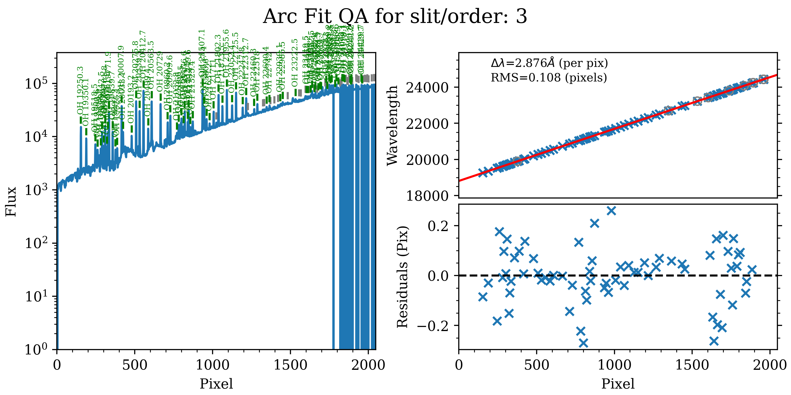
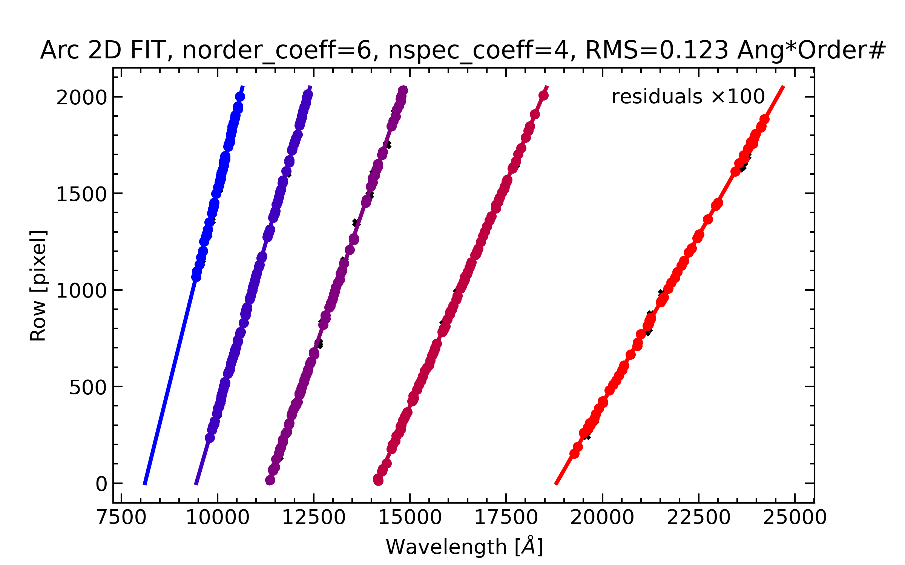
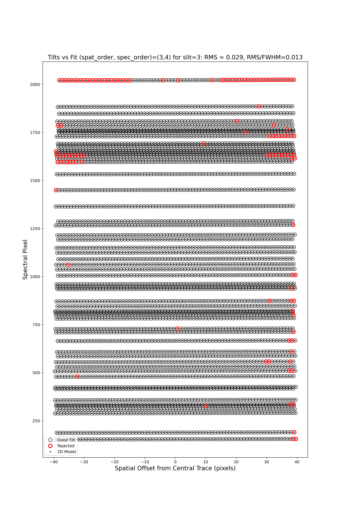
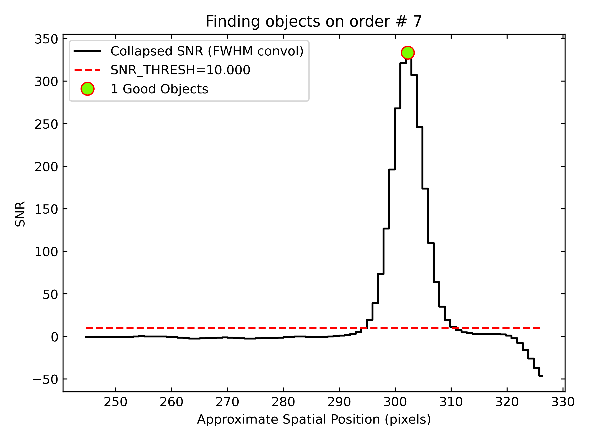

.. include:: ../include/links.rst

.. _soar_triplespec_howto:

=====================
SOAR/TripleSpec HOWTO
=====================

Overview
========

This doc goes through a full run of PypeIt on an example SOAR/TripleSpec
dataset (a reduction of the transient 2025cy with its A0 V telluric standard
HD 116699).  TripleSpec is a fixed-format, cross-dispersed near-infrared
spectrograph; PypeIt reduces it with the Echelle pipeline over five orders
(order numbers 7 through 3), covering roughly 0.8--2.47 microns.  If you're
having trouble reducing your data, we encourage you to work through this
tutorial first.  See also the instrument notes at
:ref:`soar_triplespec`, join our `PypeIt Users Slack
<https://pypeit-users.slack.com>`__ using `this invitation link <invite_>`_ to
ask for help, and/or `Submit an issue`_ to GitHub if you find a bug!

----

Setup
=====

Before reducing your data with PypeIt, you first have to prepare a
:ref:`pypeit_file` by running :ref:`pypeit_setup`:

.. code-block:: bash

    pypeit_setup -r /path/to/raw/ -s soar_tspec -b -c A

where the ``-r`` argument should be replaced by your local raw-data directory
and ``-b`` indicates that the data use background (sky) subtraction and the
``calib``, ``comb_id``, and ``bkg_id`` columns should be added to the
:ref:`data_block`.  TripleSpec has a single fixed configuration, so ``-c A``
and ``-c all`` are equivalent.

This produces a directory ``soar_tspec_A`` containing the pypeit file
``soar_tspec_A.pypeit``.  The key part is the :ref:`data_block`, which for this
example looks like (where the arc file has been commented out by hand and the science
frame has been typed as "arc,tilt,science" instead of simply "science"):

.. code-block:: console

    # Data block
    data read
     path ./
                                    filename |        frametype | ... | dispname | binning | exptime | calib | comb_id | bkg_id
    #          SPEC_ARC_04-02-2025_0103.fits |         arc,tilt | ... |     spec |     1,1 |     2.0 |     0 |      -1 |     -1
             SPEC_DFLAT_04-02-2025_0088.fits |     lampoffflats | ... |     spec |     1,1 |     2.0 |     0 |      -1 |     -1
             SPEC_DFLAT_04-02-2025_0042.fits |  pixelflat,trace | ... |     spec |     1,1 |     2.0 |     0 |      -1 |     -1
            SPEC_2025cy_05-02-2025_0116.fits | arc,tilt,science | ... |     spec |     1,1 |   300.0 |     0 |       1 |      2
            SPEC_2025cy_05-02-2025_0117.fits | arc,tilt,science | ... |     spec |     1,1 |   300.0 |     0 |       2 |      1
    SPEC_2025cy_05-02-2025_standard0120.fits |         standard | ... |     spec |     1,1 |    9.25 |     0 |       3 |      4
    SPEC_2025cy_05-02-2025_standard0121.fits |         standard | ... |     spec |     1,1 |    9.25 |     0 |       4 |      3
    data end

Wavelength-calibration frames
-----------------------------

Note that the science frames are typed ``arc,tilt,science``.  This is the most
important edit to make for TripleSpec: there is **no arc lamp that is useful
across the full near-IR range**, so the dense forest of OH sky-emission lines in
the science frames is used as the wavelength reference.  The short dedicated arc
exposure (``SPEC_ARC_...``) is therefore commented out.  The 300 s science
exposures have far more usable OH signal than a short arc, especially in the
reddest order.

The standard-star frames are *not* typed as ``arc,tilt`` because the short
(9.25 s) standard exposures do not contain enough OH signal for a good
solution.  Instead, by giving the standards the same ``calib`` value as the
science frames, PypeIt applies the science-derived wavelength solution to them.

.. warning::

    If you change the frame typing (e.g. which frames serve as the ``arc``), you
    **must delete the affected files in** ``Calibrations/`` before re-running.
    ``run_pypeit -o`` overwrites only the *science* products, not the cached
    calibration frames, so a stale ``Arc_*`` / ``WaveCalib_*`` would silently be
    reused and yield a confusing failure.

A-B differencing
----------------

The ``comb_id`` and ``bkg_id`` columns implement A-B sky subtraction for the
ABBA dither sequence.  For the science pair, frame ``0116`` has ``comb_id=1``,
``bkg_id=2`` (treat as A, subtract B) and frame ``0117`` reverses them (treat as
B, subtract A); the standard pair is handled the same way.  PypeIt builds the
A-B and B-A images, whose positive residuals are the source flux, and these can
later be combined with :ref:`2D coadding <coadd2d>`.  See
:ref:`a-b_differencing` for the full description.

----

Core Processing
===============

To perform the core processing, run :ref:`run-pypeit`:

.. code-block:: bash

    run_pypeit soar_tspec_A.pypeit

The code runs uninterrupted through order tracing, wavelength calibration, field
flattening, object finding, sky subtraction, and spectral extraction; see
:ref:`run-pypeit`.  As it runs it produces a number of files and QA plots to
inspect.

Order Edges
-----------

The code first uses the ``trace`` frames (dome flats with the lamp on) to find
the order edges.  TripleSpec is a fixed-format echelle, so the trace should
always look the same: five orders.  Inspect them with:

.. code-block:: bash

    pypeit_chk_edges Calibrations/Edges_A_0_DET01.fits.gz

This opens a `ginga`_ window with the trace image overlaid (green = left edge,
magenta = right edge).  PypeIt expects to find all 5 orders and will fault if it
does not.

.. tip::

    The default parameters disable the order PCA (``auto_pca = False``) and use
    direct polynomial fits to the order edges, which are robust for this
    detector.  If edge tracing misbehaves on your data, see the :ref:`parameters`
    and specifically the :ref:`edgetracepar`.

Wavelength Calibration
----------------------

Next the code performs the wavelength calibration from the OH sky lines, using
the ``reidentify`` method against the bundled ``soar_triplespec.fits`` archive
and the ``OH_NIRES`` line list (see :ref:`instr_par-soar_tspec`).

Check the per-order result with the automatically generated 1D-fit QA.  Below is
the plot for the reddest order (order = 3, *K* band), the most challenging one:

   The 1D wavelength-calibration QA for the reddest SOAR/TripleSpec order
   (order = 3), ``Arc_1dfit_A_0_DET01_S0003.png``.  The left panel is the OH-sky
   arc spectrum extracted down the center of the order; green marks lines used in
   the solution and gray marks detected features that were not used.  The
   top-right panel shows the fit (red) to wavelength vs. spectral pixel (blue);
   the bottom-right panel shows the residuals.  The RMS here is ~0.11 pixels.

The script :ref:`pypeit-chk-wavecalib` summarizes all orders:

.. code-block:: bash

    pypeit_chk_wavecalib Calibrations/WaveCalib_A_0_DET01.fits

which prints:

.. code-block:: console

     N. SpatOrderID minWave Wave_cen maxWave dWave Nlin     IDs_Wave_range    IDs_Wave_cov(%) measured_fwhm  RMS
    --- ----------- ------- -------- ------- ----- ---- --------------------- --------------- ------------- -----
      0           7  8106.5   9389.6 10644.7 1.242   47  9442.240 - 10588.762            45.2           2.1 0.099
      1           6  9450.3  10937.7 12399.6 1.444   91  9793.676 - 12351.597            86.7           2.2 0.070
      2           5 11324.4  13104.7 14857.2 1.730   85 11354.191 - 14833.093            98.5           2.2 0.105
      3           4 14133.8  16354.3 18543.8 2.159   90 14163.034 - 18459.584            97.4           2.3 0.065
      4           3 18806.4  21760.6 24681.4 2.876   68 19250.306 - 24220.763            84.6           2.2 0.108

All five orders are solved with RMS ~0.07--0.11 pixels, spanning ~8100--24700
Angstrom.  See :ref:`pypeit-chk-wavecalib` for a description of the columns.

.. warning::

    A common failure mode for sky-line wavelength calibration is that the
    on-sky exposures are too short to give good OH signal *in all orders*.  When
    observing, ensure at least some science exposures are long enough.  The
    reddest order (order 3) is the first to suffer.

PypeIt then traces each sky line across the spatial direction of each order to
build the 2D wavelength solution.  The global QA plot is:

   The global 2D wavelength solution, ``Arc_2dfit_global_A_0_DET01.png``,
   showing all five orders (colored points) as row vs. wavelength, with the
   overall fit RMS quoted at the top.

A per-order 2D tilt QA is also produced:

   The 2D tilt QA for order 3, ``Arc_tilts_2d_A_0_DET01_S0003.png``.  Open
   circles are measured sky-line centers (black = kept, red = rejected); the
   modeled positions are overlaid.

Field Flattening
----------------

PypeIt applies pixel-to-pixel and illumination flat-field corrections built from
the dome flats; the lamp-off dome flats (typed ``dark``) are subtracted first to
remove the thermal/dome background.  Inspect them with:

.. code-block:: bash

    pypeit_chk_flats Calibrations/Flat_A_0_DET01.fits

Object Finding and Extraction
-----------------------------

After the calibrations, PypeIt identifies sources, performs global and local sky
subtraction, and extracts 1D spectra; see :ref:`object_finding`.  Here is the
object-finding QA for the science target in order 7:

   Detection of the 2025cy spectrum in order 7.  The black line is the
   spectrally collapsed S/N as a function of spatial position; the dashed red
   line is the S/N threshold (set by the :ref:`findobjpar`), and the green
   circle marks the detected object at S/N ~ 28 (rising to ~30 in the bluer
   orders).

----

Core Processing Outputs
=======================

The primary outputs are calibrated 2D spectral images and 1D extractions; see
:ref:`outputs`.

2D Spectral Images
------------------

Each combination group produces a ``spec2d`` file.  Inspect it with
:ref:`pypeit_show_2dspec`:

.. code-block:: bash

    pypeit_show_2dspec Science/spec2d_SPEC_2025cy_05-02-2025_0116-2025cy_TSPEC_20250205T040918.237.fits --removetrace

The ``--removetrace`` option is useful for faint sources.  Check that the object
is well traced in the ``sciimg`` channel, that there are minimal sky residuals
in the ``sky_resid`` channel, and that the ``resid`` channel looks like pure
noise (see also :ref:`pypeit_chk_noise_2dspec`).

1D Spectral Extractions
-----------------------

Each combination group also produces a ``spec1d`` fits file plus a ``.txt``
summary.  For the standard star HD 116699 (frame ``0120``) the summary is:

.. code-block:: console

    | order |          name | spat_pixpos | spat_fracpos | box_width | opt_fwhm |    s2n | wv_rms |
    |     7 | OBJ0703-DET01 |       303.1 |        0.703 |      1.50 |    1.081 | 114.48 |  0.099 |
    |     6 | OBJ0703-DET01 |       483.6 |        0.703 |      1.50 |    1.023 | 141.45 |  0.070 |
    |     5 | OBJ0703-DET01 |       639.3 |        0.703 |      1.50 |    0.946 | 136.47 |  0.105 |
    |     4 | OBJ0703-DET01 |       783.2 |        0.703 |      1.50 |    0.881 | 146.21 |  0.065 |
    |     3 | OBJ0703-DET01 |       944.7 |        0.703 |      1.50 |    0.841 | 113.53 |  0.108 |

i.e. one spectrum per order, each stored in its own fits extension named like
``OBJ0703-DET01-ORDER0007``.  Plot the reddest order with
:ref:`pypeit_show_1dspec`:

.. code-block:: bash

    pypeit_show_1dspec Science/spec1d_SPEC_2025cy_05-02-2025_standard0120-HD_116699_TSPEC_20250205T043332.836.fits --exten 5

See :ref:`spec-1d-output` for further details.

----

Next Steps
==========

The core reduction does *not* flux-calibrate or telluric-correct the spectra.
With the bright A0 V standard HD 116699 in hand, the natural follow-ups are:

    - 2D coadding of the A-B / B-A images (:ref:`pypeit-coadd-2dspec`; see
      :ref:`coadd2d` and :ref:`coadd2d_howto`),
    - 1D coadding of the orders/exposures (:ref:`coadd1d`),
    - building a sensitivity function and telluric model from the standard
      (:ref:`sensitivity_function`, :ref:`fluxing`, :ref:`telluric_correction`).
